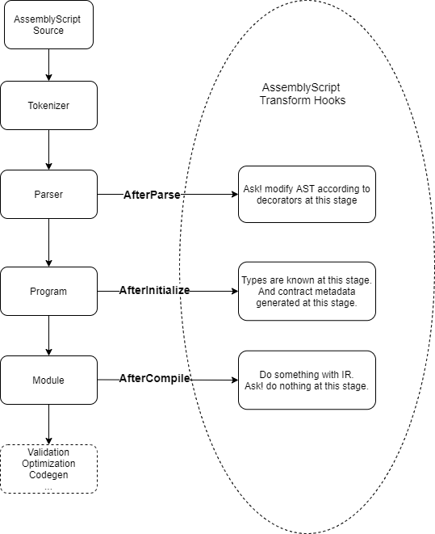

## Architecutre

## Mechanism
### ink! - rust Macros
The way how ask! is implmented is very similar to ink!. Ink utilizes rust Macros to server as an eDSL to write smart contracts. 

### ask! - Assemblyscript Transform
On the other hand, since Assemblyscrit is compiled statically, so code transformation cannot be done at runtime but must instead be performed at complied time. To enable this, the compiler frontend (asc) provides a mechanism to hook into the compilation process before, while and after the module is being compiled.  By implementing a custom transform plugin for Assemblyscript, we make ask! to serve as an eDSL of assemblyscript.

### ask! - Decorators
Since Typescript/AssemblyScript supports decorators, ask! chooses using decorators to achieve the same purpose as rust Macros. Ask! uses decorators to extend the Abstraction Syntax Tree to implement the internal logics with additional code. Using decorators can hide the complex logic of contract execution and interaction with `contract-pallet` to allow developers only focus on contract development alone. 

## How compilation works in ask!
ask! implements [transform](https://github.com/patractlabs/ask/tree/master/ts-packages/transform) to interview with Assemblyscript compilation process as follows:

