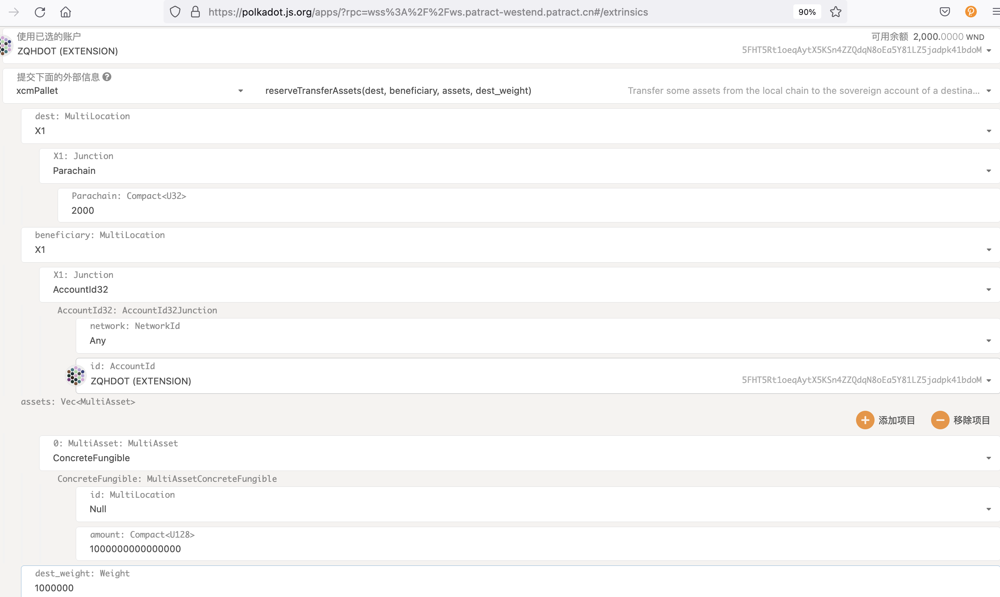
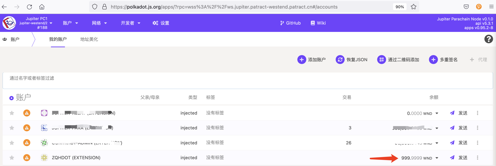

# 跨链转账

跨链转账功能仅限于 Patract 的私有 Westend 中继链 和 Jupiter 平行链之间，当前的跨链转账包括：

- 中继链 Westend 转账 WND（中继链的原生代币）给平行链 Jupiter
- 平行链 Jupiter 转账 WND（中继链的原生代币）给中继链 Westend

跨链转账有两种模块：teleport、reserver transfer，当前建议使用的是 reserve transfer。

## 中继链转账到平行链

在 Patract 的私有中继链 Westend 上，选择“交易”、“xcmPallet”模块，按照下图转账到平行链：

> 注意：当前 Patract 的私有中继链 Westend 暂时还没有水龙头，后续会添加此功能。

等待交易被打包后，检查中继链的转账发起方账户余额减少，同时平行链的转账接收方账户余额增加了。上面的示例中中继链转账了 1000 WND 给平行链，
对应的平行链中增加了约 1000 WND。

## 平行链转账到中继链

平行链转账到中继链的实现，当前使用了 [orml_xtokens](https://github.com/open-web3-stack/open-runtime-module-library) 组件。

在 Jupiter 平行链上，选择“交易”、“xTokens”，按照下图转账到中继链：

等待交易被打包后，检查平行链的转账发起方账户余额减少，同时中继链的转账接收方账户余额增加了。