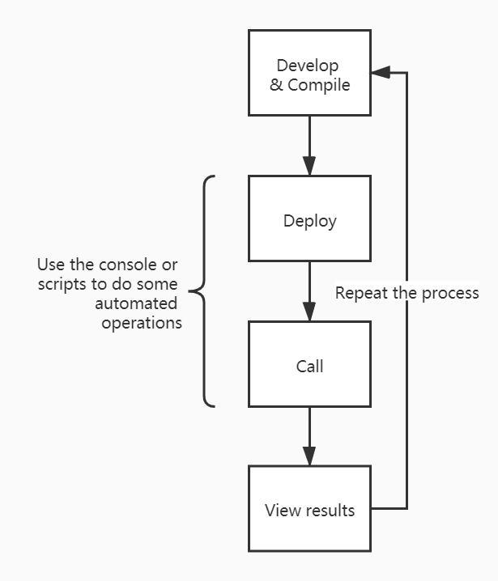

# Console

Redspot provides a JavaScript Interactive Console. It supports injecting the runtime environment of redspot. Similar to Truffle's develop command. Console is a supplement to unit testing. Through the Console, we can easily perform various tests on the contract without writing testing scripts. Users can directly interact with the contract. It gives users flexibilty to get a sense of the contract before writing any unit test.

## Features
* Provides powerful Tab completion capabilities.
* The console records the command history. You can view the cache/console-history.txt file to get the history execution commands, or you can find the required history commands by pressing the`↑`button. In the future, the console will also provide the function of shortcut keys indexing history commands.

## Start the console

```bash
$ npx redspot console
## If you are sure that the contract compiled in the ``artifacts`` directory meets your expectations, you can add the --no-compile argument to not compile the contract
$ npx redspot console --no-compile
```

To find the available commands, type `.help`
```bash
> .help
.break    Sometimes you get stuck, this gets you out
.clear    Alias for .break
.editor   Enter editor mode
.exit     Exit the repl
.help     Print this help message
.load     Load JS from a file into the REPL session
.save     Save all evaluated commands in this REPL session to a file
> 
```

## Common commands

By default, the console imports the components for interacting with the contract deployed：
* patract
* network

Consistent with the scripts in the scripts directory, many functions can be called through these components, such as interacting with the contract, querying information, and viewing the network. You can also `require` other components in the env.

## Common workflow

If you want to debug the erc20 contract, after the contract is compiled, you can see the erc20.json and erc20.wasm files in the artifacts directory. Operations related to loading the contract need to be marked with the file name here.

If you have the `deploy.ts` deployment script in the scripts directory, you can directly execute the command to test it in the console.

To obtain current redspot configuration:

```typescript
console.log(config)
```

```typescript
var factory = await patract.getContractFactory('erc20'); // erc20 is the same as the filename
var contract = await factory.deployed('new', 10000000); // upload the code and instantiate this contract
```
And the console will print:
```bash
deployedAddress: 5HTtpwJ6qGYkkQ34GYDs1xAR3Yw7HmHyqoeRSaL8qP1h8Zuk
```
If the address of a contract is known, and you want to load this contract instance first, you use the `attach` function
```typescript
var factory = await patract.getContractFactory('erc20'); // erc20 is the same as the filename
var contract = await factory.attach('5HTtpwJ6qGYkkQ34GYDs1xAR3Yw7HmHyqoeRSaL8qP1h8Zuk'); // load the contract address'); // load the contract address
```

Now, the contract object is instantiated. You can start interacting with it.

```typescript
// create a receiver
const receiver = await patract.getRandomSigner();
var ret = await contract.tx.transfer(receiver.address, 100)
ret.events // print the information of events
```

Get the result of executing a method by RPC call.

```typescript
var ret = await contract.balanceOf(receiver.address)
ret.output.toString()
'100'
```


If this process is relatively fixed, you can write the above command into a file and put it in the scripts directory, for example, named it scripts/do_something.ts.

```typescript
var factory = await patract.getContractFactory('erc20');
var contract = await factory.deployed('new', 10000000); 
const receiver = await patract.getRandomSigner();
var ret = await contract.tx.transfer(receiver.address, 100)
ret.events
```

Then use the following commands to automate a series of processes.

```typescript
.load scripts/do_something.ts
```

In summary, the auxiliary functions of the console are as follows.




