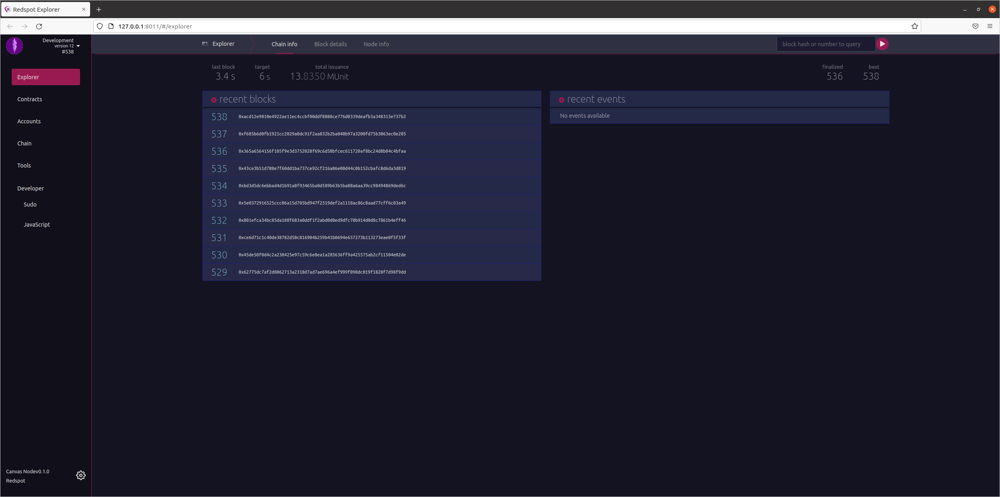

# Redspot Explorer

### Overview
Redspot also comes with explorer based on @polkadot/apps with lots of modifications and optimizations to better intergrete native code and web page. 


### Features
1. Redesigned the layout and menu with more highlight on the contract module; Improved the night mode of polkadot apps, adjusted the UI, and adjusted the color scheme; Delete pages that are irrelevant for contract development. Merged the tools page.

  

2. The explorer will use the network configured in redspot config, so users do not have to configure themself..
3. The account configured in the redspot config will appear in the explorer and can be used the same way as the accounts created on the webpage.
4. The types configured in redspot will be adopted by explorer.
5. The .contract file of the contract generated in the local project will be automatically uploaded to the explorer. The contracts page in the explorer will list all the contracts known to the code.
6. When switching networks, the explorer will only display the addresses and contracts of current network.
7. You can use polkadot{.js} extension to sign when you run tests or scripts locally.
8. You can call `compile` for local redspot project from explorer.
9. You can run redspot scripts in explorer.
10. If there is a known code, the contract event and the parameters when sending the contract will be automatically parsed in the block details.
11. You can query all transactions of a certain contract.

### Setup
To use redspot explorer, you need to install the `@redspot/explorer` plugin:

```bash
$ yarn add @redspot/explorer
```

Then add below in `redspot.config.ts`：

```javascript
// ...
import "@redspot/explorer";
// ...
```

### Quick start
Run redspot explorer:

```bash
npx redspot explorer
```

Note that when running redspot explorer, a service will be started locally to host the explorer. Also, please restart the service manually every time when `redspot.config.ts` is changed.

Then open the default URL `http://127.0.0.1:8011`

Open switch network



As you can see, you can select the network configured in redspot.

Check the accounts page, the account configured in `redspot.config.ts` will appear.


Then you can use the account in your polkadot extension to make transactions. Copy your account address in polkadot extension.

Then change the deploy.ts script:

```javascript
import { network, patract } from "redspot";

const { getContractFactory } = patract;
const {  api } = network;

async function run() {
  await api.isReady;
  const signer = "<your address>";

  const contractFactory = await getContractFactory("erc20", signer);

  const balance = await api.query.system.account(signer);

  console.log("Balance: ", balance.toHuman());

  const contract = await contractFactory.deployed("new", "1000000", {
    gasLimit: "200000000000",
    value: "100000000000",
  });

  await contract.tx.transfer(signer, 7);
  console.log("");
  console.log(
    "Deploy successfully. The contract address: ",
    contract.address.toString()
  );

  api.disconnect();
}

run().catch((err) => {
  console.log(err);
});

```

Then run the script `$ npx redspot run ./scripts/deploy.ts` to trigger the polkadot extension for signing. Check the polkadot extension in your browser (making sure the explorer page is open)


Deploy the contract. Once the deployment is successful, check the explorer page:


Now we can check the blockchain events emitted. We can check at the `contracts.instantiateWithCode` event,it displays the details of the extrinstics.


Check the codes page of contracts:


The code of the locally compiled contract will automatically appear here.

Check the contracts page of contracts: 

The contract just deployed will appear here.

Then we switch to the console page, where we can run the script and compile the contract: 

We click 'compile' contract and this prompt appears to indicate that the compilation was successful: 

If the compilation time is too long, please switch to the terminal running the `npx redspot explorer` and check the log prompt.

Then we click 'run' to run the script, and the console on the right will output the run log: 

Now that the contract is successful, let's switch to the contracts page to check:


As you can see, the newly deployed contract will appear here.

When we click on the extrinsics button (the blue "extrinsics" in each row in the "recent contracts" in the figure), a dialog box will pop up, showing the relevant transactions of current contract:

