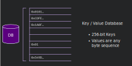
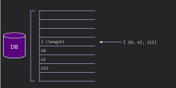
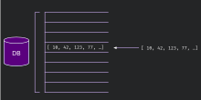

# Composite Types and Storage
## Overview
Besides from basic types in last section, oftentimes we need to use more complex data structures for storage to implement complex logics in smart contract. 

The following schema depicts the storage which is exposed to ink! by the contracts pallet:



Storing or loading complex data structures to and from contract storage can be done in many different ways. You could store all information into a single storage cell or you could try to store all information into as many different cells as possible. Both strategies have pros and cons under different conditions.

## Spread VS. Packed
Ask! provides two composite data types for storage: `StorableMap`, `StorableArray`. The composite data type supports two storage modes, **spread** and **packed**. 
### Spread
For the **spread** storage mode, each storage unit has its own storage address, and will only be loaded when needed.


### Packed
For the **packed** storage mode, all storage units need to be serialized into a set of data streams and stored in a shared address. When getting data from **packed** storage, the data will fetched once. Therefore, **packed** storage isn't desirable for accessing data in large volume.



## StorableMap
`StorableMap`:  `SpreadStorableMap` and `PackedStorableMap` are encapsulated classes of Map, and add data persistence function. Two storage modes of **spread** and **packed** are implemented respectively. 

### APIs
Here are some common functions you might use for StorableMap:
```typescript
/// check if the map has sepcific key
has(key: K): bool 

/// insert k,v into the map
set(key: K, value: V)

/// get corresponding value by key
get(key: K): V 

/// delete k,v by key
delete(key: K): bool

/// truncate the map
clear(): void 

/// get all keys of the map
keys(): K[] 

/// get all values of the map
values(): V[] 
```

### SpreadStorableMap
#### Usage
To initialize a SpreadStorableMap, as long as key and value implments scale-codec, initialize it as a normal map in AssemblyscriptFor detailed apis, please check [`PackedStorableMap.ts`](https://github.com/patractlabs/ask/blob/master/as-packages/lang/assembly/storage/PackedStorableMap.ts)

```typescript
export class ERC20 {
  @state balances: SpreadStorableMap<AccountId, UInt128> = new SpreadStorableMap<AccountId, UInt128>();
}
```

For detailed apis, please check [`SpreadStorableMap.ts`](https://github.com/patractlabs/ask/blob/master/as-packages/lang/assembly/storage/SpreadStorableMap.ts)

#### Implementation
The storage structure of `SpreadStorableMap` follows:
  

The number of data stored in this Map and the Hash of the first storage location are saved in `MapEntry`. Its storage location is in `Hash(prefix)`, and this storage location will be exported to metadata.json for access of external apps.

`KVStore` is a specific stored K/V value. In addition to storing Key/Value, each KVStore also stores the hash of the next/prev node. If it is a tail node, then the value of `next` is `NullHash `, that is (`0x0000000000000000000000000000000000`); if it is a head node, then the value of `prev` is `NullHash`. Through a doubly linked list, external Apps can iteratively access all data. The storage location of each `KVStore` is determined by the following rules: `Hash(prefix + key)`. 

### PackedStorableMap
The storage model of Packed is different from Spread, all its data is loaded/stored all at once. The usage of `MapEntry` is the same as the Spread model. All its data is stored in a fixed location under `Hash(prefix + ".value")` through the method of `u8[]`.

#### Usage
To initialize a PackedStorableMap, as long as key and value implments scale-codec, initialize it as a normal map in Assemblyscript

```typescript
export class TwoSum {
  @state hashmap: PackedStorableMap<AccountId, UInt128> = new PackedStorableMap<AccountId, UInt128>();
}
```

For detailed apis, please check [`PackedStorableMap.ts`](https://github.com/patractlabs/ask/blob/master/as-packages/lang/assembly/storage/PackedStorableMap.ts)

#### Implementation
The storage structure of `PackedStorableMap` follows:


## StorableArray
`SpreadStorableArray` and `PackedStorableArray` are the encapsulation of the Array class, and added data persistence function, respectively implementing the two storage modes of **spread** and **packed**.

### APIs
Some common APIs you might use.
```typescript
push(value: T): i32

pop(): T

delete(index: i32): bool 

at(index: i32): T 

fill(value: T, start: i32 = 0, end: i32 = i32.MAX_VALUE)

every(callbackfn: (element: T, index: i32, array?: Array<T>) => bool): bool 

findIndex(predicate: (element: T, index: i32, array?: Array<T>) => bool): i32 

includes(searchElement: T, fromIndex: i32 = 0): bool 

indexOf(searchElement: T, fromIndex: i32 = 0): i32 

lastIndexOf(searchElement: T, fromIndex: i32 = 0): i32 

concat(items: T[]): T[] 

forEach(callbackfn: (value: T, index: i32, array: Array<T>) => void): void 

map<U>(callbackfn: (value: T, index: i32, array: Array<T>) => U): Array<U> 

filter(callbackfn: (value: T, index: i32, array: Array<T>) => bool): Array<T> 

reduce<U>(callbackfn: (previousValue: U, currentValue: T, currentIndex: i32, array: Array<T>) => U, initialValue: U): U 

reduceRight<U>(callbackfn: (previousValue: U, currentValue: T, currentIndex: i32, array: Array<T>) => U, initialValue: U): U 

some(callbackfn: (element: T, index: i32, array?: Array<T>) => bool): bool 

slice(from: i32, to: i32 = i32.MAX_VALUE): Array<T> 

splice(start: i32, deleteCount: i32 = i32.MAX_VALUE): Array<T> 

sort(comparator: (a: T, b: T) => i32)

reverse(): T[] 
```

### SpreadStorableArray
#### Usage
To initialize an SpreadStorableArray
```typescript
@contract
class Flipper {
    @state flag: bool;
    @state
    aArr: SpreadStorableArray<UInt128> = new SpreadStorableArray<UInt128>(); 
```

#### Implementation
The storage structure of `SpreadStorableArray` is as follows:


`ArrayEntry` saves the number of elements of this Array `size` and the number of bytes after serialization `rawBytesCount` (this value is `0` in Spread model). Its storage location is in `Hash(prefix)`, And this storage location will be exported to metadata.json for external apps to access. The storage location of each element is determined by the method of `Hash(prefix + index)`, and the serialized data of the element is stored in this location.

### PackedStorableArray
#### Usage
To initialize an PackedStorableArray
```typescript
@contract
class Flipper {
    @state flag: bool;
    @state
    aArr: PackedStorableArray<UInt128> = new PackedStorableArray<UInt128>(); 
```

**Fixed length array** 

By default, the array is mutable length array. The default strucutre definition is SequenceDef that defines array as sequence and sepcify the object type in array. It also defines storage modes as pack/spread. In addition, for type array, it can pre-allocate some space by default. The type is Arraydef whith specification of capacity for pre-allocated space. len is set to 0 by default meaning no fixed length is specified.
To initialize a fixed length array, adding `@packed({ "capacity": 128 })` decorator:
```typescript
@contract
class Flipper {
    @state flag: bool;

    @state
    @packed({ "capacity": 128 })
    packeArr: PackedStorableArray<UInt128> = new PackedStorableArray<UInt128>();
}
```


#### Implementation
The storage structure of `PackedStorableArray` is as follows:


`ArrayEntry` stores the number of elements in this Array `size` and the number of bytes after serialization `rawBytesCount`. In this storage mode, all elements are stored under the same address `Hash(prefix + ".values ")`.

* `Composite object`
  `Composite object` is a serializable class, that is, a class that implements the `Codec` interface, which can be stored on the chain. For example, the following class:

```typescript
class EmbedObj implements Codec {

   a: i8;
   b: string;
   c: u128;

   constructor(a: i8 = 0, b: string = "", c: u128 = u128.Zero) {
     this.a = a;
     this.b = b;
     this.c = c;
   }

   toU8a(): u8[] {
     let bytes = new Array<u8>();
     let aWrap = new Int8(this.a);
     let bWrap = new ScaleString(this.b);
     let cWrap = new UInt128(this.c);

     bytes = bytes.concat(aWrap.toU8a())
                 .concat(bWrap.toU8a())
                 .concat(cWrap.toU8a());
     return bytes;
   }

   encodedLength(): i32 {
     let aWrap = new Int8(this.a);
     let bWrap = new ScaleString(this.b);
     let cWrap = new UInt128(this.c);

     return aWrap.encodedLength() + bWrap.encodedLength() + cWrap.encodedLength();
   }

   populateFromBytes(bytes: u8[], index: i32 = 0): void {
     let aWrap = new Int8();
     aWrap.populateFromBytes(bytes, index);
     index += aWrap.encodedLength();

     let bWrap = new ScaleString();
     bWrap.populateFromBytes(bytes, index);
     index += bWrap.encodedLength();

     let cWrap = new UInt128();
     cWrap.populateFromBytes(bytes, index);

     this.a = aWrap.unwrap();
     this.b = bWrap.toString();
     this.c = cWrap.unwrap();
   }

   eq(other: EmbedObj): bool {
     return this.a == other.a && this.b == other.b && this.c == other.c;
   }

   notEq(other: EmbedObj): bool {
     return !this.eq(other);
   }
 }
```

`EmbedObj` can be used in the storage class annotated by `@storage` to save a set of related information.