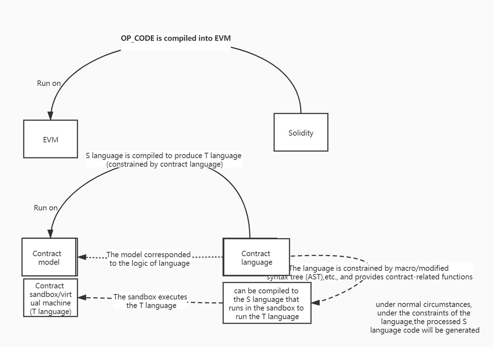
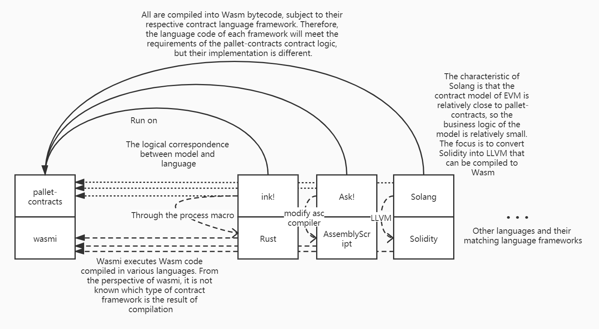

# Contract language

## Background Information

Corresponding to the concept of contract model, we can derive the concept of contract language (framework) (write code that can run on the platform). The contract language is not simply used here, but the description of the contract language (framework) is used because in actual use, some contract platforms have designed a new language to write contracts (such as Solidity), and some contract platforms are  on the basis of existing languages (such as Rust, C++, AssemblyScript), write a library or framework to make an existing language have the function of writing contracts, and some platforms even change an existing language into this language Dialects to support the function of writing contracts.

|          | Operating platform                                | Category                                                    |
| -------- | ------------------------------------------------- | ----------------------------------------------------------- |
| Solidity | The compiled results run on EVM                   | A new language                                              |
| ink!     | The compiled results run on Frame Contract Pallet | Write a library or framework on an existing language (Rust) |
| Vyper    | The compiled results run on EVM                   | Dialect of Python                                           |

> [Vyper](https://vyper.readthedocs.io/en/stable/) is a contract-oriented Python programming language, and the compilation target is the OP_CODE which running on Ethereum Virtual Machine (EVM).

For scenarios where a library or framework is added to an existing language, in most cases the function of the compiler to process the syntax tree is needed, so we prefer to call it a language framework rather than a library or framework in the conventional sense.

The contract language and contract language framework are for the description of different contract platforms. For the convenience of the following introduction, when describing the nature of the concept, the contract language is used to replace the two concepts of contract language and contract language framework. When describing specific objects, Use the corresponding concepts specifically.

## Correspondence between contract language and contract model

### Abstract representation of existing models



As shown in the figure above, the upper part describes the relationship between EVM and Solidity. EVM and Solidity proposed earlier, and their model is consistent with the usual model relationship between computer virtual machine and language. The lower part is the correspondence between the language part after separating the contract model. Here, I will focus on the lower part of the figure. In the upper part, you can analyze it based on your own experience in Ethereum  contract development compared with the introduction later.

In the system of compiled languages, for the convenience of the following introduction, first briefly define the following concepts (non-rigorous terms):

* S language: The original language (Source) for programmers to write code. For example, if C++ is compiled into assembly, then C++ is the original language S.
* T language: the language (Target) generated after the original language is compiled by the compiler. For example, if C++ is compiled into assembly, the assembly is the target language T.

The previous article introduced that the environment for running the contract system can be logically split into a contract model and a contract virtual machine. The contract model manages the business logic of the contract, and the contract virtual machine manages how to run the code of the contract. Correspondingly, the contract language part can also be split into the contract language and the S language compiled into the contract virtual machine.

According to this definition, it is clear that Solidity is a product that has both contract language and S language features.

1. Solidity has a Turing complete language system, so Solidity is a language (compared with BTC scripts).
2. The grammar of Solidity has many keywords with contract characteristics, corresponding to the concept of contract language. Such as：

    | keywords              | Description                         |
    |:----|:----|
    |mapping|Typical case of contract storage|
    |msg.sender、msg.value|Variables related to contract calls|
    |view、pure|Modifier，Play a modifying role|
    |call、delegate_cal|Keywords related to contract call|

Among them, the concept in point 2 does not exist to support the logic that the Solidity language can execute, but to serve the business logic of the Ethereum contract virtual machine. Therefore, this part can be attributed to the specific functions of the contract language.

The purpose of the contract language is to correspond to the business logic of the contract model. What kind of contract model requires what kind of contract language.

Such as：

- The bottom layer of EVM is Key-Value type storage, so the `mapping` designed in Solidity cannot be traversed unless extra storage is attached.
- The contract model of EVM contract interaction is designed as a contract calling contract mode, so the keywords `call` and `delegate_call` are provided in Solidity.

The same applies to other contract systems.

## Comparison of the advantages and disadvantages of contract language framework and contract language

### Disadvantages

For the contract language framework, it is an additional function erected on the S language, so the functions provided by the contract language framework are ultimately compiled to the T language corresponding to the S language. Some of the features required by the blockchain will be constrained at this level, such as the implementation of consistency requirements and the disallowing of operating system calls. Therefore, in addition to providing contract model functions to the S language, the contract language framework also needs to impose certain constraints on the language itself. This step is also a difficult place in the development and understanding of the contract language. At the same time, it is precisely for this reason that contract developers will have a lot of discomfort in the process of using the contract model framework.

The final result of the contract language framework is related to the ability of the language to expand the syntax tree. If the language itself provides more flexible interfaces (macros, plug-ins, etc.) for modifying or adding syntax trees, then the contract language can achieve more functions. If the language itself provides few such extensibility functions, then the contract language can only consider modifying the syntax required by the compiler and extensions to support the contract model, so that the final language becomes a dialect of the original language.

As for the contract language, languages like Solidity and Move are new languages developed for the contract platform. Although there are traces of grammatically imitating other languages, there are no ambiguity instructions when it comes to constraints. In terms of support for contract functions, corresponding keywords can also be designed directly, so it is more friendly to contract developers. For example, Solidity itself is positioned as a language designed to serve the writing of contracts. Therefore, the instructions related to the contract mentioned in the previous chapter can be designed as keywords, and you can use them directly.

Therefore, compared with the contract language, the contract language framework is very difficult to handle in terms of providing support for the contract and the constraints of running the contract. This is one of the reasons why it is more difficult for contract developers to use the framework functions.

Take ink! as an example:

* The use of float should be avoided in the blockchain, because floating-point numbers may produce indeterminate behavior. Therefore, in contract runtime development, if you need to use floating-point numbers, or when overflowing numbers are multiplied and divided, you need to introduce fixed-point numbers to deal with. Therefore, the fixed-point library provided by Substrate runtime can be introduced into the ink! contract for processing.
* Since the contract model of `pallet-contracts` is basically the same as EVM, the contract storage of `pallet-contracts` is also composed of Key-Value mode. Then the contract model framework needs to deal with the various collection types provided in the standard library. Therefore, the collection types that may be used in the standard library are rewritten in ink!, and the process of processing the collection element types into Key-Value mode data is added. Therefore, in the ink! contract storage, if a collection type is designed, then only the types provided in the ink! standard library can be used. On the other hand, since the return value of ink! needs to export metadata for third-party processing, and the current metadata interface implementation is only implemented for the collection in the standard library, so the collection of the return value of the ink! method can only use the collection type of the standard library. The code example is as follows.
    ```rust
    #[ink::contract]
    mod test {
        // Introduce Vec realized by ink
        use ink_storage::collections::Vec as StorageVec;
        // Introduce the Vec of the standard library
        use ink_prelude::vec::Vec;
        #[ink(storage)]
        pub struct Test {
            owners: StorageVec<AccountId>, // Only ink's Vec can be used
        }
        impl Test {
            #[ink(message)]
            pub fn get_owners(&self) -> Vec<AccountId> {
                // Convert Vec implemented by ink to Vec implemented by standard library
                self.owners.iter().map(Clone::clone).collect()
            }
        }
    }
    ```

### Advantages

Although there are many limitations to using contract language frameworks, there are still many advantages to designing a framework in an existing language compared to designing a new language.

|                          | Contract language framework                                  | Contract language                                            |
| ------------------------ | ------------------------------------------------------------ | ------------------------------------------------------------ |
| Attractive to developers | It is easier to attract developers in this language ecology. | Convincing developers to use a new language is very difficult. |
| Language abstraction     | Language design has been tested by engineering, with high abstract dimension and strong language expression. | The language design is relatively simple, and the abstraction of language expression is relatively weak, and it is difficult to write complex business logic. |
| Ecological Prosperity    | In many cases, the existing basic libraries and tool libraries in the language ecology can be reused. | Almost all the basic components have to be rewritten.        |
| Engineering cost         | Designing a library is relatively simple.                    | Designing a complete language is very complicated.           |

In summary, as a contract platform designer, choosing to use the contract language framework is to "substrate" from an existing language. Choosing to use contract language is "doing addition" from scratch. Both options have their own advantages and disadvantages. Designers will make choices according to their own scenarios to attract developers to the greatest extent and promote the development of their own ecology.

### Summarize

In summary, in the model structure:

* The contract language and contract model are in correspondence, and the characteristics of the contract language will match the contract model one by one.
* The contract language provides the S language with business functions for the contract model, and at the same time restricts the S language itself according to the requirements of the contract business logic.
* According to the needs of contract platform designers, they will eventually choose to use the contract language framework or design a contract language for developers to write contracts. Both methods have their own advantages and disadvantages.

## Pallet-contracts and the corresponding contract language



With the concept of the contract language model, we can nest the contract model framework on Substrate's Wasm contract system.

The realization of ink! The whole system corresponds to the contract model of `pallet-contracts`. ink! 3.0 introduces the functional logic corresponding to `pallet-contracts` into Rust through the system of process macros (2.0 through declaration macros). Therefore, the S language in this system is Rust, and the T language is Wasm bytecode. Ink! uses the auxiliary tool `cargo-contract` to compile the Rust code using the ink! framework into the Wasm bytecode of the contract. The environment in which Wasm  bytecode runs on the chain is wasmi. In the future, JIT-type operating environments such as Wasmtime will also be introduced.

And because the execution environment of `pallet-contracts`  is Wasm bytecode, a language that can be compiled into Wasm bytecode and a contract language that conforms to the `pallet-contracts` contract model can be generated and run on the contract platform of `pallet-contracts`  Contract. For `pallet-contracts`, you can design a contract system in different languages for you to choose, and you can use different languages to develop Wasm contracts.

## More information

In addition to Rust's ink!, the contract languages currently supported to run on pallet-contracts also have the following projects:

* Ask!：Developed by Patract, it is a contract language based on the  AssemblyScript language . (It is being developed)
* Solang： It is a tool that is developed by hyperledger-labs and supports the compilation of Solidity to Wasm of pallet-contracts.
