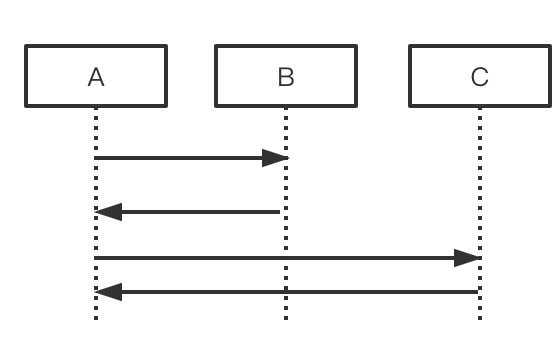
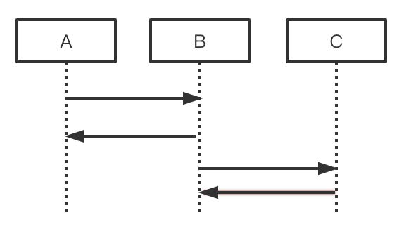

# Europa contract execution log
Here is the structure for recording contract execution information in the current Europa `pallet-contract`:

```rust
/// Record the contract execution context.
pub struct NestedRuntime {
        /// Current depth
    depth: usize,
        /// The current contract execute result
        ext_result: ExecResultTrace,
        /// The value in sandbox successful result
        sandbox_result_ok: Option<ReturnValue>,
        /// Who call the current contract
    caller: AccountId32,
        /// The account of the current contract
    self_account: Option<AccountId32>,
        /// The input selector
    selector: Option<HexVec>,
        /// The input arguments
    args: Option<HexVec>,
        /// The value in call or the endowment in instantiate
    value: u128,
        /// The gas limit when this contract is called
    gas_limit: Gas,
        /// The gas left when this contract return
    gas_left: Gas,
        /// The host function call stack
    env_trace: EnvTraceList,
        /// The error in wasm
    wasm_error: Option<WasmErrorWrapper>,
        /// The trap in host function execution
    trap_reason: Option<TrapReason>,
        /// Nested contract execution context
    nest: Vec<NestedRuntime>,
}
```

The log example corresponding to this structure is as follows.

```bash
1: NestedRuntime {
    ext_result: [success] ExecReturnValue { flags: 0, data:  },
    caller: d43593c715fdd31c61141abd04a99fd6822c8558854ccde39a5684e7a56da27d (5GrwvaEF...),
    self_account: 0144d6fc570d7bddda6f8e36141f179cd172324599b556ef514193f3105865f6 (5C6NMXaS...),
    selector: 0x9bae9d5e,
    args: 0x40420f00000000000000000000000000,
    value: 10000000000000000,
    gas_limit: 200000000000,
    gas_left: 190018947968,
    env_trace: [
        seal_input(Some(0x9bae9d5e40420f00000000000000000000000000)),
        seal_caller(Some(0xd43593c715fdd31c61141abd04a99fd6822c8558854ccde39a5684e7a56da27d)),
        ...
       seal_set_storage((Some(0x0300000001000000000000000000000000000000000000000000000000000000), Some(0x000000000000000000000000))),
    ],
    sandbox_result_ok: Value(
        I32(
            0,
        ),
    ),
    nest: [],
}
```

## Log field description

| Field             | Description                                                  |
| ----------------- | ------------------------------------------------------------ |
| 1: NestedRuntime  | Call the contract execution log with a depth of 1.           |
| ext_result        | The execution result of the contract at the `pallet-contract` level, there are two  cases: `[success]` and `[failed]`. `[success]` can only indicate that the execution was successful at the `pallet-contract` level, but the business logic of the contract itself may throw an Error. The data value in `ExecResultValue {flag:0, data: 0x...}` may be the return value of the contract, or the enumeration value of Error defined in the contract. `[failed]` will be followed by an `ExecError {.. }`, the error message is defined in `pallet-contracts`. |
| caller            | The caller of this contract may be the user or another contract account. When the value is `0x000...`, it is called by RPC. |
| self_account      | Current contract account.                                    |
| selector          | The function identifier passed to the contract, and the corresponding relationship can be queried in the metadata.json of the contract. |
| args              | The parameters passed to the contract calling function.      |
| value             | Transfer amount to the current contract.                     |
| gas_limit         | The maximum amount of gas that can be used by the current contract. |
| gas_left          | The amount of gas remaining when exiting the current contract. |
| env_trace         | During the execution of the current contract, the call stack of host_function gives the parameters of each function in detail. Take seal_call as an example. If the input is Some(xxx) and the output is empty, then there may be an error in the process of calling each other between the contracts. |
| trap_reason       | The reason for trap encountered during host_function execution.<br /> Return & Termination & Restoration: It is the normal exit strategy executed by the contract, not Error. <br />SupervisorError: DispatchError defined in `pallet_contracts`. |
| wasm_error        | If a Wasm execution error occurs in the contract, the Wasm call stack will be printed in this field. If and only if `ext_result` is `[failed]`. |
| sandbox_result_ok | If there is no `trap` and no `wasm_error` during the execution of host_function, then the contract is considered to be executed successfully and this field is printed. This field carries a `ReturnValue` information. In `ink!`, if the value returned is not 0, then an Error defined in `ink!` may have occurred, and the corresponding  [DispatchError](https://github.com/paritytech/ink/blob/abd5cf14c0883cb2d5acf81f2277aeec330aa843/crates/lang/src/error.rs#L66-L80) needs to be queried. |
| nest              | Contract log of nested calls. If the current contract calls other contracts, the execution log of the called contract will be nested in this field. |


## Contract nested call

Examples of mutual calls between contracts are as follows.

* In contract A, call contract C after calling contract B.

  

The log is as follows.

```sh
1: NestedRuntime {
	self_account: A,
	nest:[
		2: NestedRuntime {
			self_account: B,
			nest:[],
		},
		2: NestedRuntime {
			self_account: C,
			nest:[],
		}
	]
}
```

* In contract A, call contract B, in contract B, call contract C

  


The log is as follows.

```bash
1: NestedRuntime {
        self_account: A,
        nest:[
                2: NestedRuntime {
                        self_account: B,
                        nest:[
                                3: NestedRuntime {
                                self_account: C,
                                nest:[],
                        }
                        ],
                }  
        ]
}
```

##  `env_trace`:
Indicates that during the execution of the current layer of the contract, each time host_function is called in the contract WASM execution, a record will be added to the list here. Because all host_functions and the definitions in [`define_env!` in the `Pallet Contracts` module](https://github.com/paritytech/substrate/blob/master/frame/contracts/src/wasm/runtime.rs#L610 ) are related, so tracing `env_trace` can trace the process of interacting with `Pallet Contracts` during the execution of the current WASM contract. 

For example, if following thing appears in `env_trace`:

- `seal_call`: It means that there is a contract call contract situation in the current contract. According to the order in which `seal_call` appears in `env_trace`, it can correspond to `nest` to calculate the state before and after the contract calls the contract.
- `seal_get_storage`&`seal_set_storage`: It means that data read and write occurred in the contract. Through these two interfaces, it is possible to intercept and count the data read and write during the execution of the current contract, and the data size calculated by **`seal_set_storage` can also be used to infer the storage size required by `rent`. **
- `seal_deposit_event`: indicates that the event is printed in the contract. Here you can intercept the content of each event separately, instead of getting a unified event at the end. And the following text will use an example to surface that Europa can quickly locate the bug in the `host_function`.

On the other hand, the statistics of `env_trace` are relatively **fine-grained**. For example, if there are multiple possible errors in `host_function`, when an error occurs, all the information before the error will be retained, so it can be located to the place where the problem occurred during the execution of `host_function`.

And if there is an error in `host_function` that causes the contract to end execution, `env_trace` records the last error `host_function` call, so you can directly locate which `host_function` caused the contract execution exception.

## `trap_reason`: 
According to the definition of `TrapReason` in `Pallet Contracts`, `trap_reason` can be divided into 2 categories:

1. `Return` & `Termination` & `Restoration`: indicates that the contract exit is the design of `Pallet Contracts`, not an internal error. This type of trap indicates that the contract is executed normally and is not an error.
2. `SupervisorError`: Indicates that an error occurred during the execution of the contract calling host_function.

Therefore, the current Europa log printing design is designed to record whenever `trap_reason` appears. On the other hand, `trap_reason` may not always appear during the execution of the contract. Combining the design of `Pallet Contracts` and `ink!`, there is a case where the successful execution of the contract or the execution failure in the `ink!` layer does not generate `trap_reason`. Therefore, in addition to recording `trap_reason`, Europa also **records the results returned by the WASM executor after execution, which is recorded with `sandbox_result_ok`. **


## `sandbox_result_ok`: 

The value of `sandbox_result_ok` represents the result of the contract after the WASM executor is executed. This value could have been recorded as `sandbox_result`, including correct and incorrect conditions. However, due to the limitations of Rust and combined with the business logic of `Pallet Contracts`, only the result of `sandbox_result` is kept as `Ok` here. **For log printing, Europa is designed to print `sandbox_result_ok` only when trap_reason is the first case, as information to assist in judging contract execution. **

`sandbox_result_ok` is the WASM executor [result after calling `invoke`](https://github.com/paritytech/substrate/blob/712085115cdef4a79a66747338c920d6ba4e479f/frame/contracts/src/wasm/mod.rs#L155-L156) After the processing of `to_execution_result`, if there is no `trap_reason`, the result of `Ok(..)` is [discarded](https://github.com/paritytech/substrate/blob/712085115cdef4a79a66747338c920d6ba4e479f /frame/contracts/src/wasm/runtime.rs#L366-L368). But in fact there are two situations here:

1. An error occurred in `ink!`: According to the implementation of `ink!`, before calling the functions wrapped by the contract `#[ink(message)]` and `#[ink(constructor)]`, the input The process of decoding and matching `selector`. If an error occurs during this process, the contract will return [error code `DispatchError`](https://github.com/paritytech/ink/blob/abd5cf14c0883cb2d5acf81f2277aeec330aa843/crates/lang/src/error.rs#L22). But for the WASM executor, the WASM code is executed normally, so the result will be returned, including this error code. **This contract execution process is an error situation. **
2. The return value of `#[ink(message)]` is defined as `()`: According to the implementation of `ink!`, if the return value type is `()`, `seal_reason` will not be called, so it will not Contains `trap_reason`. **This contract execution process is an correct situation. **

Since `ink!` is only a contract implementation that runs on `Pallet Contracts`, other implementations may have different rules, so currently `sandbox_result_ok` is only used to assist in determining the execution of the `ink!` contract, the value is [` ReturnValue`](https://github.com/paritytech/substrate/blob/712085115cdef4a79a66747338c920d6ba4e479f/primitives/wasm-interface/src/lib.rs#L462-L467). Among them, if the `<num>` part of `ReturnValue::Value(<num>)` of the log is not 0, it means that there may be an error in the execution of `ink!`. You can use `ink!` for [`DispatchError` The error code](https://github.com/paritytech/ink/blob/abd5cf14c0883cb2d5acf81f2277aeec330aa843/crates/lang/src/error.rs#L66-L80) determines the error.
