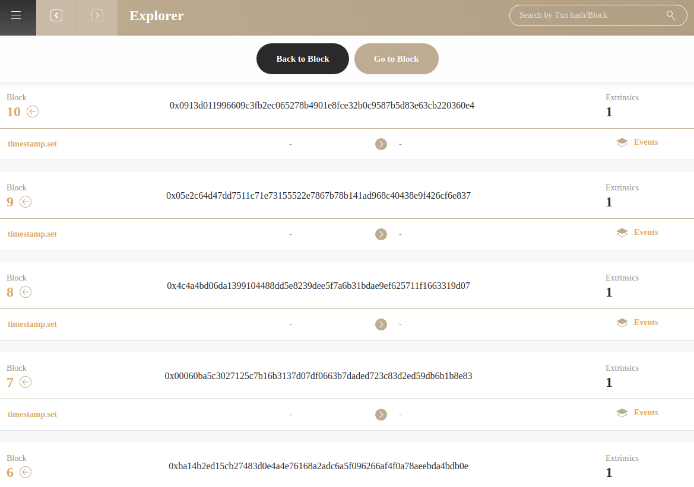

# Europa UI

Europa ships with a powerful Graphic User Interface that helps user better understand the node and contract execution without spending too much time learning the configs and commands.

## Installation
### Download Binary Releases

Detailed release information can be found here [Release v0.3.32](https://github.com/patractlabs/europa-ui/releases/tag/v0.3.32).
Currently, 3 operating systems are supportd:
* **Windows** 10 (21H1 and above) [europa-ui-v0.3.32-x86_64-darwin.dmg](https://github.com/patractlabs/europa-ui/releases/download/v0.3.32/europa-ui-v0.3.32-x86_64-darwin.dmg)
* **MacOS** (10.15.7 and above) [europa-ui-v0.3.32-x86_64-linux.AppImage](https://github.com/patractlabs/europa-ui/releases/download/v0.3.32/europa-ui-v0.3.32-x86_64-linux.AppImage)
> MacOS doesn't support M1, but you can try to use Rosetta to run the binary package of macOS. We do not guarantee all compatibility.
* **Ubuntu** (20.04 and above) [europa-ui-v0.3.32-x86_64-win.exe](https://github.com/patractlabs/europa-ui/releases/download/v0.3.32/europa-ui-v0.3.30-x86_64-win.exe)
>  For Ubuntu, we only guarantee Ubuntu 20.04 and above to work. Europa UI won't run on Ubuntu 18.04 and below due to the compatibility of glibc.*

*NOTE* 

ink! Stabilize `seal_debug_message` after pr [paritytech/ink#902](https://github.com/paritytech/ink/commit/fdae16d7a9384ae4d475b99a7d86f72e1927e665). Thus, if use the ink! which after this commit, the `pallet-contracts` should support stable seal_debug_message either. 

To use ink! supports `seal_debug_message`, making sure running Europa >= v0.3.32 or node will report `Error: Other`. Otherwise, use Europa <= v0.3.30

## Start the Europa node

## Configure Europa

This is the entry where you can set all the configurations for Europa node.

* **Database Path**: Sets which database to load. Each database will have different block states.
* **Workspace**: Sets the subdirectory of database. You can have multiple workspace for a single database.
* **HTTP Port**: Set the RPC through http protocal
* **WS Port**: Set the RPC through websocket protocal
* **External Endpoint**: Connect to another Europa instance through Websocket
* **Redspot Projects**: Choose to register the Redspot Project path in the startup configuration item, so that starting Europa will be associated with the compiled contract under the Redspot project.

## Tabs
Once you finished config, the Europa node will be started automatically. On the top left, click on `≡`

* **Contracts**: Check the contracts deployed
* **Explorer**: Blockchain explorer, allow users to revert and forward blocks
* **Accounts**: Check existent addresses 
* **Blocks**: Check existent blocks
* **Extrinsics**: check extrinsics
* **Events**: check emitted events
* **Developer**: check chain states, send transaction, make rpc calls, check Europa Cli logs

## Explorer

This page displays the mined blocks.

* `Go to Block`: Generate blocks to desinated height

* `Back to Block`: Revert the blockchain to desingated height and remove corresponding states in database.

## Accounts

* Add or delete accounts
* Transfer Balances
* Click on `Address` to check related `Extrinsics`

## Contracts
### Codes

The `upload& deploy contract` button allows users to upload and deploy contract in `**.format`
You can also deploy codes by other two methods:
* Deploy code through **Redspot** or other deployment tool through Europa RPC
* Setup the Redspot Project redo by uploading `redspot.config.ts` file

After successful deployment, you can check the deployed contract by clicking `Uploaded At Extrinsic`

### Instances

The instance tab will display all existing contract instances. Click on `Address` will link to the contract page where you can check related functions, extrinsics and events.

Apart from normal `Read` to call the contract function , Europa-UI also allows the user to `Call with Trace` which will display the blockchain state changes for better debugging and testing purposes.

## Extrinsic
Europa-UI focuses on revealing more insights during contract developement. When entering a page of `Extrinsic` for method under `contract`.

### Env Trace

Europa-UI parses all input data for the extrinsic and display them under the `data` row. Aside from common fields for an extrinsic, Europa-UI also provide `Env Trace` which elaborates how contract executes in a lower level.

If contract execution contains an error, the error will be traped. You can check the Wasm backtrace message of Wasm Error by clicking on `More Details`.

### Wasm Backtrace

### Cross-Contract Call 
For **Calling the Function of Another Contract**, Europa will "indent" the contract respectively to better demostrate the hierarchy. 

As shown in the figure above, when calling contract "5EQLt" in the first row, contract "5EQLt" then calls the "5D1cq" contract and the "5FdGb" contract separately through cross-contract calls. The `erc20` and `miner_erc20` contract are called in the `all` contract.

### State
This page records the state changes caused by the extrinsic showd in the same page.

The state changes have 6 actions:

* Put: A state has been modified
* PutChild: A state under a certain sub-tree (sub trie) has been modified, where child_id refers to the index of this sub-tree
* KillChild: Remove all storage under a certain subtree, which is more common in the case of contract destruction
* ClearPrefix: delete all the states under the key matching the specified prefix
* ClearChildPrefix: Delete the state under all keys matching the specified prefix under a certain subtree
* Append: Append new content to the state under a key, mostly used to add new Event data.

Among those 6 actions, if you only care about the storage changes made by contract execution, you only need to track PutChild, KillChild, and ClearChildPrefix.

## Developer
The developer page aims to replace cli by allowing developer to check chain state, send extrinsic, make rpc calls and check the console logs.

