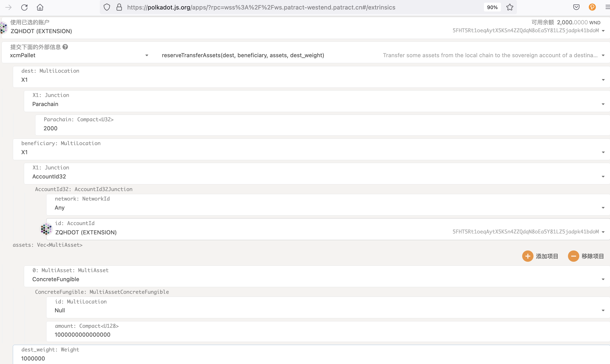
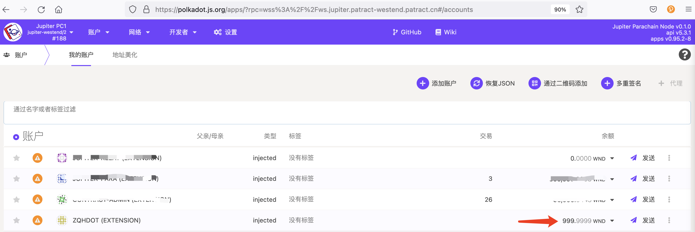
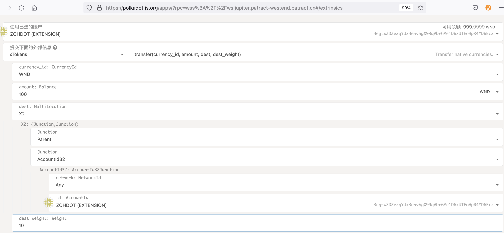

# XCMP Transfer

XCMP only limit to Patract own Westend relaychain and Jupiter parachain, current xcmp function include:

- Relaychain Westend transfer WND(Relaychain native currency) to Parachain Jupiter
- Parachain Jupiter transferWND(Relaychain native currency) to Relaychain Westend

XCMP has two transfer model: teleport、reserver transfer, current we suggest use reserve transfer model.

## Relaychain transfer to Parachain

In Patract own Westend, issue an extrinsic as follows:

> Note: we did't support facet for Patract own Westend for now, we'll add this soon.

After extrinsic success, check the balance of relaychain account is withdraw, and the balance of parachain account is deposit.
for example, relaychain transfer 1000 WND to parachain, so the relaychain account decrease 1000 WND, and parachain account increase nealy 1000 WND.

## Parachain transfer to Relaychain

We use [orml_xtokens](https://github.com/open-web3-stack/open-runtime-module-library) to simplify transfer from parachain to relaychain.

In Jupiter parachain, issue an extrinsic as follows:

After extrinsic success, check the the balance of relaychain account is deposit, and the balance of parachain account is withdraw.
