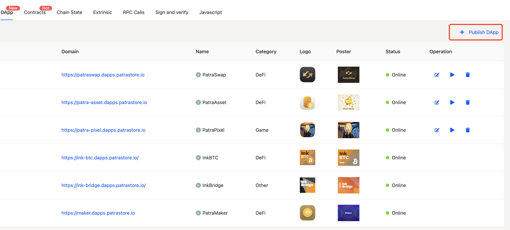
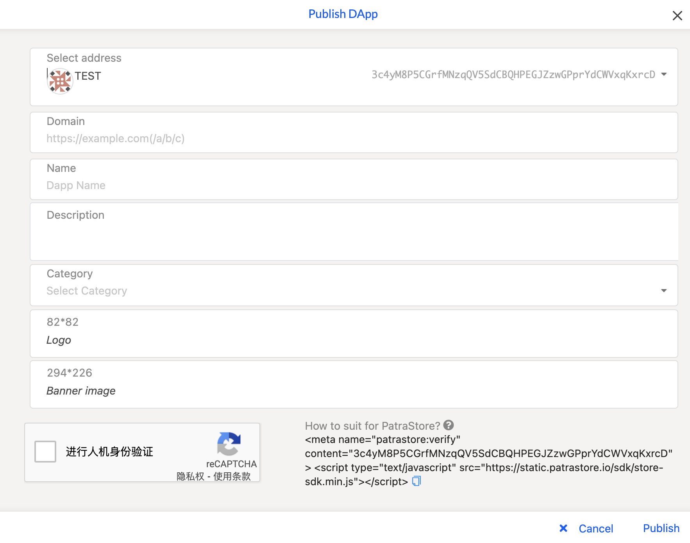

## Publish DApp

Currently we do not support hosting DApps. Developers need to deploy DApps and upload information (domain name, type, picture, account, etc.) on PatraStore.

Make sure that the front end of the DApp you develop includes our [SDK](./getting-starter.md), otherwise the DApp will not work properly in PatraStore.

1. Enter [https://patrastore.io/:chain-value/system/developer](https://patrastore.io/jupiter-a1/system/developer) page
2. Click the Publish DApp button


3. Select Account and fill in the basic information of the DApp
4. **Add meta tag to html**
     ```html
     <!-- The accountId must be the same as the account address you selected. We will check the meta tag at intervals in the background. If the accountId and the account address are inconsistent, the DApp will become Offline -->
     <meta name="patrastore:verify" content="accountId">
     ```
5. Click the `Publish` button, and if the information filled above is correct, the DApp can be successfully published.