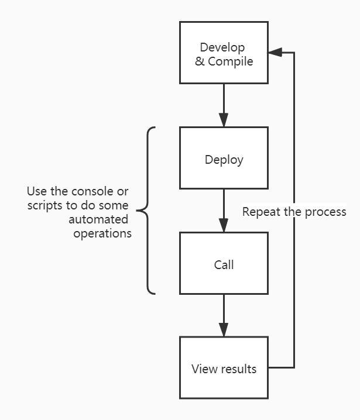

# Console

Redspot provides a powerful console that allows you to use commands and contracts to do operations, and you can also call scripts located in the scripts directory to do repetitive tasks. Redspot's console also has many rich features, such as:

* Provides powerful Tab completion capabilities.
* The console records the command history. You can view the cache/console-history.txt file to get the history execution commands, or you can find the required history commands by pressing the`↑`button. In the future, the console will also provide the function of shortcut keys indexing history commands.
## Start the console

```bash
$ npx redspot console
## If you are sure that the contract compiled in the ``artifacts`` directory meets your expectations, you can add the --no-compile argument to not compile the contract
$ npx redspot console --no-compile
```

If you run the the `.help` command to see the corresponding help information.

```bash
> .help
.break    Sometimes you get stuck, this gets you out
.clear    Alias for .break
.editor   Enter editor mode
.exit     Exit the repl
.help     Print this help message
.load     Load JS from a file into the REPL session
.save     Save all evaluated commands in this REPL session to a file
> 
```

## Common commands

The console imports the components for contract interaction under the Redspot library by default, such as：

* patract
* network

Consistent with the scripts in the scripts directory, many functions can be called through these components, such as interacting with the contract, querying information, and viewing the network.

## Common workflow

If you want to debug the erc20 contract, after the contract is compiled, you can see the erc20.json and erc20.wasm files in the artifacts directory. Operations related to loading the contract need to be marked with the file name here.

If you imitate the deploy.ts deployment script in the scripts directory, you can directly execute the command to deploy the contract and invoke it on the console.

```typescript
var factory = await patract.getContractFactory('erc20'); // erc20 is the same as the filename
var contract = await factory.deployed('new', 10000000); // upload the code and instantiate this contract
```
If the address of a contract is known, and you want to load this contract instance first, you can use the following way.
```typescript
var factory = await patract.getContractFactory('erc20'); // erc20 is the same as the filename
var contract = await factory.attach('16DHBsUan9GoedoTYJmbyBZJMmN39ZpKUPvYeAGMTXCgxLQe'); // load the contract address'); // load the contract address
```

At this time, the contract object here is an instantiated object. Later, you can directly use this contract object to interact with the contract, such as calling a transfer function.

```typescript
var ret = await contract.transfer("15Jbynf3EcRqdHV1K14LXYh7PQFTbp5wiXfrc4kbMReR9KxA", 100)
ret.events // print the information of events
```

Get the result of executing a method by RPC call.

```typescript
var ret = await contract.balanceOf("15Jbynf3EcRqdHV1K14LXYh7PQFTbp5wiXfrc4kbMReR9KxA")
ret.output.toString()
```

If this process is relatively fixed, you can write the above command into a file and put it in the scripts directory, for example, named it scripts/do_something.ts.

```typescript
var factory = await patract.getContractFactory('erc20');
var contract = await factory.deployed('new', 10000000); 
var ret = await contract.transfer("15Jbynf3EcRqdHV1K14LXYh7PQFTbp5wiXfrc4kbMReR9KxA", 100)
ret.events
```

Then use the following commands to automate a series of processes.

```typescript
.load scripts/do_something.ts
```

In summary, the auxiliary functions of the console are as follows.




