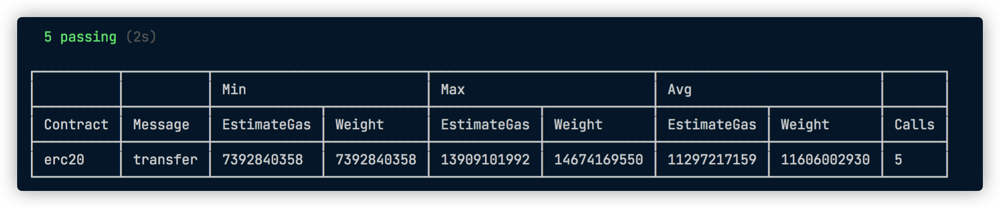

# @redspot_gas-reporter plug-in

## What

The plug-in will print out the gas usage of the transaction of the called contract when the test is completed.



## Installation
```
$ yarn add @redspot/gas-reporter
```
Add this to your `redspot.config.ts`:
```typescript
import '@redspot/gas-reporter'
```

## Usages

Once you have imported this plugin in `redspot.config.ts`, it will automatically print out gas usage of the transaction of the called contract when the test is completed


