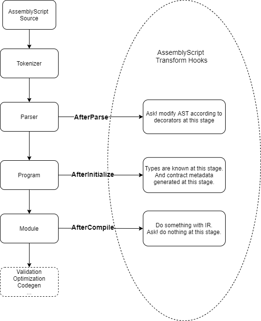

# 什么是Ask! 智能合约编程

## 背景信息

Ask! 是一个由Patract设计的基于AssemblyScript编程语言，能运行于`pallet-contracts`模块上的Wasm合约语言框架。

从非严格意义上说，AssemblyScript语法是TypeScript语法的一个子集。目前市场上存在大量使用TypeScript的开发人员，这些开发人员学习AssemblyScript的成本相对较低， 因此Patract认为基于AssemblyScript的Ask!项目具有很好的应用开发前景。与基于Rust的ink!相比，Ask!可以有效降低合约开发者的学习门槛，吸引更多的TypeScript开发者来开发智能合约，使智能合约生态系统更加丰富。

Ask! 实现方式和ink!类似，采取Rust宏设计，通过eDSL来实现智能合约。通过在AssemblyScript（简称AS）中编写编译器Transform来提供自定义的装饰器（在其他语言中也称为注解），在AS的语法基础上提供了能适用于`pallet-contracts`合约模型上的功能。通过注解的这种实现方式，尽量隐藏了与合约相关的细节。另一方面Ask! 的实现将借鉴部分ink! 的思路，力图在最终实现上将会最大程度保证与ink! 合约的兼容。例如ink! 描述合约的外部调用接口采用`#[ink(constructor)]`， `#[ink(message)]` 对合约结构体的方法进行修饰。
在Ask! 中，将会采用 `@constructor`、`@message` 等装饰器来装饰智能合约类定义的方法来实现类似的功能。

## Ask! 编译运作方式

Ask! 通过编写AssemblyScript的Transform来介入编译流程，流程图如下所示。

## 更多信息

Ask! 目前还在开发中，只完成了Kusama财政议案的v0.2版本。当前的很多设计将来都有可能发生不兼容性改变。

<!-- TODO： 添加议案链接及报告链接。 -->

## Ask!议会提案报告

- [v0.1Report](./reports/v0.1Report.md)
- [v0.2Report](./reports/v0.2Report.md)
