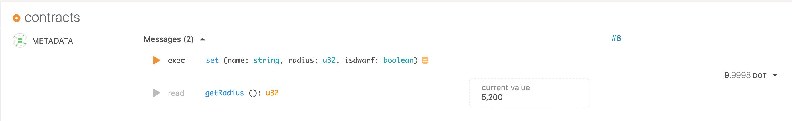

## Ask! v0.1 报告
概述  

十周之前, [Patract Hub](https://patract.io)提交了Ask! v0.1的[国库提案 #66](https://kusama.polkassembly.io/treasury/66). 这个提案的目标是提供一套基于AssebmlyScript(AS)的合约编程框架.  

在这份提案中, 我们承诺在v0.1版本中完成以下功能:

> **v0.1目标: 能够使用AS编写可运行于FRAME Contract Pallet的合约**
>
> * 定义合约中使用的`@contract`, `@storage`, `@constructor`, `@message`注解的意义及生成代码逻辑.
> * 封装runtime API, 提供编写合约的组件: `AccountId`, `Block`, `Crypto`, `Gas`等.
> * PreProcessor能够解析`@contract`, `@storage`, `@message`, `@constructor`四个注解, 生成对应的代码.
> * PreProcessor能够生成以上四个注解的`metadata.json`内容.
> * Ask!合约能够在FRAME Contract Pallet上运行.

> **v0.1验证方式: Gighub源码 & 合约范例**
>
> * 能够在合约中存取基本数据类型: `u8`/`i8`, `u16`/`i16`, `u32`/`i32`, `u64`/`i64`, `u128`/`i128`, `string`, `bool`，不包含集合类型。
> * 能够定义可调用的`messages`。
> * 能够生成完整格式的`metadata.json`文件。
> * 能够生成正确的Wasm代码。

到目前为止, 我们已经实现了除array/map数据类型存取功能之外的其它所有提案内容. 由于array/map涉及到scale-info项目中生成metadata.json的规则, 但是这个生成规则在ink!项目没有公开的规范文档可供参考, 所以对于array/map的支持需要延后实现.

我们已经实现的源码在[Ask!](https://github.com/patractlabs/ask)项目仓位中, 示例合约在[examples](https://github.com/patractlabs/ask/tree/master/examples)目录下.  

## 设计与实现
Ask!的设计出发点是使用注解的方式, 简化合约编写过程, 将合约的业务逻辑与合约Rumtime分离; 同时, 注解及其子注解也被用来生成合约的metadata.json文件.

在合约Runtime层, Ask!提供了`AccountId`, `Block`, `Crypto`, `Gas`等对象. 这些对象将底层逻辑和API调用封装起来, 提供上层语义和方法, 供编写合约和Preprocessor展开注解时使用.

在Preprocessor层面, 它需要将编写好的合约，编译成目标合约WebAssembly字节码。 

从编译器的角度来看, Preprocessor的工作分以下几个步骤(示例中使用的代码选自下面`如何使用Ask! v0.1`):  

1. 通过`asc`将合约编译为Program对象，以获取代码语法信息。
  * 代码是按照合约结构编写的程序，因此通过编译，可以获取程序的语法信息。

2. Program编译后，可以获取程序的语义信息. 通过分析语义信息里面的注解，获取合约中需要代码注入的点和合约的结构信息。
  * `@contract`注解表明class是一个合约入口。
  * `@storage`注解表明class对象是一个合约存储对象。
  * `@message`注解表明这个method是一个可供外部调用的合约方法。
  * `@constructor `注解表示这是一个合约构造方法， 能够通过设置不同参数实例化合约。

3. 针对不同的注解，获取需要生成目标合约代码的相关结构信息。
  * 当一个class含有注解`@contract`,如： 
  
  ``` typescript
    @contract
    class SolarSystem {
    }
  ```
  那么获取此类注解为`@constructor`的方法:
    
  ```typescript 
    @constructor
    default(name: string = "Earth", radius: u32 = 6300, isdwarf: boolean = false): void {
        this.stored.name = name;
        this.stored.radius = radius;
        this.stored.isdwarf = isdwarf;
    }
  ```
  通过语义信息，可以获取default函数的`FunctionPrototype` 信息，通过解析`FunctionPrototype`对象可以获取Function的描述信息`declaration`。然后获取方法名methodName, 方法的参数列表和返回值等函数信息 `FunctionDef`。
  
  ```typescript
    export class FunctionDef {  
        private funcProto: FunctionPrototype;
        methodName: string = "";
             parameters: ParameterNodeDef[] = new Array();
         isReturnable: boolean = false;
         returnType: NamedTypeNodeDef | undefined;
    }
  ```
  根据导出的`FunctionDef`信息，通过`Handlebar`渲染main.tpl（如下），生成deploy函数。通过模板的方式，可以方便的调整，deploy函数结构和实现。
    
  ```typescript
    export function deploy(): i32 {
      let {{contract.instanceName}} = new {{contract.className}}();
       {{#each contract.cntrFuncDefs}}
        const {{methodName}}Selector: u8[] = {{#selector methodName}}{{u8Arr}}{{/selector}};
              if (msg.isSelector({{methodName}}Selector)) {
          {{#neq parameters.length 0}}
          const fnParameters = new FnParameters(msg.data);
           {{/neq}}
        {{#each parameters}}
        let p{{_index}} = fnParameters.get<{{type.codecType}}>();
        {{/each}}
        {{../contract.instanceName}}.{{methodName}}({{#joinParams parameters}}{{/joinParams}}{{ctrDefaultVals}});
        }
      {{/each}}
      return 0;
    }
  ```

  渲染后得到的deploy方法

  ```typescript
    export function deploy(): i32 {
      let solarSystem = new SolarSystem();

     const defaultSelector: u8[] = [0xed,0x4b,0x9d,0x1b];
      if (msg.isSelector(defaultSelector)) {
        const fnParameters = new FnParameters(msg.data);
        let p0 = fnParameters.get<ScaleString>();
        let p1 = fnParameters.get<UInt32>();
        let p2 = fnParameters.get<Bool>();
        solarSystem.default(p0.toString(),p1.unwrap(),p2.unwrap());
      }
      return 0;
    }
  ```

  同理，获取注解为`@message`的方法，通过分析`FunctionPrototype`获取方法名，方法的参数列表和返回值等信息, 生成`call`入口函数的调用分发逻辑。
    
  * 当一个class标记`@storage`。 需要获取class中field信息。通过分析`FieldPrototype`获取字段参数名，字段类型等信息`FieldDef`, 其中storeKey用来存储对象key。key会经过blake2算法hash生成。
   
  ```typescript
    export class FieldDef {
       protected fieldPrototype: FieldPrototype;
        layout: LayoutDef = new LayoutDef();
        name: string = "";
        type: NamedTypeNodeDef | null = null;
        storeKey: string = "";
        varName: string = "";
        path: string = "";
    }
  ```
  
  这个地方需要对field进行包装，原始的是TypeScript基本类型，i8/u8等。需要包装成codec的IInt8， Uint8类型等。方便存储和读取时进行序列化和反序列化。 然后为每个field生成符合读写要求的getter/setter方法。同样通过`Handlebar`渲染模板生成。模板如下：
  
  ```typescript
      class {{className}} {
        {{#each fields}}
        private {{varName}}: {{type.codecType}} | null = null;
          {{/each}}
          {{#each fields}}
          get {{name}}(): {{type.originalType}} {
            if (this.{{varName}} === null) {
              const st = new Storage<{{type.codecType}}>("{{storeKey}}");
              this.{{varName}} = st.load();
            }
            {{#eq type.codecType 'ScaleString'}}
            return this.{{varName}}!.toString();
            {{/eq}}
            {{#neq type.codecType 'ScaleString'}}
              return this.{{varName}}!.unwrap();
            {{/neq}}
          }
          set {{name}}(v: {{type.originalType}}) {
            this.{{varName}} = new {{type.codecType}}(v);
            const st = new Storage<{{type.codecType}}>("{{storeKey}}");
            st.store(this.{{varName}}!);
          }
          {{/each}}
        }
  ```
  生成的代码： 
     
  ``` typescript
      class Planets {
          private _name: ScaleString | null = null;
          private _radius: UInt32 | null = null;
        private _isdwarf: Bool | null = null;
          get name(): string {
            if (this._name === null) {
              const st = new Storage<ScaleString>("Planetsname");
              this._name = st.load();
            }
          return this._name!.toString();
          }
          set name(v: string) {
            this._name = new ScaleString(v);
            const st = new Storage<ScaleString>("Planetsname");
            st.store(this._name!);
          }
          get radius(): u32 {
            if (this._radius === null) {
              const st = new Storage<UInt32>("Planetsradius");
              this._radius = st.load();
            }
              return this._radius!.unwrap();
          }
          set radius(v: u32) {
            this._radius = new UInt32(v);
            const st = new Storage<UInt32>("Planetsradius");
            st.store(this._radius!);
          }
          get isdwarf(): boolean {
            if (this._isdwarf === null) {
              const st = new Storage<Bool>("Planetsisdwarf");
              this._isdwarf = st.load();
            }
          return this._isdwarf!.unwrap();
          }
          set isdwarf(v: boolean) {
            this._isdwarf = new Bool(v);
            const st = new Storage<Bool>("Planetsisdwarf");
            st.store(this._isdwarf!);
          }
        }
  ```

  * 展开所有的注解, 生成最终可供编译的合约文件.

4. 根据合约结构信息，通过模板引擎生成metadata.json文件  
  * 根据不同的合约结构信息，生成metadata.json中各section的代码. 通过`@storage`对象信息生成metadata.json中`storage`字段的信息; 通过`@message`生成`messages`字段的信息; 通过`@constructor`生成`constructor`字段的信息等. 代码生成逻辑通过`Handlebar`模板引擎完成, 当目标代码结构需要调整时，只需调整模板即可。

5. 编译展开后的合约文件，生成合约wasm字节码。
  * 通过`asc`对展开后的目标代码进行编译， 编译命令：`asc --importMemory --initialMemory 2 --maximumMemory 16 --noExportMemory --runtime half --use abort= extension.ts -O2 -b target.wasm `，获取可以在wasm虚拟机运行的字节码。

从合约开发者的角度来看, 从调用`ask`命令开始, Preprocessor的工作流程如下:
```text
                               +-------------+
                           +-->+metadata.json|
                           |   +-------------+
                           |
   +-----------------+     |
   | ./ask sample.ts +-----|
   +-----------------+
                           |   +------------+       +------------+
                           +-->+extension.ts+------->target.wasm |
                               +------------+       +------------+
```

下面我们将通过一个实例来说明如何使用Ask! v0.1编写合约.

## 使用Ask! v0.1
Ask!项目尚末发布, 所以我们需要将源码clone到本地.  
`git clone https://github.com/patractlabs/ask`  

在项目中, 我们已经在examples目录下, 建立了`flipper`和`increment`两个项目供大家参考, 下面我们将用一个新的项目`solar`来说明怎样使用Ask!, 完整的源代码位于`example/solar/`目录下.
* 编写合约
    * 定义storage需要存储的内容  
    `@storage`注解使用于class, 表示这个class中定义的数据成员是state variable, 对这些数据成员的读写操作需要进行持久化保存.
    ```typescript
    @storage
    class Planets {
        name: string;
        radius: u32;
        isdwarf: boolean;
    }
    ```
    上面的代码定义了一个storage, 它具有`name`, `radius`, `isdwarf`三个变量.  
    * 编写contract内容  
    `@contract`注解使用于class, 表示这个class是合约的入口. Ask!只支持单一的合约入口.  
    `@constructor`注解使用于method, 表示这个方法只在调用合约交易`instantiate`或`instantiate_with_code` 时被触发, 可以调用来设置部分初始化参数.  
    `@message`注解使用于method, 表示这个方法在调用合约交易`call`时调用.

    ```typescript
    @contract
    class SolarSystem {
        protected stored: Planets;

        constructor() {
            this.stored = new Planets();
        }

        @constructor
        default(name: string = "Earth", radius: u32 = 6300, isdwarf: boolean = false): void {
            this.stored.name = name;
            this.stored.radius = radius;
            this.stored.isdwarf = isdwarf;
        }

        @message
        set(name: string, radius: u32, isdwarf: boolean): void {
            if (this.stored.name != name) {
                this.stored.name = name;
                this.stored.radius = radius;
                this.stored.isdwarf = isdwarf;
            }
        }

        @message(mutates = false, selector = "0x0a0b0c0d")
        getRadius(): u32 {
            return this.stored.radius;
        }
    }
    ```
    
* 编译合约  
  编译合约需要在终端环境下进行, 打开一个终端, 进入到ask项目目录下。在编译合约之前, 首先需要安装编译依赖, 执行以下命令安装依赖项目

   ```bash
  npm install
   ```

  依赖项目安装完成之后, 执行以下命令进行编译:  

  ```bash
  ./assembly/codegen/bin/ask examples/solar/solar.ts
  ```

  编译成功之后, 将会在`example/solar/`目录下生成以下结构的文件:  

  ```bash
  .
  ├── extension.ts
  ├── solar.ts
  └── target
      ├── metadata.json
      └── target.wasm
  ```

  其中`extension.ts`文件是合约`solar.ts`中所有注解展开之后的文件, `target/metadata.json`和`target/target.wasm`是编译生成的abi和wasm文件.
* 部署和调用  
我们在[Europa](https://github.com/patractlabs/europa)沙盒环境中部署和测试合约功能, 前端使用[polkadot-js](https://github.com/polkadot-js/apps)作为交互界面.  
测试步骤如下:  
1. 首先我们按照`Europa`和`plokadot-js`的说明, 启动节点和服务.  

2. 在`polkadot-js`的合约界面中, 上传`solar/target`下的`metadata.json`和`target.wasm`文件.  


3. 部署已经上传的合约.  
按照操作流程, 我们将`solar`合约部署到Europa节点.  

部署成功之后, 将会得到以下结果:  


4. 调用`set`方法, 设置新的`radius`值.  
之后, 我们调用`set`方法, 并设置`name`为`Mars`, 设置`radius`的值为`5200`. 成功执行之后, `getRadius`方法将会返回新的`radius`值.


至此, 我们完成了合约上传, 部署, 调用操作, 并得到了预期的结果.

## Ask! v0.1已经实现的内容
如上所述, 我们已经实现了提议中除array/map之外的所有内容.  
同时v0.2版本的设计已经完成, 请参考[v0.2版本开发计划](https://github.com/patractlabs/proposals/blob/main/%E6%8F%90%E6%A1%88/As-ink/v0.2ProposalCN.md).  
