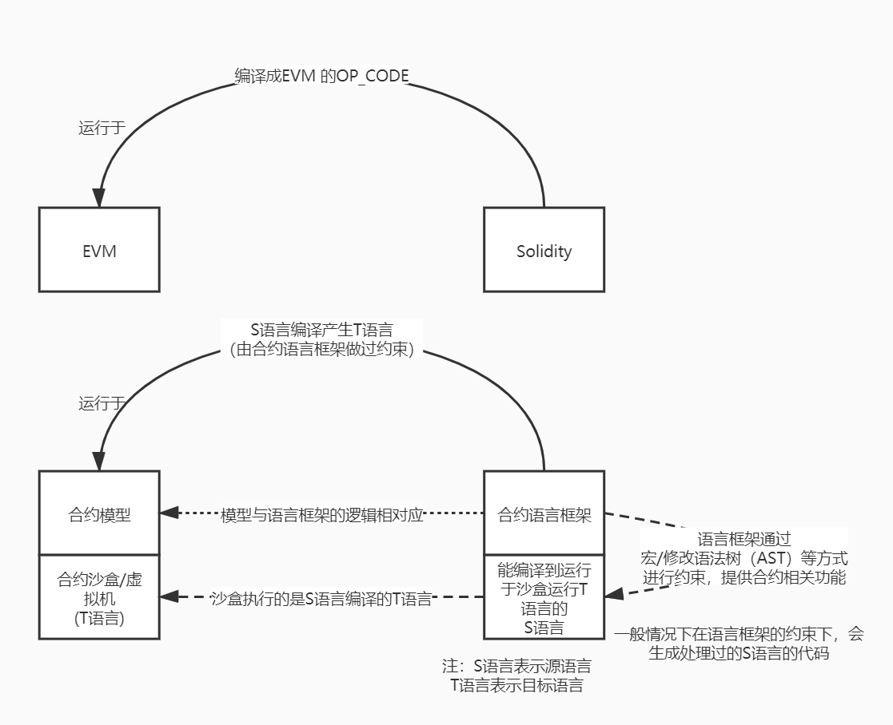

## 背景信息

与合约模型的概念相对应的，可以衍生出合约语言的概念。在上一章节中我们已经拆分出了合约沙盒与合约模型的结构层次。在实际应用中，一些新型的合约平台并不像EVM那样发明了一套新的Solidity合约语言，而是选择了一些现有的语言，例如Rust、C++、AssemblyScript等语言。并基于这门语言在hack语法解析、宏等维度上给现有语言添加上合约相关的约束和功能逻辑等。因此许多情况下会以框架、库等形态存在，例如Frame Contract Pallet的Rust合约语言框架ink!。而这种框架、库又不是平时程序开发中使用库的维度，有一些合约语言需要修改到编译器维度，因此我们有时候也称其为合约语言框架。

## **合约语言与合约模型的对应关系**



如上图所示，上半部分描述了EVM与Solidity之间的关系。EVM和Solidity提出的时间较早，且其模型与通常的计算机虚拟机与语言的模型关系是一致的。而下半部分是在分离了合约模型后，语言部分的对应关系。在这里重点介绍图中下半部分，上半部分您可以根据自己在以太坊合约开发的经验对比后文的介绍进行分析。

在编译型语言的体系中，为方便后文介绍，先简单定义以下名词（非严谨说法）：

* S语言：程序员编写代码的原语言（Source），例如将C++编译成汇编，那么C++就是原语言S。
* T语言：原语言通过编译器编译后产生的语言（Target），例如将C++编译成汇编，那么汇编就是目标语言T。

前文介绍了运行合约体系的环境可以在逻辑上拆分为合约模型和合约虚拟机。合约模型管理合约的业务逻辑，合约虚拟机管理如何运行合约的代码，那么相对应的，合约语言部分同样可以拆分为合约语言和编译到合约虚拟机的S语言。

根据这种定义，显然Solidity是一种同时具备合约语言和S语言特性的产物。

1. Solidity具备图灵完备的语言体系，因此Solidity是一门语言（相对于BTC脚本而言）。
2. Solidity的语法中具备很多合约特性的关键字，对应于合约语言的概念。例如：
| 关键字                    | 说明                     |
|:----|:----|
|mapping|合约存储的典型案例<|
|msg.sender、msg.value|与合约调用相关的变量|
|view、pure|修饰符，起修饰作用|
|call、delegate_call|与合约调用相关关键字|

上述概念并非是为了支持Solidity语言能执行逻辑而存在的，而是为了服务于以太坊合约虚拟机的业务逻辑而存在的。

合约语言实现的目的是为了与合约模型的业务逻辑所对应，什么样的合约模型就需要什么样的合约语言。例如EVM底层是K/V类型的存储，因此Solidity中设计的`mapping`不能遍历,除非附带多余存储。EVM合约交互的合约模型设计为合约调用合约的模式，那么Solidity中就提供了`call`、`delegate_call`关键字。对应到其他合约体系也同理。

合约语言是架设到S语言上的附加功能，因此合约语言提供的功能最终也是编译到S语言对应的T语言上。而区块链所需要的一些特性，例如确定性要求和不允许使用操作系统调用的接口特性，会在这个层面上做约束。因此合约语言除了本身对S语言本身提供了合约模型的功能以外，还需要给语言本身产生一定的约束，这一步也是开发和理解合约语言中比较困难的地方。同时也正是因为此，造成了合约开发者在使用合约模型框架的过程中，产生了诸多不适。Solidity、Move等语言本身是针对合约平台开发的新语言，虽然在语法上有模拟其他语言的痕迹，但是在做约束的方面，对合约开发者更友好。而对现有语言加上合约语言功能的合约语言，在这一方面处理的不是很好，这也是造成合约开发者较难使用框架功能的原因之一。

以ink!为例：

* 在区块链中应该避免使用float，因为浮点数可能产生不确定性行为。因此在合约/runtime开发中，如果需要使用浮点数，或者出现溢出数字乘除的时，需要引入定点数来处理。因此在ink!的合约中可以引入Substrate runtime提供的定点数的库来处理。
* 由于`pallet-contracts`的合约模型与EVM基本相同，因此`pallet-contracts`的合约存储也是由K/V构成。那么合约模型框架就需要处理标准库里提供的各类集合类型。因此在ink!中将标准库中可能用到的集合类型重写了一遍，添加了能将集合元素类型处理成K/V数据的过程。因此在ink!的合约存储中，如果设计了集合类型，那么只能使用ink!标准库中提供的类型。而另一方面由于ink!的返回值需要导出metadata令第三方处理，而当前的metadata的接口实现只给标准库中的集合实现，因此ink!方法的返回值的集合只能使用标准库的集合类型。代码示例如下。

    ```rust
    #[ink::contract]
    mod test {
        // 引入 ink 实现的 Vec
        use ink_storage::collections::Vec as StorageVec;
        // 引入标准库的Vec
        use ink_prelude::vec::Vec;
        #[ink(storage)]
        pub struct Test {
            owners: StorageVec<AccountId>, // 只能使用 ink的Vec
        }
        impl Test {
            #[ink(message)]
            pub fn get_owners(&self) -> Vec<AccountId> {
                // 将 ink 实现的 Vec 转换为 标准库实现的 Vec
                self.owners.iter().map(Clone::clone).collect()
            }
        }
    }
    ```

综上所述，在模型结构上：

* 合约语言与合约模型是对应关系，合约语言的特性会与合约模型一 一匹配。
* 合约语言为S语言提供了针对合约模型的业务功能，同时也针对合约业务逻辑的需求对S语言本身有约束。

因为Solidity本身定位是服务于写合约而设计出来的语言，所以很多与合约相关的功能可以设计为关键字。如果一门语言本身并不是针对合约设计的，那么需要基于这门合约设计对应于合约模型的合约语言。因为是在这门语言上添加新的功能，所以一般情况下很难与语言本身结合的比较深入，最后做到的成果与这门语言提供的拓展语法树的能力相关。如果语言本身提供了越灵活修改或添加语法树的接口（宏、插件等），那么合约语言就可以实现越多的功能。如果语言本身提供这类可扩展性的功能较少，那么合约语言只能考虑修改编译器和扩展需要的语法来支持合约模型，这样最后的语言就变成了原语言的一种方言了。因此前者可以以库/框架的形态存在，而后者则变为了一门新的语言，这也是将这种模型称为合约语言的原因。

## `pallet-contracts`与对应的合约语言


有了合约语言的模型的概念后，我们可以把合约模型框架嵌套在Substrate的Wasm合约系统上了。

ink!整套系统的实现，是与`pallet-contracts`的合约模型相对应的。ink! 3.0通过过程宏（2.0通过声明宏）的系统，将对应于`pallet-contracts`的功能逻辑引入到了Rust中。因此这套系统里的S语言就是Rust，而T语言就是Wasm字节码。ink!借助于辅助工具`cargo-contract`，把使用了ink!框架的Rust代码编译成为了合约的Wasm字节码。而Wasm字节码在链上运行的环境就是wasmi，将来也会引入Wasmtime等JIT形式的运行环境。

而因为`pallet-contracts`的执行环境是Wasm字节码，所以能够编译成Wasm字节码的的语言配套上符合`pallet-contracts`合约模型的合约语言，都可以产生能运行于`pallet-contracts`这个合约平台上的合约。对`pallet-contracts`而言，完全可以设计出不同语言的合约体系供您选择，您可以使用不同的语言开发Wasm合约。

## 更多信息

当前支持运行于`pallet-contracts`的合约语言除了对于Rust的ink!之外，还有以下项目：

* Ask!： 由Patract主导开发，在AssemblyScript语言上的合约语言（正在开发中）。
* Solang：由hyperledger-labs主导开发，支持将Solidity编译到`pallet-contracts`的Wasm的工具。

