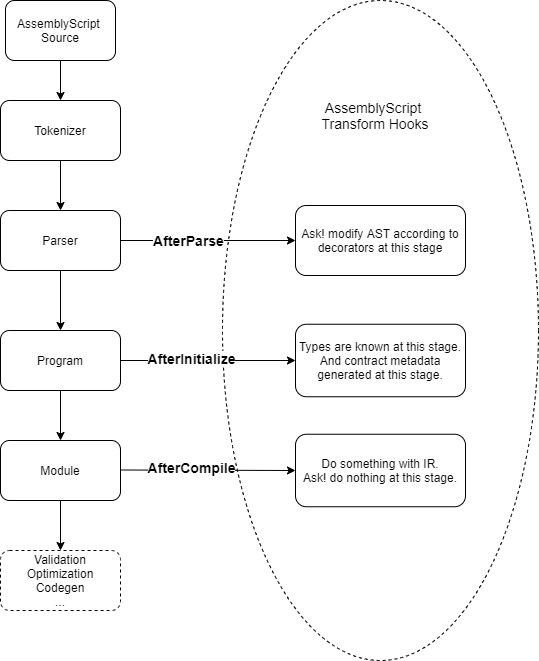

# Ask! Smart Contract Programming

Ask! is a Wasm contract language framework designed by Patract based on AssemblyScript and running on the `pallet-contracts` module.

Although AssemblyScript syntax is only a (non-strict) subset of TypeScript syntax, there are currently a large number of developers who use TypeScript as a development language, so the cost of learning AssemblyScript for these developers is relatively low. Therefore, Patract believes that the Ask! project based on AssemblyScript has a good application development prospect. Compared with Rust-based ink!, Patract believes that Ask! can effectively lower the threshold for contract developers, attract TypeScript developers to develop smart contracts, and enrich the smart contract ecosystem.

Ask!’s implementation is similar to ink!’s rust macro design, and smart contracts are implemented through eDSL. Provide custom decorators (also called annotations in other languages) by writing the compiler Transform in AssemblyScript (hereinafter referred to as AS), and provide a model that can be applied to the `pallet-contracts` contract based on the syntax of AS On the function. Through the implementation of annotations, the details related to the contract are hidden as much as possible. On the other hand, the realization of Ask! will learn from some ink! ideas, and strive to ensure maximum compatibility with the ink! contract in the final implementation.

> For example:
> ink! describes the external call interface of the contract using `#[ink(constructor)]`, `#[ink(message)]` to modify the method of the contract structure.
> In Ask!, decorators such as `@constructor` and `@message` will be used to decorate the smart contract class definition methods to achieve similar functions.

## Ask! How the compilation works

Ask! is involved in the compilation process by writing AssemblyScript transforms, as follows:

## Ask! Development progress

**Ask! is currently under development, and currently only the v0.2 version of the Kusama financial proposal has been completed. Many current designs may undergo incompatibility changes in the future. **
