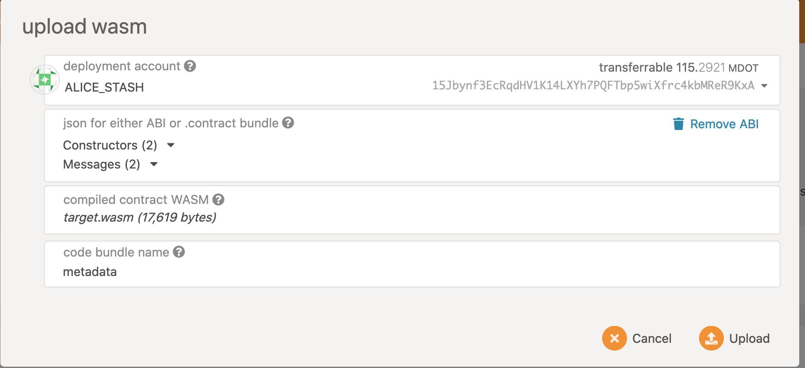
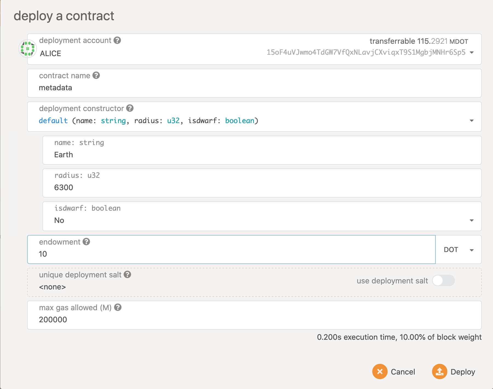
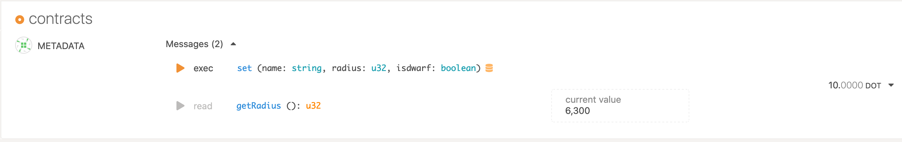

# Report for Ask! v0.1
Ten weeks ago, [Patract Hub](https://patract.io) submitted the [Treasury Proposal #66](https://kusama.polkassembly.io/treasury/66) for Ask! v0.1. The goal of this proposal is to provide a contract programming framework based on AssemblyScript (aka AS). In this proposal, we promise to complete the following functions in the v0.1:

> **v0.1 Target: being able to use AS to write contracts that can run on FRAME Contract Pallet**
>
> * Define the meaning of `@contract`, `@storage`, `@constructor`, `@message` annotations and code generation logic used in the contract.
> * Encapsulate the runtime API and provide components for writing contracts: `AccountId`, `Block`, `Crypto`, `Gas`, etc.
> * `PreProcessor` can parse the four annotations `@contract`, `@storage`, `@message`, `@constructor`, and generate the corresponding code.
> * PreProcessor can generate the content of `metadata.json` with the above four annotations.
> * The Ask! contract can run on FRAME Contract Pallet.

> **v0.1 Verification: GitHub source code & contract example**
> * The basic data types can be stored and called in the contract: `u8`/`i8`, `u16`/`i16`, `u32`/`i32`, `u64`/`i64`, `u128`/`i128 `, `string`, `bool`, without collection types.
> * Ability to define callable `messages`.
> * Able to generate a full format `metadata.json` file.
> * Able to generate correct Wasm code.

So far, we have implemented all the content of the proposal except the array&map data type access function. Because array&map involves the rules for generating metadata.json in the scale-info project, but this generation has no public specification documents for reference in ink!, so the support for array&map needs to be implemented later. We had contacted Robin from ink!, and this issue is on his agenda.

The source code we have implemented is in the [Ask!](https://github.com/patractlabs/ask) repo, and the example contract is in [examples](https://github.com/patractlabs/ask/tree/master/ examples) directory.

## Design and Implementation of v0.1
Ask!'s design starting point is to use annotations to simplify the contract writing process and separate the business logic of the contract from the contract runtime; at the same time, annotations and their sub-annotations are also used to generate the metadata.json file of the contract.

At the contract runtime layer, Ask! provides objects such as `AccountId`, `Block`, `Crypto`, `Gas`. These objects encapsulate the underlying logic and API calls, and provide upper-level semantics and methods for writing contracts and preprocessors. 

At the Preprocessor level, it needs to compile the written contract into the target contract WebAssembly bytecode.

From the perspective of the compiler, the work of Preprocessor is divided into the following steps (the code used in the example is selected from the following `How to use Ask! v0.1`):

1. Use `asc` to compile the contract into a Program object to obtain code syntax information.
  * The code is a program written in accordance with the contract structure, so the syntax information of the program can be obtained through compilation.

2. After the Program is compiled, the semantic information of the program can be obtained. By analyzing the annotations in the semantic information, the points in the contract that require code injection and the structural information of the contract can be obtained.
  * The `@contract` annotation indicates that the class is a contract entry.
  * The `@storage` annotation indicates that the class object is a contract storage object.
  * The `@message` annotation indicates that this method is a contract method that can be called externally.
  * The `@constructor` annotation indicates that this is a contract construction method, which can instantiate the contract by setting different parameters.

3. For different annotations, obtain the relevant structural information that needs to generate the target contract code.
  * When a class contains the annotation `@contract`, such as:

  ``` typescript
    @contract
    class SolarSystem {
    }
  ```

Then the method of getting annotation as `@constructor`:
    
  ```typescript 
    @constructor
    default(name: string = "Earth", radius: u32 = 6300, isdwarf: boolean = false): void {
        this.stored.name = name;
        this.stored.radius = radius;
        this.stored.isdwarf = isdwarf;
    }
  ```

Through semantic information, the `FunctionPrototype` information of the default function can be obtained, and the description information `declaration` of the Function can be obtained by parsing the `FunctionPrototype` object. Then get the function information of `FunctionDef` such as methodName, method parameter list and return value.

  ```typescript
    export class FunctionDef {  
        private funcProto: FunctionPrototype;
        methodName: string = "";
             parameters: ParameterNodeDef[] = new Array();
         isReturnable: boolean = false;
         returnType: NamedTypeNodeDef | undefined;
    }
  ```

According to the exported `FunctionDef` information, the main.tpl (see below) is rendered through `Handlebar` to generate the deploy function. In the way of templates, you can easily adjust, deploy function structure and implementation.
    
  ```typescript
    export function deploy(): i32 {
      let {{contract.instanceName}} = new {{contract.className}}();
       {{#each contract.cntrFuncDefs}}
        const {{methodName}}Selector: u8[] = {{#selector methodName}}{{u8Arr}}{{/selector}};
              if (msg.isSelector({{methodName}}Selector)) {
          {{#neq parameters.length 0}}
          const fnParameters = new FnParameters(msg.data);
           {{/neq}}
        {{#each parameters}}
        let p{{_index}} = fnParameters.get<{{type.codecType}}>();
        {{/each}}
        {{../contract.instanceName}}.{{methodName}}({{#joinParams parameters}}{{/joinParams}}{{ctrDefaultVals}});
        }
      {{/each}}
      return 0;
    }
  ```

The deploy method obtained after rendering:

  ```typescript
    export function deploy(): i32 {
      let solarSystem = new SolarSystem();

     const defaultSelector: u8[] = [0xed,0x4b,0x9d,0x1b];
      if (msg.isSelector(defaultSelector)) {
        const fnParameters = new FnParameters(msg.data);
        let p0 = fnParameters.get<ScaleString>();
        let p1 = fnParameters.get<UInt32>();
        let p2 = fnParameters.get<Bool>();
        solarSystem.default(p0.toString(),p1.unwrap(),p2.unwrap());
      }
      return 0;
    }
  ```

In the same way, to obtain the method annotated as `@message`, obtain the method name, method parameter list and return value and other information by analyzing the `FunctionPrototype`, and generate the call distribution logic of the `call` entry function.
    
  * When a class is marked with `@storage`. Need to get the field information in the class. By analyzing the `FieldPrototype` to obtain the field parameter name, field type and other information `FieldDef`, where storeKey is used to store the object key. The key will be generated by the blake2 hash.

  ```typescript
    export class FieldDef {
       protected fieldPrototype: FieldPrototype;
        layout: LayoutDef = new LayoutDef();
        name: string = "";
        type: NamedTypeNodeDef | null = null;
        storeKey: string = "";
        varName: string = "";
        path: string = "";
    }
  ```

The field needs to be packaged in this place. The original is TypeScript basic types, i8/u8, etc. need to be packaged into IInt8, Uint8 etc in codec, making it convenient to serialize and deserialize when storing and reading. Then generate getter/setter methods that meet the read and write requirements for each field. The same is generated by the `Handlebar` rendering template. The template is as follows:

  ```typescript
      class {{className}} {
        {{#each fields}}
        private {{varName}}: {{type.codecType}} | null = null;
          {{/each}}
          {{#each fields}}
          get {{name}}(): {{type.originalType}} {
            if (this.{{varName}} === null) {
              const st = new Storage<{{type.codecType}}>("{{storeKey}}");
              this.{{varName}} = st.load();
            }
            {{#eq type.codecType 'ScaleString'}}
            return this.{{varName}}!.toString();
            {{/eq}}
            {{#neq type.codecType 'ScaleString'}}
              return this.{{varName}}!.unwrap();
            {{/neq}}
          }
          set {{name}}(v: {{type.originalType}}) {
            this.{{varName}} = new {{type.codecType}}(v);
            const st = new Storage<{{type.codecType}}>("{{storeKey}}");
            st.store(this.{{varName}}!);
          }
          {{/each}}
        }
  ```

The generated code： 
     
  ``` typescript
      class Planets {
          private _name: ScaleString | null = null;
          private _radius: UInt32 | null = null;
        private _isdwarf: Bool | null = null;
          get name(): string {
            if (this._name === null) {
              const st = new Storage<ScaleString>("Planetsname");
              this._name = st.load();
            }
          return this._name!.toString();
          }
          set name(v: string) {
            this._name = new ScaleString(v);
            const st = new Storage<ScaleString>("Planetsname");
            st.store(this._name!);
          }
          get radius(): u32 {
            if (this._radius === null) {
              const st = new Storage<UInt32>("Planetsradius");
              this._radius = st.load();
            }
              return this._radius!.unwrap();
          }
          set radius(v: u32) {
            this._radius = new UInt32(v);
            const st = new Storage<UInt32>("Planetsradius");
            st.store(this._radius!);
          }
          get isdwarf(): boolean {
            if (this._isdwarf === null) {
              const st = new Storage<Bool>("Planetsisdwarf");
              this._isdwarf = st.load();
            }
          return this._isdwarf!.unwrap();
          }
          set isdwarf(v: boolean) {
            this._isdwarf = new Bool(v);
            const st = new Storage<Bool>("Planetsisdwarf");
            st.store(this._isdwarf!);
          }
        }
  ```

  * Expand all the annotations to generate the final contract file for compilation.

4. According to the contract structure information, the metadata.json file is generated through the template engine
   * According to different contract structure information, generate the code of each section in metadata.json. Generate the information of the `storage` field in metadata.json through the `@storage` object information; generate the information of the `messages` field through `@message`; Generate the information of the `constructor` field through `@constructor`. The code generation logic is completed by the `Handlebar` template engine. When the target code structure needs to be adjusted, you only need to adjust the template.

5. Compile the expanded contract file to generate the contract wasm bytecode.
   * Use `asc` to compile the expanded target code. Compile command: `asc --importMemory --initialMemory 2 --maximumMemory 16 --noExportMemory --runtime half --use abort= extension.ts -O2 -b target .wasm `, get the bytecode that can be run on the wasm virtual machine.

From the perspective of the contract developer, starting from calling the `ask` command, the workflow of the Preprocessor is as follows:
```text
                               +-------------+
                           +-->+metadata.json|
                           |   +-------------+
                           |
   +-----------------+     |
   | ./ask sample.ts +-----|
   +-----------------+
                           |   +------------+       +------------+
                           +-->+extension.ts+------->target.wasm |
                               +------------+       +------------+
```

Below we will use an example to illustrate how to write a contract using Ask! v0.1.

## How to use Ask! v0.1
The Ask! project is not yet released, so we need to clone the source code locally.`git clone https://github.com/patractlabs/ask`

In the project, we have established two projects `flipper` and `increment` in the examples directory for your reference. Below we will use a new project `solar` to illustrate how to use Ask!, the complete source code is located `example/solar/` directory.

1. Write the contract
  * Define what storage needs to store: The `@storage` annotation is used in the class to indicate that the data members defined in this class are state variables, and the read and write operations of these data members need to be persistently stored.
    ```typescript
    @storage
    class Planets {
        name: string;
        radius: u32;
        isdwarf: boolean;
    }
    ```
    The above code defines a storage, which has three variables: `name`, `radius`, and `isdwarf`.

  * Write contract content
    * The `@contract` annotation is used in the class, which means that this class is the entry point of the contract. Ask! only supports a single contract entry point.
    * The `@constructor` annotation is used in the method, which means that this method is only triggered when the contract transaction `instantiate` or `instantiate_with_code` is called, and can be called to set some initialization parameters.
    * The `@message` annotation is used in the method, which means that this method is called when calling the contract transaction `call`.

    ```typescript
    @contract
    class SolarSystem {
        protected stored: Planets;
    
        constructor() {
            this.stored = new Planets();
        }
    
        @constructor
        default(name: string = "Earth", radius: u32 = 6300, isdwarf: boolean = false): void {
            this.stored.name = name;
            this.stored.radius = radius;
            this.stored.isdwarf = isdwarf;
        }
    
        @message
        set(name: string, radius: u32, isdwarf: boolean): void {
            if (this.stored.name != name) {
                this.stored.name = name;
                this.stored.radius = radius;
                this.stored.isdwarf = isdwarf;
            }
        }
    
        @message(mutates = false, selector = "0x0a0b0c0d")
        getRadius(): u32 {
            return this.stored.radius;
        }
    }
    ```

2. Compile the contract

Compiling the contract needs to be carried out in the terminal environment. Open a terminal and enter the ask project directory. Before compiling the contract, you first need to install the compilation dependencies, execute the following command to install the dependent projects
   ```bash
  npm install
   ```

After the dependent project is installed, execute the following command to compile:

  ```bash
  ./assembly/codegen/bin/ask examples/solar/solar.ts
  ```

After successful compilation, files with the following structure will be generated in the `example/solar/` directory:

  ```bash
  .
  ├── extension.ts
  ├── solar.ts
  └── target
      ├── metadata.json
      └── target.wasm
  ```

Among them, the `extension.ts` file is the file after all the annotations in the contract `solar.ts` are expanded, and `target/metadata.json` and `target/target.wasm` are the abi and wasm files generated by compilation.

3. Deployment and calling

We deploy and test contract functions in the [Europa](https://github.com/patractlabs/europa) sandbox environment, using [polkadot-js](https://github.com/polkadot-js/apps) on the front end as an interactive interface. The test steps are as follows:
  * First, we follow the instructions of `Europa` and `plokadot-js` to start nodes and services.
  * In the contract interface of `polkadot-js`, upload the `metadata.json` and `target.wasm` files under `solar/target`.

  * Deploy the uploaded contract.
According to the operation process, we deploy the `solar` contract to the Europa node.

After successful deployment, you will get the following results:


  * Call the `set` method to set a new `radius` value.
After that, we call the `set` method, and set `name` to `Mars`, and set the value of `radius` to `5200`. After successful execution, the `getRadius` method will return the new `radius` value.


So far, we have completed the contract upload, deployment, and call operations, and got the expected results.

## About Ask! v0.2
As mentioned above, we have implemented everything in the proposal except array&map. At the same time, the v0.2 design has been completed, please refer to [Treasury proposal for Ask! v0.2](https://github.com/patractlabs /proposals/blob/main/%E6%8F%90%E6%A1%88/As-ink/v0.2ProposalCN.md).
