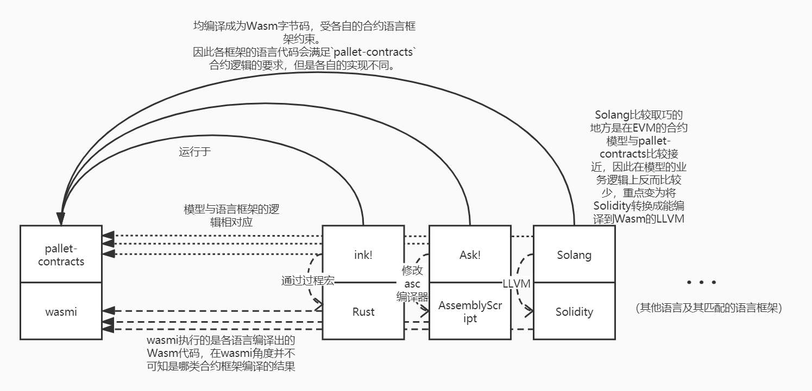

# Contract language (framework)
Corresponding to the concept of "contract model" (operating platform), we can derive the concept of contract language (framework) (writing code that can run on the platform).

Instead of simply using "contract language", we use words like "contract language (framework)" because we have separated the "contract sandbox" and "contract model" in the previous chapter. Structure level, so in fact, some new contract platforms did not "invent" a new Solidity contract language like EVM, but chose some languages ​​(such as Rust, C++, AssemblyScript, etc.) based on this language. "hack syntax analysis", "macro", and other dimensions add contract-related constraints and functional logic to existing languages. Therefore, in many cases, it will exist in the form of "frame", "library", etc. (such as Frame Contract Pallet's rust contract language framework ink!). And this "framework/library" is not the dimension of libraries used in usual program development. Some contract language frameworks need to be modified to the compiler dimension, so we prefer to call them "language frameworks".

## Correspondence between contract language (framework) and contract model


As shown in the figure above, the upper part is the relationship between EVM and Solidity. Since EVM/Solidity was proposed earlier, its model is consistent with the usual model relationship between computer virtual machines and languages. The lower part is the correspondence between the language framework part after separating the contract model.

Here we will focus on the second half. The readers of the first half can analyze according to their own experience in Ethereum contract development compared with the introduction in the following text.

In the system of compiled language, first simply define the following nouns (not rigorously speaking, defined only for the following introduction):

* S language: the original language (source) for programmers to write code, for example, to compile C++ into assembly, then C++ is the original language S
* T language: The language (target) produced after S language is compiled by a compiler, for example, if C++ is compiled into assembly, then assembly is the target language T

The previous article has introduced that the environment for running the contract system can be logically split into a "contract model" and a "contract virtual machine". The former manages the business logic of the contract, and the latter manages how to run the code of the contract, so the corresponding contract language The part can also be disassembled into "contract language framework" and "S language compiled into contract virtual machine".

According to this definition, it is clear that Solidity is a product that has the characteristics of both "contract language framework" and "S language":

1. Solidity has a Turing complete language system, so Solidity is a "language" (relative to the BTC script)
2. The grammar of Solidity has many keywords with contract characteristics, corresponding to the concept of "contract language framework", such as:

    * `mapping`: A typical case of contract storage
    * `msg.sender`, `msg.value`: variables related to contract calls
    * `view`, `pure` and other modifiers
    * `call`, `delegate_call` and other keywords related to contract calls

    These concepts do not exist to support the logic of the Solidity language, but to serve the business logic of the Ethereum contract virtual machine.
    
The purpose of the "contract language framework" is to correspond to the business logic of the contract model. What kind of contract model requires what kind of contract language framework. For example, the bottom layer of EVM is k/v type storage, so the `mapping` designed in Solidity cannot be traversed (unless extra storage is attached). For example, the contract model of EVM contract interaction is designed as a contract calling contract mode, so Solidity provides `call` and `delegate_call`. **The same applies to other contract systems**.

On the other hand, the contract language framework is an additional function built on the S language, so the functions provided by the contract language framework are ultimately compiled to the T language corresponding to the S language. Some of the features required by the blockchain, such as deterministic requirements, not allowed to use the interface called by the operating system, etc., will be **constrained** at this level. Therefore, the contract language framework not only provides the function of the contract model for the S language itself, but also needs to impose certain constraints on the language itself. This step is also a difficult place to develop and understand the contract language framework. At the same time, it is precisely because of this point that causes many awkward situations in the process of contract developers using the contract model framework. Languages ​​such as Solidity or Move are new languages ​​developed for contract platforms. Even though their grammar will have many traces of simulating other languages, they can be more friendly to contract developers in terms of constraints. However, it is difficult to deal with the contract language that adds the contract language framework function to the existing language, and this is one of the reasons why it is difficult for contract developers to use the framework function.

Take ink! for example:

1. Float should be avoided in the blockchain, because floating-point numbers may produce non-deterministic behavior. Therefore, in contract/runtime development, if you need to use floating-point numbers, or multiply and divide overflow numbers, you need to introduce fixed-point numbers for processing. Therefore, the fixed-point library provided by Substrate runtime can be introduced into the ink! contract for processing.
2. Since the contract model of `pallet-contracts` is basically the same as EVM, the contract storage of `pallet-contracts` is also composed of K/V. Then the contract model framework needs to deal with the various collection types provided in the standard library. Therefore, the collection types that may be used in the standard library are rewritten in **ink!**, and the process of processing the collection element types into K/V data is added. Therefore, in the ink! contract storage, if a collection type is designed, only the types provided in the ink! standard library can be used. On the other hand, since the return value of ink! needs to export metadata for third-party processing, and the current metadata interface implementation is only implemented for the collection in the standard library, so the collection of the return value of the ink! method can only use the collection of the standard library. Types of. So the following code will appear:

    ```rust,ignore
    #[ink::contract]
    mod test {
        // Introduce Vec realized by ink
        use ink_storage::collections::Vec as StorageVec;
        // Introduce the Vec of the standard library
        use ink_prelude::vec::Vec;
        #[ink(storage)]
        pub struct Test {
            owners: StorageVec<AccountId>, // Only ink's Vec can be used
        }
        impl Test {
            #[ink(message)]
            pub fn get_owners(&self) -> Vec<AccountId> {
                // Convert Vec implemented by ink to Vec implemented by standard library
                self.owners.iter().map(Clone::clone).collect()
            }
        }
    }
    ```

So in summary, in the model structure, developers need to understand:

* The contract language framework corresponds to the contract model, and the characteristics of the language framework will match the model one by one;
* The contract language framework provides the S language with business functions for the contract model, and it also restricts the S language itself according to the requirements of the contract business logic.

However, because Solidity itself is positioned as a language designed for writing contracts, many contract-related functions can be designed as keywords. And if a language itself is not designed for contracts, it is necessary to design a "contract language framework" corresponding to the contract model based on this contract. Since new functions are added to this language, it is generally difficult to integrate with the language itself in depth. Therefore, the final result is related to the ability of this language to **expand the syntax tree**. The language itself provides more flexible interfaces (macros, plug-ins, etc.) for modifying/adding the syntax tree, the more functions the contract language framework can achieve. The less the language itself provides such extensibility functions, the contract language framework can only consider modifying the compiler and extending the required grammar to support the contract model, so that the final language becomes a "dialect" of the original language. Up. Therefore, the former can exist in the form of a library/framework, while the latter becomes a new language. **This is why we call this model the "contract language framework"**.

## `pallet-contracts` and the corresponding contract language framework



After explaining the contract language framework model above, we can apply the contract model framework to Substrate's Wasm contract system.

Obviously, the realization of the ink! system corresponds to the contract model of pallet-contracts. ink! 3.0 introduces the functional logic corresponding to `pallet-contracts` into rust through the system of process macros (2.0 through god declaration macros). Therefore, the S language in this system is rust, and the T language is Wasm bytecode. With the help of an auxiliary tool `cargo-contract`, the rust code using the ink! framework is compiled into the Wasm bytecode of the contract. The environment in which Wasm bytecode runs on the chain is wasmi (Wasmtime and other JIT execution environments will also be introduced in the future).

And because the execution environment of `pallet-contracts` is Wasm bytecode, the language that can be compiled into Wasm bytecode is matched with a contract language framework that conforms to the `pallet-contracts` contract model, and it can be generated that can run on `pallet. -contracts` The contracts on this contract platform. So for `pallet-contracts`, it is completely possible to design contract systems in different languages ​​to provide multiple options for development and use different languages ​​to develop Wasm contracts.

In addition to rust's ink!, the contract language framework that currently supports running on `pallet-contracts` also has the following items:

* Ask!, developed by Patract, is a contract language framework based on the AssemblyScript language. (Currently under development)
* Solang, developed by hyperledger-labs, supports to compile Solidity to Wasm tool of `pallet-contracts`.