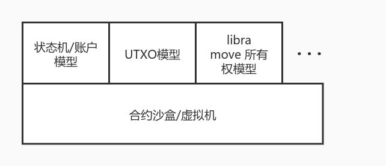

# Contract model
After we have the concept of contracts and contract sandboxes, we can begin to discuss the concept of contract models.

The contract sandbox only represents the environment in which the contract is run, and how the contract is run, how the contract interacts with the contract, and how the contract interacts with the data of the chain. These problems belong to the contract model problem.

In other words, the **contract model is the model in which the contract runs in the contract sandbox/virtual machine**.

As shown in the figure, the contract model and the contract virtual machine can be decoupled in nature. The only relationship is whether the contract virtual machine can support the contract model required by the upper layer, for example:

* Bitcoin's virtual machine is the stack executor of Bitcoin scripts. Since the executor design is a non-Turing complete OP_CODE, the upper-level contract model can only support Bitcoin scripts.
* Ethereum follows the inspiration of Bitcoin and designed OP_CODE with Turing completeness, namely EVM Virtual Machine (Ethereum Virtual Machine). But the OP_CODE of EVM is relatively simple, and only has a stack design, without the concept of a heap. But EVM introduces the OP_CODE of read and write state, so the contract model can support the state model from the virtual machine mechanism. Therefore, the EVM is also regarded as a state transition machine that performs state transitions (as described in the Ethereum Yellow Paper written by Gavin Wood). The state model is actually a relatively general abstract model. Most models can be simulated with the state model (such as building a UTXO model in the state model). Therefore, theoretically, as long as you continue to improve the OP_CODE of the EVM, the upper layer of the EVM can also be used. Construct other contract models.
* libra believes that the core of the blockchain lies in the processing of assets, so it proposes the Move Virtual Machine (MVM) model to limit the contract model from the virtual machine, which can be understood as a specialized logic OP_CODE collection. Therefore, the upper layer of MVM can only run the Move model.

Through the above discussion, we can recognize the concept of the contract model and understand the limitations of the virtual machine on the upper-level contract model. Therefore, we can discuss the contract model that the Wasm virtual machine can run and the contract model composition of `pallet-contracts`.

## Wasm Virtual Machine
Wasm is a binary instruction format that runs on a stack-based virtual machine. (WebAssembly (abbreviated Wasm) is a binary instruction format for a stack-based virtual machine, from [https://webassembly.org/](https://webassembly.org/)) So Wasm’s model and mainstream computer program The model structure is relatively similar. On the other hand, Wasm is designed to be a more general form, and WASI is designed and supports the free definition of `host function` in the operating environment. Therefore, although Wasm is developed from the browser, the current usage scenarios are not limited to browsing. It is beginning to take effect on edge computing, hot updates, and serverless platforms.

If the ability of a virtual machine is measured by the completeness of instructions, the EVM is at the level of a semi-finished product, which has many restrictions and is not flexible enough; while the JVM and Wasm virtual machines are relatively complete with few restrictions and strong functionality. On the other hand, the rationality of the instruction design will also affect the execution efficiency of the virtual machine to a certain extent, and the implementation scheme adopted by the virtual machine will also have a relatively large impact on the execution efficiency.

For example, EVM currently can only run in the form of an interpreter, and there is no optimization for the interpreter in the current implementation process body (go, c++, etc.), and the execution efficiency is relatively low, while virtual machines such as JVM and Wasm There are implementations using JIT mode, and the execution efficiency is quite high and even close to the performance of local execution.

> Note: `pallet-contracts` currently can only use `wasmi` (interpreter) to execute Wasm code, so the execution performance of the contract is not as good as that of Runtime using `wasmtime`.

At the same time, compared to virtual machines such as JVM, the Wasm virtual machine is very lightweight (lightweight), fast, and highly customizable. ** And the function of `host function` gives the Wasm virtual machine a channel for interaction with the host** Therefore, compared with other virtual machines, it is easier to combine the Wasm virtual machine as a blockchain contract sandbox with the functions of the chain.

On the other hand, in the author's opinion, Wasm is a better abstraction layer between the bottom code and the upper code, and its complexity and completeness are far beyond EVM, so it is more suitable for the needs of the blockchain contract field.

Therefore, the sandbox environment provided by the Wasm virtual machine meets the following two requirements on the premise that the contract sandbox is satisfied:
* Complete instructions, rich functionality, and high execution efficiency
* There is a suitable interface that can interact with the host (here refers to the environment in which Wasm is running, that is, the chain), so that the host can provide the required functions.

## EVM contract model

Since Ethereum is a blockchain that stores state, the contract model of EVM needs basic read and write state functions as it should. If the process of each contract operation is regarded as a process from the start of the program to the end of its execution, then the changes in the state data correspond to the changes in the data that the program needs to persist.

Therefore, for the read and write status, Ethereum's EVM provides two instructions, `SLOAD` and `SSTORE`.

On the other hand, Ethereum describes an account using the "account model", that is, the contract and the user calling the contract are regarded as an account. Under this account, there are concepts such as `balance`, so EVM provides `CALLER`, `ORIGIN `, `CALLVALUE` and a series of instructions to describe this model.

At the same time, because in the abstract system of EVM, the contract and the user are considered to be consistent, the model of "contract call contract" appears, namely `CALL`, `DELEGATECALL` and other instructions, which brings the composability of the contract. Created a prosperous Ethereum ecosystem. In EVM, a contract relies on one EVM to run, so the contract calling contract starts another EVM in one EVM and loads instructions for execution.

Of course, the original intention of the EVM virtual machine design is to solve the problem of non-Turing completeness of the Bitcoin script. In order to solve this problem and ensure that the downtime problem does not occur, the instruction Gas billing model is introduced.

Therefore, in summary, the EVM contract model has the following characteristics:

1. The data processing model is a state machine model, and state changes are triggered by external calls (analogous to the process of calling a state change function);
2. The contract model requires chain-related features;
3. Treat the contract as consistent with the user and allow the contract to call the contract;
4. Introduce an instruction billing model.

## The contract model of `pallet-contracts`

Here is a direct conclusion: **`pallet-contracts` uses the Wasm virtual machine to execute code, but its contract model is basically the same as the EVM contract model**.

In other words, the contract model of `pallet-contracts` also has the following 4 characteristics:

1. The data processing model is the state machine model;
2. The contract model requires chain-related features;
3. Treat the contract as consistent with the user and allow the contract to call the contract;
4. Introduce an instruction billing model.

And, on the basis of the above 4 characteristics, a "storage leasing model" has been added:

* `Rent` storage lease billing.

As mentioned above, the contract execution environment and contract model can be decoupled. Since the EVM was designed relatively early, there is no concept of decoupling this level, so the instructions in the instructions are `SLOAD`, `SSTORE` and similar. The instructions are combined with other instructions of the EVM. And Wasm was not originally designed for the blockchain, so there must be no instructions related to the chain environment.

So Wasm's `host function` is used to accomplish this. As the host of the host, the chain only needs to provide the methods that he thinks the contract may use to the Wasm virtual machine, and let him import these function objects, which can be used during the execution of the contract. Therefore, through the `host function`, the `pallet-contracts` contract module can have 1, 2, and 4 functions, and will provide some of the functions required by 3, and the fifth feature (rental billing) can also be introduced.

And the implementation of the third function is also consistent with EVM. When there is a part of the contract calling the contract, it returns to the `pallet-contracts` module from Wasm through the `host function`, and starts a new Wasm virtual machine to execute The contract being called. (This part will be described in a future article)

So in summary, the contract model of `pallet-contracts` has the following characteristics:

1. The contract model is consistent with the EVM contract model, and a storage billing model is added on this basis
2. The interaction with the chain is realized through the `host function` feature of Wasm

## Use Wasm virtual machine to implement other contract models

I just briefly described how `pallet-contracts` implements the contract model on the Wasm virtual machine. Since the previous article has explained that the virtual machine and the contract model can be decoupled, in fact, other things can also be implemented on the Wasm virtual machine. Contract model.

For example, we can consider porting the Move virtual machine to the Wasm virtual machine. There are two possible implementations:
1. Analogous to running the EVM implementation in the Runtime Wasm environment, the MVM implementation can also be compiled into the form of Wasm (for example, named `pallet-mvm`) and run in the Runtime Wasm.

    Based on this implementation, Move can still be compiled in the normal way, and it is consistent with the compilation result of Solidity running on `pallet-evm`, and the result of Move compilation is run on a platform such as `pallet-mvm`.

2. Abstract the MVM, ownership, and chain-related features into a form of `pallet-contracts`, and design to compile the intermediate code IR compiled by the Move language to Wasm.

    Based on this realization, Move can be compiled into Wasm and run in the Wasm virtual machine.

## Other contract models
### EOS contract model

EOS's contract model is similar to EVM, while strengthening the concept of account model. Therefore, the way EOS uses Wasm is also based on the execution of Wasm, and introduces chain-related functions through `host function`.

The main difference between the EOS and EVM models is that the EOS contract calls the contract in the form of a transaction, and the EOS resource model is a mortgage model. At present, it is generally believed that it is the EOS mortgage model that ultimately led to EOS not succeeding.

### Asynchronous contract model
The `pallet-actor` is the beginning of Substrate's attempt to implement the asynchronous contract model, and there is currently no progress. The model of `pallet-actor` intends to use the Wasm virtual machine as the operating environment, and on this basis add asynchronous functions to improve performance.

There are also a few other studies on asynchronous contract models, but they are all in a relatively preliminary stage.