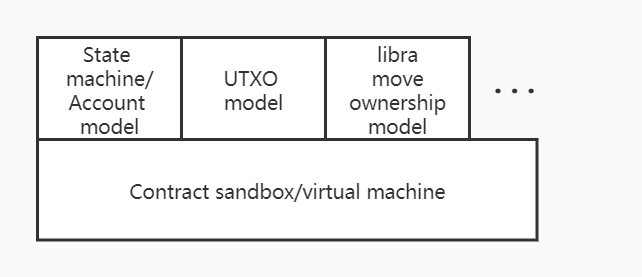

# Contract model

## Background Information

The contract sandbox only represents the environment in which the contract is run, but how the contract is run, how the contract interacts with the contract, and how the contract interacts with the data of the chain. These problems belong to the contract model problem. In other words, the contract model refers to the model in which the contract runs in the contract sandbox/virtual machine.

As shown in the figure above, the contract model and the contract virtual machine can be decoupled in nature, and the relationship only exists whether the contract virtual machine supports the contract model required by the upper layer. To facilitate the understanding of the contract model, you can refer to the following examples.

* Bitcoin's virtual machine is the stack executor of Bitcoin scripts. Because the executor design is a non-Turing complete OP_CODE, the upper-level contract model can only support Bitcoin scripts.
* Following the inspiration of Bitcoin, Ethereum designed a Turing-complete OP_CODE, namely EVM . The OP_CODE of EVM is relatively simple, and only has a stack design without the concept of a heap. But EVM introduces the OP_CODE of read and write state, so the contract model can support the state model from the virtual machine mechanism. As described by Gavin Wood in the Ethereum Yellow Paper, EVM is also regarded as a state transition machine that performs state transitions. The state model is actually a more general abstract model. Most models can be simulated with the state model, for example, the UTXO model is constructed in the state model. In theory, as long as the OP_CODE of the EVM continues to be improved, the upper layer of the EVM can also construct other contract models.
* libra believes that the core of the blockchain lies in the processing of assets, and proposed the concept of Move's virtual machine model MVM (Move Virtual Machine). From the model of restricting the contract on the virtual machine, it can be understood as a set of OP_CODE with specialized logic. Therefore, the upper layer of MVM can only run the Move model.

As described above , I believe you have a clearer understanding of the concept of the contract model, and realize the limitations of the virtual machine on the upper-level contract model.

## Wasm virtual machine

The following describes the contract model that the Wasm virtual machine can run and the contract model composition of pallet-contracts.

[WebAssembly](https://webassembly.org/) (abbreviated as Wasm) is a binary instruction format that runs on a stack-based virtual machine, so the model structure of Wasm is similar to that of mainstream computer programs. On the other hand,  Wasm is designed into a more general form, and WASI is designed and supports the free definition of `host function` in the operating environment. Therefore, although Wasm evolved from a browser, the current usage scenarios are not limited to browsers, and begin to play a role in edge computing, hot updates, and Serverless platforms.

If the ability of a virtual machine is measured by the completeness of instructions, the EVM is at the level of a semi-finished product, which is more restrictive and not flexible enough. The instructions of the JVM and Wasm virtual machines are relatively complete, with few restrictions and strong functionality. On the other hand, the rationality of the instruction design will also affect the execution efficiency of the virtual machine to a certain extent, and the implementation scheme adopted by the virtual machine will also have a relatively large impact on the execution efficiency. For example, EVM currently can only be run in the form of an interpreter, and the current implementation process body (Go, C++, etc.) does not see optimization for the interpreter, and the execution efficiency is relatively low, while virtual machines such as JVM and Wasm use JIT The execution efficiency is quite high, even approaching the performance of local execution.

**Note** The `pallet-contracts` currently can only use wasmi (interpreter) to execute Wasm code, so the execution performance of the contract is not as good as the execution performance of Runtime using wasmtime.

However, compared with virtual machines such as JVM, the Wasm virtual machine is light, fast, and highly customizable, and the function of the host function gives the Wasm virtual machine a channel for interaction with the host. Therefore, compared with other virtual machines, It is easier to combine the Wasm virtual machine as a blockchain contract sandbox with the functions of the chain.

At the same time, Wasm is a better abstraction layer between the underlying code and the upper code, and its complexity and completeness are far beyond EVM, which can better meet the needs of the blockchain contract field.

The sandbox environment provided by the Wasm virtual machine meets the following requirements on the premise that the contract sandbox is satisfied:

* Complete instructions, rich functionality, and high execution efficiency.
* There is a suitable interface to interact with the host (here refers to the environment where Wasm is running, that is, the chain) to facilitate the host to provide the required functions.
## EVM contract model

Ethereum is a blockchain that stores state, so the EVM contract model requires basic functions of reading and writing state. If the process of each contract operation is regarded as a process from the start of the program to the end of its execution, then the changes in the state data correspond to the changes in the data that the program needs to persist. For the read and write status, Ethereum's EVM provides two instructions,`SLOAD `and `SSTORE`.

On the other hand, Ethereum describes an account that uses the account model, that is, the contract and the user calling the contract are regarded as an account. Under this account, there are concepts such as balance. Therefore, EVM provides a series of instructions such as `CALLER` ,`ORIGIN`,`CALLVALUE`, etc. to describe This model.

At the same time, in the abstract system of EVM, the contract and the user are considered to be consistent, so there is a model of contract calling contract, namely `CALL`,`DELEGATECALL ` and other instructions, which brings the composability of the contract and achieves the prosperity of Ethereum's ecology. In EVM, a contract relies on one EVM to run, so the contract calling contract starts another EVM in one EVM, and loads instructions for execution.

The original intention of the EVM virtual machine is to solve the problem of non-Turing completeness of the Bitcoin script. In order to solve this problem and ensure that the downtime problem does not occur, the instruction Gas billing model is introduced.

In summary, the EVM contract model has the following characteristics:

1. The data processing model is the state machine model, and the state change is triggered by external calls (similar to the process of calling the state change function).
2. The contract model requires chain-related features.
3. Treat the contract as consistent with the user and allow the contract to call the contract.
4. Introduce an instruction billing model.
## Pallet-contracts contract model

Although pallet-contracts uses the Wasm virtual machine to execute code, its contract model is basically the same as the EVM contract model. Therefore, the contract model of pallet-contracts also has the four characteristics of the EVM contract model mentioned above. Based on the storage lease model, storage lease charging is added:

1. The data processing model is a state machine model, and the change of state is triggered by external calls.
2. The contract model requires chain-related features.
3. Treat the contract as consistent with the user and allow the contract to call the contract.
4. Introduce an instruction billing model.
5. Storage lease model.

The contract execution environment and contract model can be decoupled, but because EVM was designed earlier, there is no concept of decoupling. Therefore, SLOAD, SSTORE, and similar chain-related instructions in the instructions are merged with other EVM instructions. Wasm was not originally designed for blockchain, so there are no instructions related to the chain environment.

The host function of Wasm is used to accomplish this. As the host , the chain only needs to provide the Wasm virtual machine with the methods it thinks the contract may use, and let it import these function objects, which can be used during the execution of the contract. Therefore, through the host function and pallet-contracts contract module, you can have the functions of 1, 2, and 4, and will provide some of the functions required by the third point, and the fifth feature (rental billing) can also be introduced. And the implementation of the third function above is also consistent with EVM. When there is a part of the contract calling the contract, the host function is used to return to the pallet-contracts module from Wasm, and a new Wasm virtual machine is started to execute the called contract. (This part will be elaborated in a future article).In summary, the contract model of pallet-contracts has the following characteristics:

* The contract model is consistent with the EVM contract model, and a storage billing model is added on this basis.
* The interaction with the chain is realized through the host function feature of Wasm.
## Use Wasm virtual machine to implement other contract models

The above describes how pallet-contracts implements the contract model on the Wasm virtual machine. It has also been mentioned in the previous document that the virtual machine and the contract model can be decoupled, so other things can also be implemented on the Wasm virtual machine. Contract model.

If the Move virtual machine is also transplanted to the Wasm virtual machine, there are two possible ways to implement.

* Analogous to running the EVM implementation in the Runtime Wasm environment, the MVM implementation can also be compiled into the form of Wasm (for example, named `pallet-mvm`) and run in the Runtime Wasm.

Based on this implementation, Move can still be compiled in the normal way, and the compiled result of Solidity runs on `pallet-evm` consistent with that of Solidity, and the compiled result of Move is run on a platform such as `pallet-mvm`.

* Abstract one level of MVM, ownership, and chain-related features into the form of pallet-contracts, and design to compile the intermediate code IR compiled by the Move language to Wasm.

Based on this realization, Move can be compiled into Wasm and run in the Wasm virtual machine.

## Other contract models

### EOS contract model

EOS's contract model is similar to EVM, while strengthening the concept of account model. Therefore, the way EOS uses Wasm is also based on the execution of Wasm, and introduces chain-related functions by `host function`.

The main difference between the EOS and EVM models is that the EOS contract calls the contract in the form of transaction calls, and the EOS resource model is a mortgage model. At present, it is generally believed that EOS has not succeeded because of the EOS mortgage model.

### Asynchronous contract model

Pallet-actor is the beginning of substrate's attempt to implement an asynchronous contract model, but there is currently no progress. For details, please refer to the [Actor-based contract model](https://corepaper.org/contract/actor/). The `pallet-actor` model intends to use the Wasm virtual machine as the operating environment, and on this basis add asynchronous functions to improve performance. There are also a few other studies on asynchronous contract models, but they are all in the preliminary stage, so I won't elaborate on them here.
