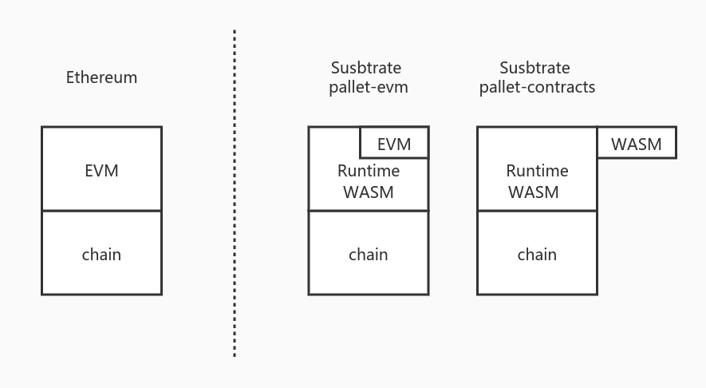

# Contract overview

## Background Information

The model of blockchain running contracts can essentially be considered as a blockchain environment (distributed consensus system) and a platform that can run a piece of logic. From this, we can draw:

* Bitcoin model can be split into block model/PoW and Bitcoin script.
* The Ethereum model can be divided into blocks, state models/PoW and EVM.
* Substrate's model can be divided into blocks, state models/Bft consensus and Runtime.

Therefore, in general, the model of the blockchain can be split into:

* Run the underlying system of the blockchain: Provide a distributed and trusted environment.
* The business logic of the chain: run in a trusted environment.

In the blockchain system, it is required that for the same code and the same state, the execution results must be consistent. Therefore, at the level of the business logic of the supply chain, in order to ensure the consistency of the execution results, it is required that the entire operating environment does not cause inconsistent running results due to inconsistencies in running nodes (referring to not the same node). In order to ensure this characteristic, most blockchains will adopt the sandbox/virtual machine model and tailor some functions to achieve it.

The platform for running the contract is a kind of business logic of the chain. This kind of business logic is especially open for the code that can be run on it, and the content of the contract is not controlled by the chain itself. In this case, a sandbox environment is needed to isolate the operation of various contracts.

## What is a sandbox？

The concept of sandbox in the computer field is very extensive, and virtual machines are the easiest to simulate the environment of the sandbox. Therefore, in the blockchain, in general, the sandbox will be run by a virtual machine. Different chains use different virtual machines to run the contract sandbox.

* Ethereum

Gavin Wood's yellow paper proposed the EVM model, created the concept of the Ethereum Virtual Machine (EVM) and drafted the OP_CODE of the EVM, and then designed the Solidity to compile to the OP_CODE, thus having the entire ecology of Ethereum. It is equivalent to Ethereum's contract sandbox model for processing blockchain, building all facilities from zero to one. Therefore, the syntax of Solidity and the things that EVM can do are very rudimentary compared with the current blockchain, such as the syntax of Solidity and the stack depth limit of EVM. But as a pioneer, it pioneered the blockchain contract virtual machine model.

* Fabric

As a consortium chain, it is different from the public chain in usage scenarios. Fabric puts forward the concept of chain code and runs the chain code on Docker. Compared with EVM, Docker is a heavier type of virtual machine. Therefore, compared with EVM, Fabric's chaincode can do more than Solidity, of course, the cost of its operation will be relatively higher.

* EOS

EOS adopted Wasm as the virtual machine of the contract, which was also EOS's advantage at the time. Compared to the EVM running Solidity, EOS's Wasm virtual machine has a much higher operating efficiency. Using C++ as a language compiled to Wasm has also attracted many traditional developers. EOS, as the forerunner of Wasm virtual machine, had already demonstrated the advantages of Wasm over EVM at that time. However, due to the design defects of its contract model and the constraints of the environment at the time, and EOS is not a true decentralized system, EOS was not very Well demonstrated the capabilities of the Wasm contract system.

* Substrate's `pallet-contracts`

Pallet-contracts uses the Wasm virtual machine to run contracts. Currently, for security reasons, only the`Wasmi` interpreter is used to execute Wasm. But its contract model is similar to the EVM contract model (see the next chapter for details). The Wasm virtual machine and EVM also have the characteristics of fast startup and loss as you use it. It has high performance and high scalability while not being too large like Docker and JVM. Therefore, Wasm is slowly being adopted in more scenarios outside the browser environment, such as edge computing and hot updates. Therefore, more and more new blockchains will use the Wasm virtual machine as the main solution when they need a sandbox environment. On the other hand, Wasm also has the features of compiling from different languages to Wasm, such as Rust, Assemblyscript, C++, etc., which attracts all kinds of developers to join the contract development process.

* Other blockchains

Other blockchains will also have their own solutions in order to achieve the goal of this sandbox. Some alliance chains use tailored JVMs, some public chains use`RISC-V`virtual machines, and some chains use a design from scratch. A virtual machine (for example ，libra). Each of these solutions has its own requirements and characteristics, but from the perspective of the model, no matter what the solution, the ultimate goal is to provide a virtual machine environment to run the contract sandbox.

## Sandbox for running contracts

Most of the business logic of the chain will run in the sandbox system, and the business logic of running contracts requires sandbox isolation. On the other hand, Substrate's runtime is a sandbox environment running in Wasm, so in Substrate's contract module

`Pallet-evm` and `pallet-contracts` need to run another sandbox in a sandbox environment, as shown in the figure below.

* On the left is the Ethereum model, which means that every time a contract is run, an Ethereum virtual machine needs to be started on the chain platform to run it.
* On the right is the Substrate model. The business logic of the Substrate chain runs in the Wasm virtual machine.

`Pallet-evm`: The EVM of Ethereum is compiled into Runtime Wasm, so every contract that runs is actually consistent with Ethereum, and an Ethereum virtual machine is created to run. If the chain is running in Wasm form, that is, an Ethereum virtual machine is generated in the Wasm virtual machine to run.

`pallet-contracts`: Wasm contracts use Wasm virtual machine to run contracts. Unlike `pallet-evm,`if the chain is running in Wasm form, the virtual machine of Wasm contract jumps out of the current Runtime Wasm virtual machine and recreates a new Wasm virtual machine. The machine is running. Up to now,`Wasmtime` is recommended for the Wasm virtual machine of Runtime, and`Wasmi`can only be used for `pallet-contracts`. Pallet-contracts can also be executed using Wasmtime, but Parity currently believes that Wasmtime is relatively uncontrollable, so `Wasmtime` has not yet been adopted. Currently they have related plans and prototype code to use `Wasmtime` to run`pallet-contracts`contracts.

In short, in the process of running the contract, most chains adopt a sandbox model to run the contract. And for EVM and for the `pallet-contracts` model, a virtual machine is created every time a contract is run.

## More information

Wasmtime is a Wasm virtual machine that implements JIT, and Wasmi is a pure interpreter-type Wasm virtual machine. In terms of execution efficiency, Wasmtime's execution efficiency is much higher than Wasmi.

