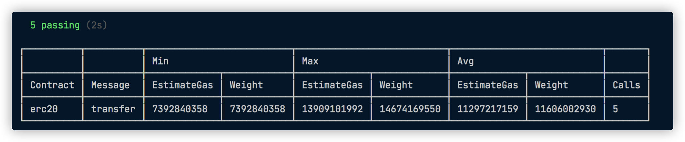

# @redspot_gas-reporter plug-in

## Background Information

The plug-in will print out the gas usage of the transaction of the called contract when the test is completed.




## How to use the plug-in?

1. Import the @redspot/gas-reporter plugin.
2. Add this plug-in to redspot.config.ts and it will run automatically.
    ```typescript
    // redspot.config.ts
    import { RedspotUserConfig } from 'redspot/types';
    import '@redspot/gas-reporter';
    export default {
     ...
    } as RedspotUserConfig;
    ```


