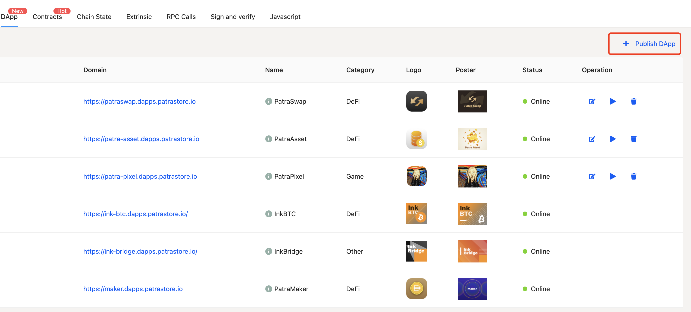
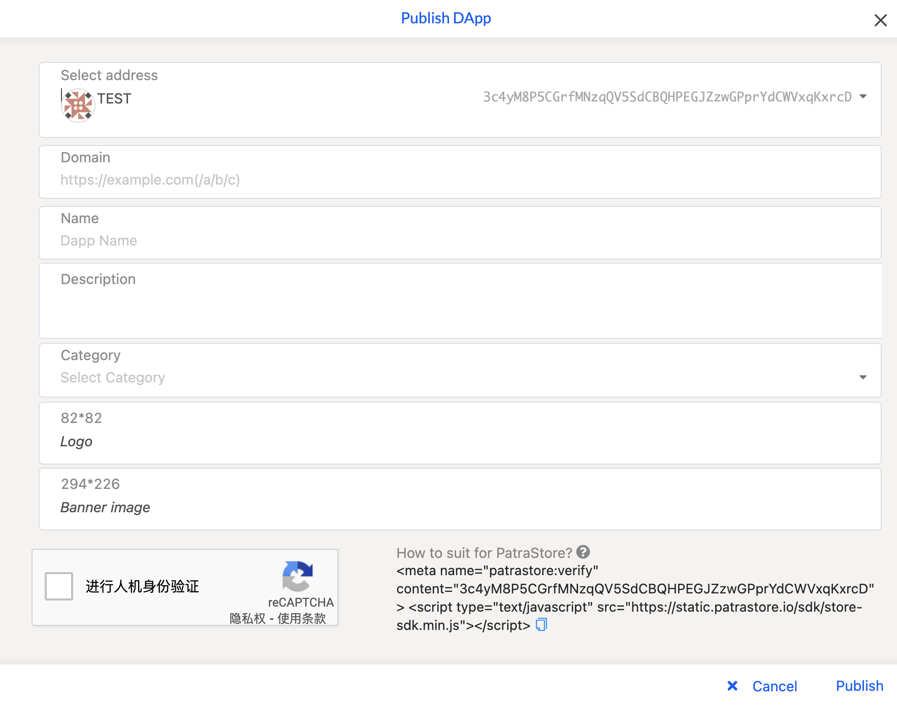

## 发布DApp

目前我们不支持托管DApp，需要开发者部署好DApp，然后在PatraStore上面上传一下资料（域名，类型，图片，账户等信息）。

确保您开发的DApp前端引入了我们的[SDK](./getting-starter.md)，否则DApp在PatraStore中无法正常工作。

1. 进入[https://patrastore.io/:chain-value/system/developer](https://patrastore.io/jupiter-a1/system/developer)页面
2. 点击Publish DApp按钮


3. 选择Account，然后填入DApp的基本信息
4. **在html中加入meta标签**
    ```html
    <!-- accountId必须和您选择的账户地址一致，我们后台会间隔一段时间检查一下meta标签，如果accountId和账户地址不一致，DApp将会变为Offline状态 -->
    <meta name="patrastore:verify" content="accountId" >
    ```
5. 点击`Publish`按钮，如果上方填的信息无误，即可成功发布DApp。