# Europa v0.3报告
Patract Hub's treasury report for Europa v0.3

// 下面这块需要改成对应的

Patract Hub (https://patract.io) develops local open source toolkits and one-stop cloud smart IDE, committed to provide free development toolkits and infrastructure services for the entire smart contract ecosystem. Six weeks ago, we applied a [treasury proposal](https://polkadot.polkassembly.io/motion/48) for Europa v0.2 , and now we have finished the development (https://github.com/patractlabs/europa) . This repost shows what Europa v0.2 completion.

## Introduction

Europa is kind of another implementation for [Substrate client](https://github.com/paritytech/substrate/tree/master/client) in our design. We know that the runtime of a blockchain is the business logic that defines its behavior, and the Substrate runtime need to run by an executor and environment. So that we design the executor and environment more like a "sandbox" to run a Substrate runtime.

In v0.3, Europa 的主要目标是提升开发者的使用europa的易用度，该版本中提供了较为完备的前端界面用于解析展示Europa执行合约的细节，加强和Patract其他工具的协作，并且提供了windows，macOS，Ubuntu三个平台预打包的可执行程序。开发者没有必要再为开发调试合约构建复杂的节点环境，而是直接下载对应平台的执行程序即可使用。

### Summary of Europa's v0.3 plan:

Europa v0.3的工作将会分为节点端Europa及UI端 Europa-UI 两块。后文使用 Europa 代表Europa的节点，Europa-UI代表v0.3中的产品UI工作。

> 1. Europa-UI：设计并实现针对合约功能及Europa功能的UI组件及逻辑：
>    1. 强化与合约逻辑相关的功能：
>       1. 合约执行过程信息的可视化；
>       2. 构建合约，交易与用户之间的关联关系；
>       3. 扫描当前链上的合约代码及合约实例，与合约的metadata构建关联关系并附属合约信息的解析。
>    2. 强化与Europa及Redspot工具的关联关系
>       1. 结合Europa的workspace进行工作空间的划分；
>       2. 将Europa特殊的RPC调用与UI进行结合；
>       3. 展示每笔交易中对状态的变更情况；
>       4. 链接Redspot 的项目并导入Redspot项目的合约信息。
> 2. Europa：
>    1. 针对Europa-UI的需求重构节点的部分功能，将需要的信息进行持久化并提供相应的rpc给Europa-UI
>    2. 升级Europa的`pallet-contracts`模块至最新的版本，并将历史的改动进行迁移
> 3. 将Europa与Europa-UI合并制作成不同平台的二进制包进行分发。
>

## Feature

在0.3中，所有完成的功能如下：

### 1. windows, macOS, Ubuntu 三个平台的可执行文件

当前可以从github的仓库 [Europa-UI](https://github.com/patractlabs/europa-ui/releases) 上直接下载对应平台的二进制文件。该二进制文件点击后即可运行（linux需要赋予执行权限）。三端平台支持的系统如下：

* windows 10 21H1 及以上版本
* macOS 10.15.7 及以上版本
* Ubuntu 20.04 及以上版本

其中 macOS 不支持 M1，不过可以尝试使用 **Rosetta** 运行macOS的二进制包，但是我们不保证全部兼容。对于Ubuntu，我们只保证 Ubuntu 20.04 及以上版本能正常运行。Ubuntu 18.04 及以下版本由于 glibc 的兼容关系无法运行。

### 2. 启动Europa的相关配置

Europa节点具备选择数据路径，workspace等功能。因此Europa-UI将这些功能做的更易使用：

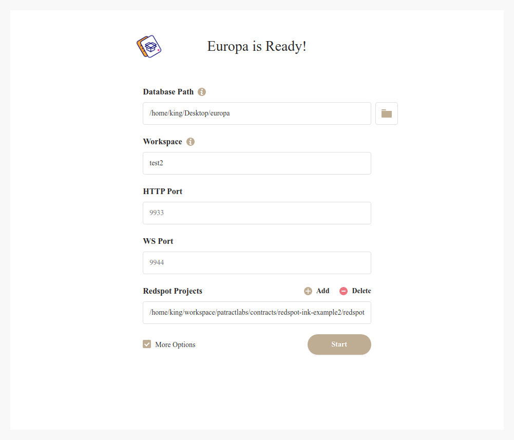

这是Europa的进入界面，我们可以看到现在Europa与以太坊生态中的Ganache类似，用户可以选择自己的数据路径及workspace。同时也可以设置Europa节点启动时的Websocket及Rpc端口。

另一方面值得注意的是，启动配置项中可以选择注册Redspot Project路径，这样启动Europa将会与Redspot项目下已编译的合约相关联。

### 3. Europa-UI 的功能

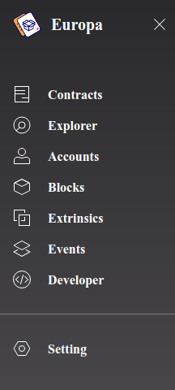

Europa-UI的主要功能和[Polkadot/Substrate Portal](polkadot.js/apps)(后文统称为apps)类似，如图所示，列举出的tab与区块链元素相关。其中的Contracts即本次Europa重点为程序员强化的部分。Explorer与apps中的explorer类似，用于展示当前区块链的基础信息。而在 Blocks，Extrinsic及Event上相对于apps的基础功能而言有更大的加强。整体而言，相比于apps这类在设计思路上主要给用户使用的产品，Europa-UI设计的侧重点在如何更全面的展示开发者所关心的链及合约的信息。

#### 3.1 Explorer

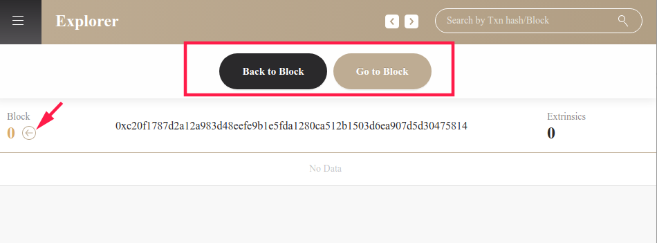

Explorer除了展示一个区块基础的信息之外，Europa-UI提供了一些调用Europa特殊功能的操作接口：

1. “Go to Block”和“Back to Block”两个按钮分别表示可以直接将Europa生产到指定高度的区块，以及可以回滚到指定高度的区块。点击相应的按钮可以调用Europa特殊的rpc产生或回滚区块。
2. 每个区块的区块号右边有一个"<-"的箭头。点击该箭头按钮可以直接回滚到对应区块上。

当Europa已经打包过交易产生区块后（例如使用 "go to block" 前进几个区块），点击区块下的交易名字或者Events，可以直接条状到交易或者event的详细信息页面，看到更详细的信息。

#### 3.2 Account

Account 页面的功能与apps中的Account接近，可以添加或导出账户，并且直接调用账户进行转账。

#### 3.3 Contracts

合约的界面相比于apps的合约界面就复杂的多。合约界面总共分为 "Codes" 和 "Instances" 两类，分别代表着合约的代码以及合约的实例。

##### 3.3.1 Codes

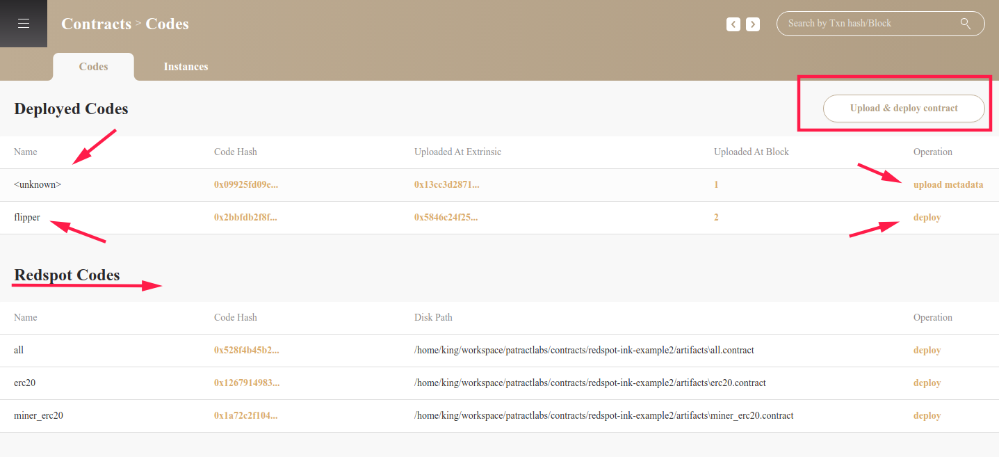

在合约代码界面，主要分为 Deployed Codes 和 Redspot Codes 两类。

其中：

* Deployed Codes ：代表当前已经部署于Europa上的代码，表示了合约的code hash，部署所在的区块及交易索引等重要信息，且点击了相应的信息可以索引跳转到相应的页面中。

  而部署的代码会分为2类：

  * 一类是通过"Upload & deploy contract" 部署的合约，这类合约含有的metadata信息，例如“flipper”，因此其表现和apps中已部署的合约代码一致，可以点击deploy再次部署。
  * 另一类是通过其他方式（例如通过脚本等方式）部署于Europa中的合约。**这类合约在apps中就无法展示出来，而在europa可以索引到。**如上图中的"\<unknown\>"，但是由于当前Europa-UI无法获知这个合约对应的metadata信息，因此他会要求开发者先上传对应的metadata文件。

* Redspot Codes：这类合约是从关联的Redspot项目中索引得到的合约，这类合约已经在Redspot的项目下获取到的合约metadata信息，因此其可以直接展示合约的信息并拥有deploy按钮。

点击 code hash，会进入该合约代码的详细界面。其中在“Instances”栏下会列出Europa索引出来的所有和这个合约代码相关联的合约实例。

##### 3.3.2 Instances

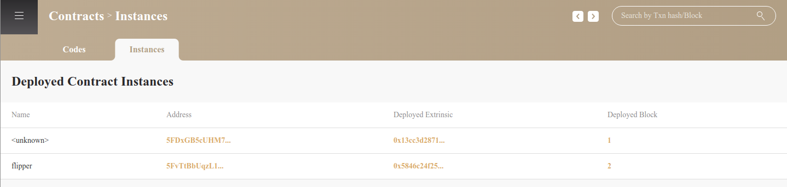

在instances界面中，会列出当前Europa中**已经存在的所有合约实例**，并非只记录通过europa-ui部署的合约。当前没有对应metadata的合约会显示为`<unknown>`，而已有metadata的合约会显示对应的名字。

点击合约地址会进入合约的详细信息界面。其中 Funtions 的功能与apps一致，可以直接发送对合约的调用交易或rpc调用。

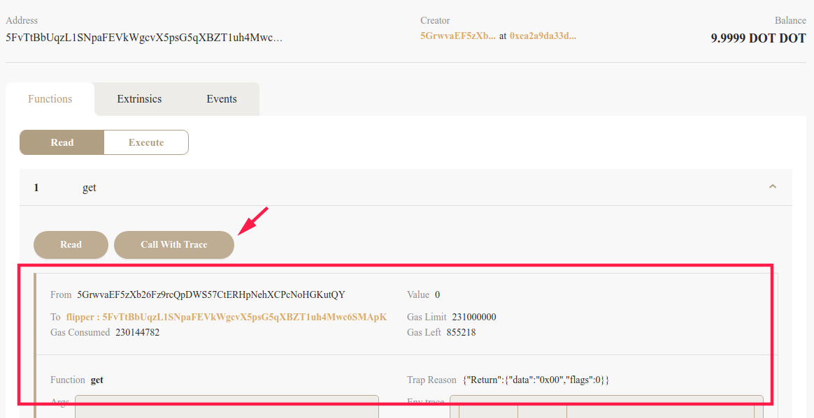

但是Europa-UI除了与apps一致的调用外，还可以通过"Call With Trace"的方式调用Europa提供的特殊的rpc，将本次合约调用的 contract trace 也反馈出来。

contract trace 是本次的核心功能，其目的是将合约的执行过程从黑盒变为白盒执行，让开发者获取到丰富的调试信息。在v0.2中，contract trace 是以日志的形式打印到控制台中，开发者需要花费精力在很多日志中辨别出需要的信息。而在v0.3中这些关键调试信息将可以通过Europa-UI直接看到。关于contract trace 的详细内容在后文会详细讲解。

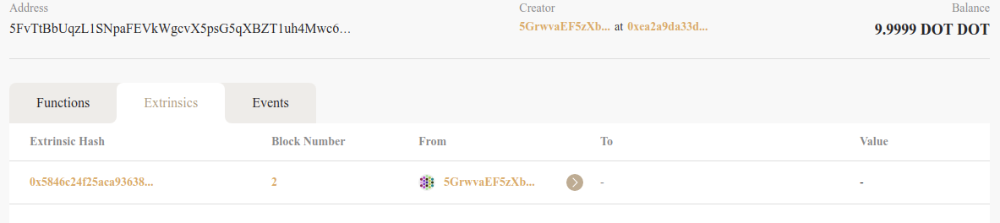

在extrinsics 界面下，Europa-UI 展示了所有与这笔合约有关联的交易，包含该合约的实例化交易以及所有的调用交易。点击对应的交易可以跳转到该交易的详细信息页面。

##### 3.3.3 Contract Extrinsic

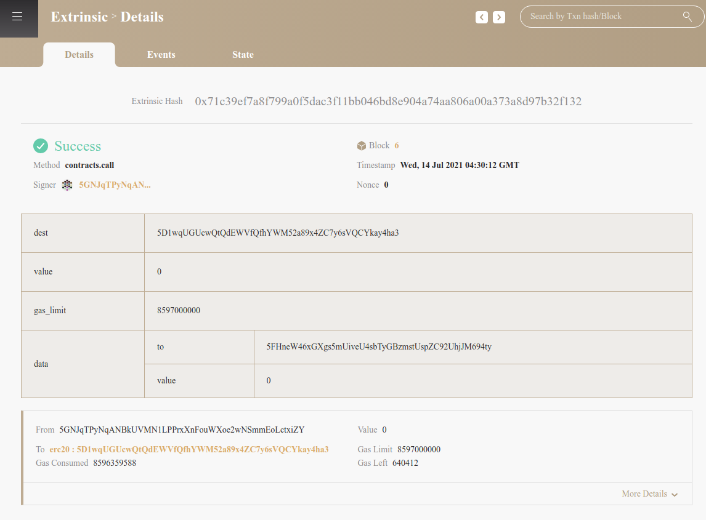

进入一个合约详细界面后，可以看到Europa-UI专门针对合约相关的交易做了特化。如图，对于合约的调用交易，Europa-UI显示了本次调用的所有参数，特别是 data字段，Europa-UI将data部分按照合约metadata的信息做了解析，展示了本次合约调用的参数有"to", "value"及它们具体的值。

在参数表格的下方即是本次合约调用的contract trace 信息。

contract trace 信息分为主要信息和次要信息。主要信息包括调用者from，目标合约 to，及gas消耗等。次要信息点开 "More Details" 可以看到：

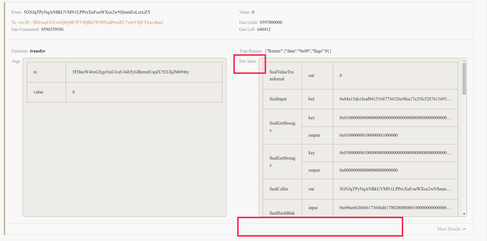

详细信息中展示了本次调用的参数信息，返回信息的 "Trap Reason"，以及对于调试最重要的 env trace 信息。如果本次交易调用出现了异常，还会在下方出现Wasm Error 的Wasm backtrace 信息。

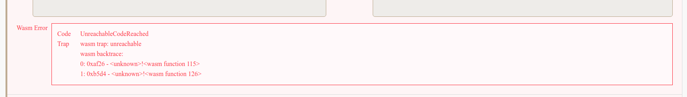

若本次调用是一个合约调用合约的情况：

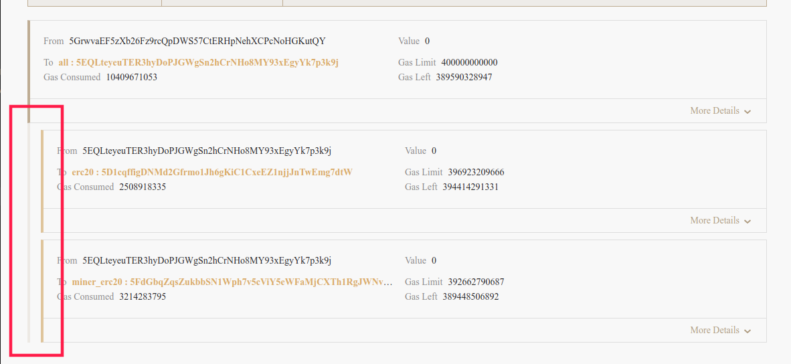

则在contract trace 信息中将会显示为一个合约之间"缩进"的关系，而从缩进的合约的 From，to可以观察到合约调用之间的关联关系。例如上图所示即在本次调用合约"5EQLt" 中，合约"5EQLt"自己通过跨合约调用分别调用了"5D1cq"合约及"5FdGb"合约，可知本次的交易是调用all合约的方法，而在all合约中又调用了erc20及miner_erc20的方法。

分别点开他们的 "More Details" 信息界面，可以通过详细信息获取很多的细节。

#### 3.4 Extrinsic-State

点击Extrinsic下的State会进入当前这笔交易更改的state界面。这个功能类似于Etherscan 的 StateChange，例如这个[链接](https://etherscan.io/tx/0x820f0c222e3cdcd8890c8f107f08a7a4266d71edd68a611af83ea3e3307ad7fe#statechange)。在v0.2版本的Europa中，能够记录一个块中的状态变更情况，但是没法记录单个Extrinsic在执行过程中变更的交易。

因此在v0.3的版本中，我们参考了 [state_traceBlock 的实现](https://github.com/paritytech/substrate/pull/7780)，引入了使用 tracing 来记录交易执行的状态变更，并且可以把这个变更以rpc的形式提供给外部使用。Europa-UI结合了这个功能，在 Extrinsic-State中表示出来。

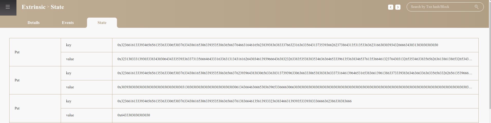

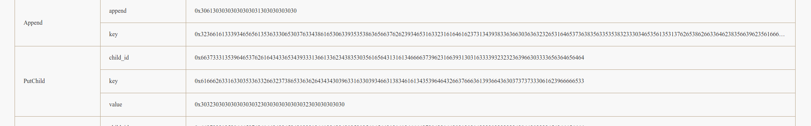

对于状态的变更总共分为6类：

* Put: 对某个状态进行了修改
* PutChild: 对某个子树(sub trie)下的某个状态进行了修改，其中child_id指这个子树的索引
* KillChild: 移除某个子树下的所有存储，多见于合约销毁的情况
* ClearPrefix: 删除所有匹配指定前缀的key下的状态
* ClearChildPrefix: 删除某个子树下所有匹配指定前缀的key下的状态
* Append: 对某个key下的状态追加新内容，多用于添加新的 Event 数据。

因此在State页面，以表格的形式列出了当前这笔交易对状态的变更情况。其中若只关心合约执行对存储的变更情况，只需要跟踪PutChild及KillChild及ClearChildPrefix即可。

#### 3.5 Developer

Developer 的功能和apps类似，但是Developer下提供了"Log"页面，其将Europa运行的原有输出到控制台的日志在Europa-UI中输出。

由于Europa v0.3 支持了 `seal_debug_message`的直接打印，因此在合约运行中的日志信息（例如在ink!中调用`ink_env::debug_println!`进行日志打印）会打印到控制台中。而Europa-UI接管了Europa的启动，因此此时需要查阅Europa的日志时可以在当前 Log 页面中查阅得到。

## Verification

对于以上Europa v0.3 中展示的功能可以通过以下方式验证：

1. 准备测试 Europa v0.3 的 redspot 项目：

   ```bash
   git clone https://github.com/atenjin/redspot-ink-example2
   git checkout -b europa_v0.3 europa_v0.3
   cd redspot-ink-example2
   yarn
   npx redspot compile
   ```

   经过以上命令，redspot已经准备完毕。后续可以使用Europa对其进行测试。

2. 进入 Europa-UI 的release页面https://github.com/patractlabs/europa-ui/releases下载对应平台的Europa

3. 启动Europa，在开始界面设置路径及workspace信息，点击More Options 添加Redsport项目，路径选择在1中准备好的项目路径，并选择该路径下的 redspot.config.ts 文件。启动Europa。

4. 回到 redspot项目，执行以下命令部署并调用测试合约

   ```bash
   npx redspot run scripts/deploy.ts
   ```

   该脚本会部署3个合约all, erc20, miner_erc20，其中all 合约持有erc20, miner_erc20 的地址，调用all合约的一些方法会对erc20, miner_erc20合约产生跨合约调用。

5. 点击侧边栏的Explorer，点击区块7下的contract.call交易。这是一个通过all合约调用miner_erc20合约的例子。在details页面中可以看到上文介绍的contract trace 信息，在state页面中可以看到这次调用的state change信息。

6. 回到Explorer，点击区块6下的contract.call交易，这是通过all合约调用erc20合约，erc20执行正确，但是在all合约遇到了错误导致合约trap的调用。在details页面下展开两个合约的"more details"信息，可以看到"Wasm error"出现在all合约实例中，而erc20的details页面是正常的。表示最后导致合约执行错误的原因是由all合约导致。结合all合约details信息中的"env trace"信息可以进一步推断错误位置。

7. 点击侧边栏回到Contracts页面，可以看到Redspot Codes 下有redspot-ink-example2项目下的三个合约，all，erc20, miner_erc20。而上方的Deployed Codes 表示已经部署的合约也是这三个。点击codehash可以看到这个合约代码已部署的合约实例。点击实例的地址可以跳转到合约实例的详细界面，在Extrinsics页面下可以看到与这个合约相关联的交易，点击可以跳转到对应交易详细界面中。点击交易调用或者部署人的地址，会列出所有和账户有关的交易列表。这个过程表面了Europa-UI已经将所有对开发人员重要的信息都做了关联跳转。

8. 回到Explorer，点击"Go to Block"，输入大于当前best区块的数字，可以看到当前Europa区块已经生产并达到了指定块高的区块。点击"Back to Block"输入某个区块高度，或者点击区块号右边了"<-"箭头可以回滚区块到对应高度。

9. 点击侧边栏的Setting，在workspace的输入栏可以输入一个新的workspace 名，点击change后，回到Explorer，可以看到最高区块变为了0，表示这是一个全新的Europa环境。这种方式可以让开发者隔离不同的测试环境。再次点击Setting，在workspace上点击出现的下拉菜单中选择最初的workspace名，change后可以看到恢复到了之前的状态。并且随意尝试点击关联关系的跳转后都是正常的。

10. 退出Europa后再次进入，可以发现相同的workspace下所有的关联关系及已有的数据都能恢复，并不会因为关闭后丢失所有的关联关系。

