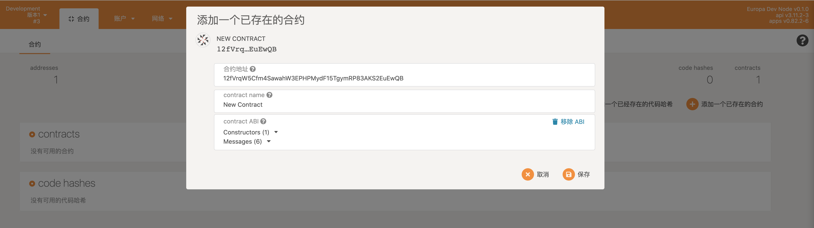

# Europa tutorial

Europa 作为一个模拟具备合约功能的节点沙盒环境，其接口（主要是rpc）对于大部分第三方工具都保持兼容，因此可以将Europa视为一个独立的节点进行操作。

## 搭建开发环境

Europa的环境与正常使用节点调试合约的环境无异，唯一的差别在于若需要打印Wasm的backtrace时，需要使用Patract提供的一个fork版本的`cargo-contract`，直到parity（官方）的`cargo-contract`合并Patract提交的功能之前。若不需要打印合约执行崩溃时的Wasm backtract，则使用官方提供的`cargo-contract`即可。

* 编译并运行 Europa 节点

  ```bash
  $ git clone --recurse-submodules https://github.com/patractlabs/europa.git
  ## or do following commands
  $ git clone https://github.com/patractlabs/europa.git
  $ cd europa/vendor
  $ git submodule update --init --recursive
  ```

  也直接使用`cargo install`的方式安装Europa。（注意要添加上`--locked`以使用Europa当前依赖的Substrate版本）

  ```bash
  $ cargo install europa --git=https://github.com/patractlabs/europa.git --force --locked
  ```

  运行Europa：

  ```bash
  $ ./target/release/europa --log=runtime=debug -d ./europa_database
  # 若没有需要保留数据的需求，也可以使用`--tmp`运行Europa
  $ ./target/release/europa --log=runtime=debug --tmp
  ```

* 安装 [PatractLabs's `cargo-contract`](https://github.com/patractlabs/cargo-contract) （可选，若需要Wasm合约执行崩溃时的backtrace时才需要）

  ```
  $ cargo install cargo-contract --git https://github.com/patractlabs/cargo-contract --branch=tag-v0.12.0 --force
  ```

  如果开发者已经安装了官方的`cargo-contract`并且不想覆盖安装，可以采取手动编译的方式：
  
  ```bash
  $ git clone https://github.com/patractlabs/cargo-contract --branch=v0.10.0
  $ cd cargo-contract
  $ cargo build --release
  ```

* 编译合约

  `--debug`选项是Patract的`cargo-contract`提供的，若使用parity提供的`cargo-contract`则下面执行命令中都不需要`--debug`的选项。

  ```bash
  $ cargo-contract build --debug
  # or
  $ cargo +nightly contract build --debug
  ```
  
  `-d/--debug`能够在`target/ink`目录下**替换**原本的`*.wasm`及`*.contract`文件，替换后的Wasm、Contract文件关闭了编译过程中的代码优化条件，且包含了"name section"部分，用来帮助分析wasm调用栈的信息。
  
  >  如果在编译合约的时候没有使用Patract仓库中的`cargo-contract`并携带`-d/--debug`参数进行合约编译，则在合约执行过程中若出现wasm panic时，可能出现如下日志：
  >
  > ```
  > wasm_error: Error::WasmiExecution(Trap(Trap { kind: Unreachable }))
  >    wasm backtrace:
  >    |  <unknown>[...]
  >    |  <unknown>[...]
  >    ╰─><unknown>[...]
  > ```
  
  > 添加了`-d/--debug`后产生的编译产物一般比原产物大几百倍（例如原产物2.5k，新产物700k），因为新产物没有进行优化，且保留了大量调试信息。因此开发者也可以通过产物大小粗略判定是否是添加了`-d/--debug`选项后的产物。

## 部署合约

开发者可以使用[Redspot](https://redspot.patract.io/zh-CN/tutorial/)或者[Substrate Protal](https://polkadot.js.org/apps/#/explorer)来部署合约。

注意，Europa的`extending types`如下：

```json
{
  "LookupSource": "MultiAddress",
  "Address": "MultiAddress"
}
```

例如使用Redspot部署，使用apps执行交易和查看状态。

Redspot部署一个合约：

```bash
$ npx redspot run scripts/deploy.js
```

获取到部署成功的合约地址，在apps上添加一个已存在的合约：



## 分析日志

使用Europa部署及执行合约的过程中会有如下详细信息的打印，这些信息是合约执行中的信息，可以方便的帮助开发人员定位合约中出现的问题。通过这些信息，合约的执行过程就不再是一个黑盒了。

日志的打印效果举例：

```bash
1: NestedRuntime {
    ext_result: [success] ExecReturnValue { flags: 0, data:  },
    caller: d43593c715fdd31c61141abd04a99fd6822c8558854ccde39a5684e7a56da27d (5GrwvaEF...),
    self_account: 0144d6fc570d7bddda6f8e36141f179cd172324599b556ef514193f3105865f6 (5C6NMXaS...),
    selector: 0x9bae9d5e,
    args: 0x40420f00000000000000000000000000,
    value: 10000000000000000,
    gas_limit: 200000000000,
    gas_left: 190018947968,
    env_trace: [
        seal_input(Some(0x9bae9d5e40420f00000000000000000000000000)),
        seal_caller(Some(0xd43593c715fdd31c61141abd04a99fd6822c8558854ccde39a5684e7a56da27d)),
        ...
       seal_set_storage((Some(0x0300000001000000000000000000000000000000000000000000000000000000), Some(0x000000000000000000000000))),
    ],
    sandbox_result_ok: Value(
        I32(
            0,
        ),
    ),
    nest: [],
}
```

### Contract执行日志

上面列举的日志案例，我们可以简单分析出以下信息：

* `ext_result`： 可以表面这次合约调用执行的执行结果（通过交易调用与rpc调用都属于合约调用）；
* `caller`： 表面了调用者的公钥，合约调用合约则为父合约的公钥（与EVM的模型一致）；
* `self_account`：表面本合约的地址；
* `selector`: 被调用的方法的selector，通过这个属性可以判断出这次的调用是合约的哪个方法；
* `args`，`value`，`gas_limit`，`gas_limit`等表明了这次执行的相关参数及gas消耗；
* `env_trace`及`sandbox_result_ok`：表面了合约Wasm执行与`pallet-contracts`之间的交互信息，及Wasm执行器最终的结果（Wasm执行器结果与合约执行结果是不同概念）
* `nest`：描述了合约调用合约的关系，由于这里为空，表面这次调用只涉及一个合约执行。详细介绍见后文；

由此可见，Europa提供的合约日志能够清晰的表面一次合约调用中的很多详细信息。若合约的开发者对合约模块`pallet-contracts`比较了解，则可以获得许多重要的调试信息以辅助定位合约问题。若合约开发者对合约模块了解较少，则例如`selector`，`caller`，`nest`等信息也能给合约开发过程中带来很大帮助，减少调试合约的时间。

**注意，当在apps上查看contracts中的messages时，apps会自动调用合约只读的messages获取当前合约的一些值，导致Europa会出现一些读取调用的日志，干扰正常判断。因此开发者需要辨别清楚哪块日志才是自己所需要的。** 若使用发送请求都是能被自己控制的第三方客户端，则没有这方面的顾虑。

> 开发者使用apps发送请求时，在Europa中辨别出需要日志的小tip：
> 
> `1: NestedRuntime {}` 块下有一个`selector`字段，表示该次合约执行所使用的selector。开发者可以在metadata.json 中的`messages`部分中，获知当前调用的方法名对应的selector是什么，例如：
> ```json
> "messages": [
>     {
>       "name": [
>         "flip"
>       ],
>       "selector": "0x633aa551"
>     }
> ]
> ```
> 因此可以通过`selector`字段与日志中的`selector`进行比对，判定出当前通过apps发出的合约调用所对应的日志部分。

### wasmi panic backtrace

假设在`ink!`中编写合约的方法如下：

```rust
#[ink(message)]
pub fn transfer(&mut self, to: AccountId, value: Balance) -> Result<()> {
    let from = self.env().caller();
    self.transfer_from_to(from, to, value)?;
    panic!("123");
    Ok(())
}
```

调用该方法时，Europa中会打印如下日志（请注意当前该合约需要使用Patract的`cargo-contract`才会打印Wasm的Backtrace）：

```bash
1: NestedRuntime {
	ext_result: [failed] ExecError { error: DispatchError::Module {index:5, error:17, message: Some("ContractTrapped"), orign: ErrorOrigin::Caller }}
    caller: d43593c715fdd31c61141abd04a99fd6822...(5GrwvaEF...),
    self_account: b6484f58b7b939e93fff7dc10a654af7e.... (5GBi41bY...),
    selector: 0xfae3a09d,
    args: 0x1cbd2d43530a44705ad088af313e18f80b5....,
    value: 0,
    gas_limit: 409568000000,
    gas_left: 369902872067,
    env_trace: [
        seal_value_transferred(Some(0x00000000000000000000000000000000)),
        seal_input(Some(0xfae3a09d1cbd.....)),
        seal_get_storage((Some(0x0100000000000....), Some(0x010000000100000001000000))),
        # ...
        seal_caller(Some(0xd43593c715fdd31c61141abd...)),
        seal_hash_blake256((Some(0x696e6b20686173....), Some(0x0873b31b7a3cf....))),
      	# ...  
        seal_deposit_event((Some([0x45726332303a....00000000000]), Some(0x000..))),
    ],
	trap_reason: TrapReason::SupervisorError(DispatchError::Module { index: 5, error: 17, message: Some("ContractTrapped") }),
    wasm_error: Error::WasmiExecution(Trap(Trap { kind: Unreachable }))
        wasm backtrace: 
        |  core::panicking::panic[28]
        |  erc20::erc20::_::<impl erc20::erc20::Erc20>::transfer[1697]
        |  <erc20::erc20::_::__ink_Msg<[(); 2644567034]> as ink_lang::traits::MessageMut>::CALLABLE::{{closure}}[611]
        |  core::ops::function::FnOnce::call_once[610]
        |  <erc20::erc20::_::_::__ink_MessageDispatchEnum as ink_lang::dispatcher::Execute>::execute::{{closure}}[1675]
        |  ink_lang::dispatcher::execute_message_mut[1674]
        |  <erc20::erc20::_::_::__ink_MessageDispatchEnum as ink_lang::dispatcher::Execute>::execute[1692]
        |  erc20::erc20::_::<impl ink_lang::contract::DispatchUsingMode for erc20::erc20::Erc20>::dispatch_using_mode[1690]
        |  call[1691]
        ╰─><unknown>[2387]
    ,
    nest: [],
}
```

从Europa的日志中，我们可以分析出如下调用过程：

```bash
call -> dispatch_using_mode -> ... -> transfer -> panic 
```

因此合约开发者可以定位到产生这次panic的原因是因为`transfer`这个函数中出现了`panic`导致。

以上为简单的日志分析说明，更多特殊的情况将在后面的“示例”章节中介绍。

## 自定义ChainExtensions

### ink logger

查看[ink-log](https://github.com/patractlabs/ink-log)。

### ZKP feature

查看 [zkMega](https://github.com/patractlabs/zkmega)，相关合约示例[metis/groth16](https://github.com/patractlabs/metis/tree/master/groth16)。