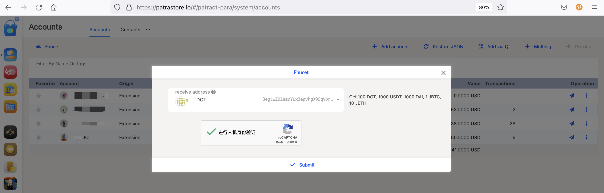

## 合约

当前 Jupiter PoA 测试网 和 Jupiter 部署的合约有：

- 稳定币：USDT、jBTC、jETH
- patramaker：DAI
- patrapixel
- patraswap

合约的具体实现，可以参考项目：[store-contracts](https://github.com/patractlabs/store-contracts)，部署工具采用 [redspot](https://github.com/patractlabs/redspot)。

## 网络切换

当前 Jupiter PoA 和 Jupiter 分为不同的网络，一个是独立的测试网，一个是平行链版本，除此之外，其他功能和操作都一样。

Jupiter PoA 的首页登录 [patrastore](https://patrastore.io/)

从 Jupiter PoA 切换网络到 Jupiter：

同理，也可以从 Jupiter 要切换到 Jupiter PoA。

## 水龙头

点击《账户》-《Faucet》领取测试币

等待片刻，检查账户收到代币后，就可以回到首页测试已经部署好的合约。