 # @redspot/explorer插件


## 背景信息


该插件目的是为了在进行合约开发时取代polkadot apps和canvas-ui。

## 优化内容

和polkadot apps相比, 主要进行了以下优化：

1.重新设计了布局和菜单，更加专注于合约模块。完善了polkadot apps的夜间模式、调整了UI和配色，删除对合约开发无用的页面，并合并了一些工具页面。 

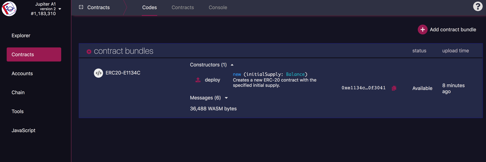

2.redspot config中配置的网络，会被注入到explorer中。 

3.redspot config中配置的账号，会出现在explorer中，可以在explorer中使用，例如可以进行转账等交易，就和网页账户中的一样。 

4.redspot中配置的types会被explorer采用。 

5.本地项目中生成的合约的`.contract` 文件，会自动上传到explorer中。explorer中的contracts 页面会收录所有code已知的合约。 

6.切换网络时，只显示当前网络的合约和abi和账号。 

7.可以在本地运行测试或者脚本时，使用polkadot extension进行签名。 

8.能够在explorer中向本地发送编译代码的指令。 

9.在 explorer中可以运行Redspot的脚本。

10.如果有已知的code ，那么会在区块详情中，自动解析合约事件和发送合约时的参数。

11.可以查询合约相关的交易。 


## 使用步骤

1.先安装@redspot/explorer插件。

    $ yarn add @redspot/explorer

2.然后在`redspot.config.ts`中导入插件。

    import "@redspot/explorer";

3.运行redspot explorer。 

    npx redspot explorer

**注意** 在运行redspot explorer的时候，会在本地启动一个服务，请不要终止该进程。并且，在每次redspot.config更改时，请手动重启该服务。 

4.然后打开[默认的网址](http://127.0.0.1:8011)，打开切换网络，可以看到，能够选择Redspot中配置的网络信息。

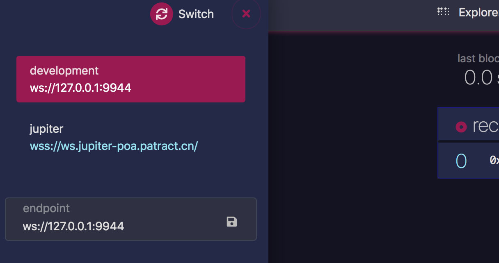


5.在**accounts** 页面，可以看到redspot.config中配置的账号。 

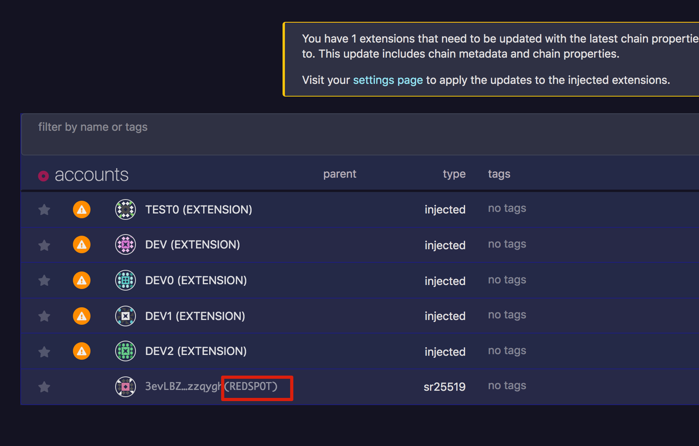

6.然后可以使用自己的polkadot extension中的账号，进行交易。复制您在polkadot extension中的账号地址。 

7.然后更改deploy.ts脚本。

```
import { network, patract } from 'redspot';

const { getContractFactory } = patract;
const { api } = network;

async function run() {
  await api.isReady;
  const signer = '<your address>';

  const contractFactory = await getContractFactory('erc20', signer);

  const balance = await api.query.system.account(signer);

  console.log('Balance: ', balance.toHuman());

  const contract = await contractFactory.deployed('new', '1000000', {
    gasLimit: '200000000000',
    value: '100000000000'
  });

  await contract.tx.transfer(signer, 7);
  console.log('');
  console.log(
    'Deploy successfully. The contract address: ',
    contract.address.toString()
  );

  api.disconnect();
}

run().catch(err => {
  console.log(err);
});
```


8.运行脚本`$ npx redspot run ./scripts/deploy.ts`， 然后此时会调用polkadot extension进行签名。检查浏览器里面的polkadot extension （explorer页面必须是打开的）。 

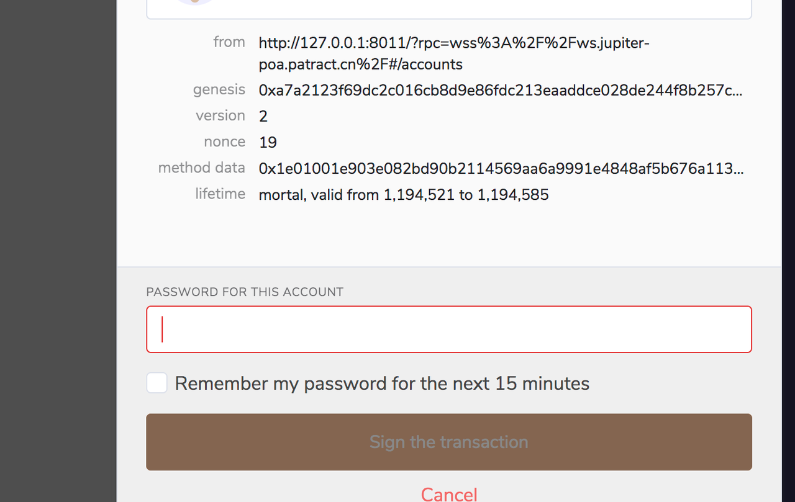

9.部署合约。部署成功后，检查**explorer**页面。

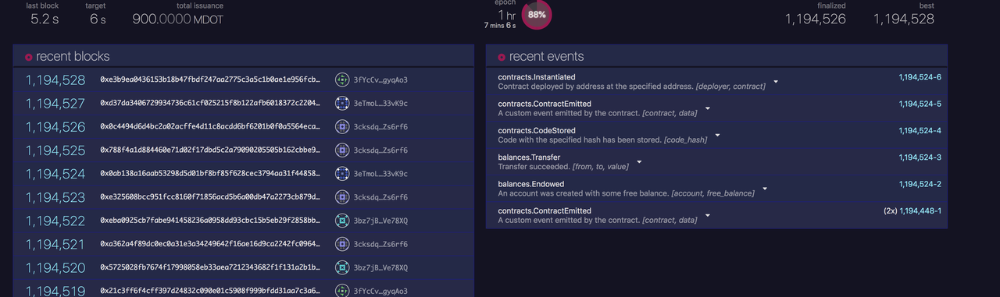

会出现链上的事件，可以查看contracts.instantiateWithCode事件。

这里会有合约message和合约event的解析。

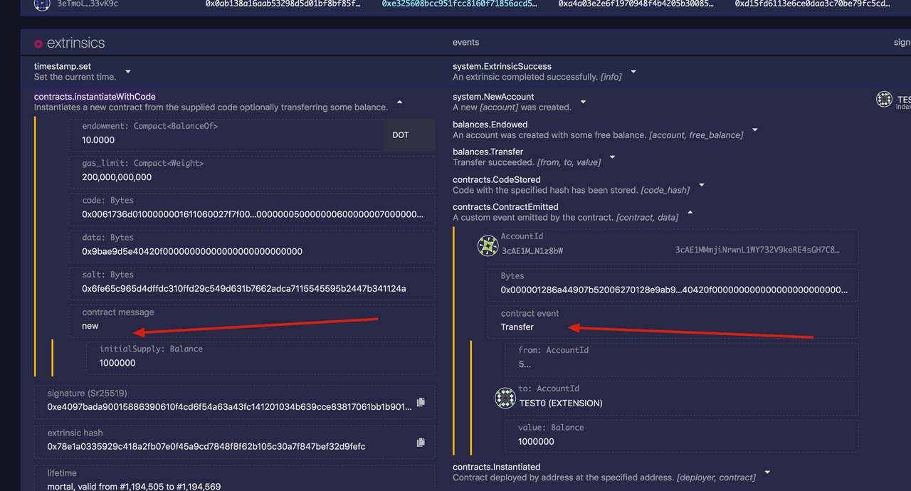

10.检查contracts的**codes**页面，这里会自动出现本地编译好的合约的code。

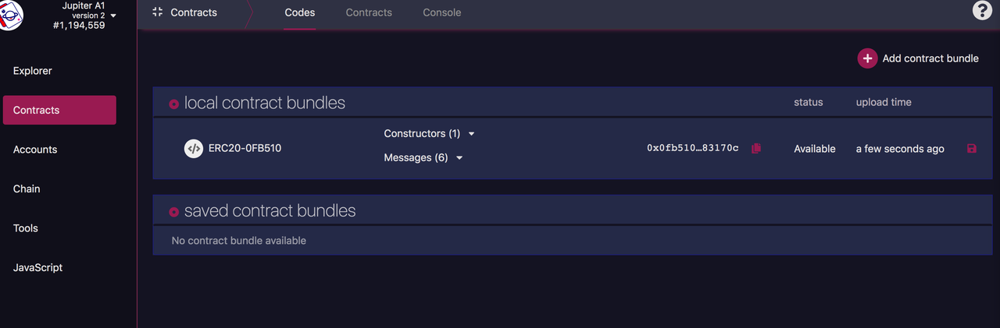

11.然后检查contracts的**contracts**页面，可以查看到刚刚部署好的合约。 

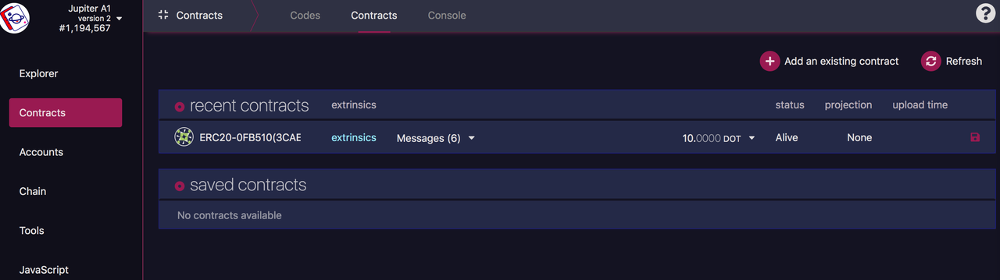

12.切换到**Console**页面，运行脚本和编译合约。

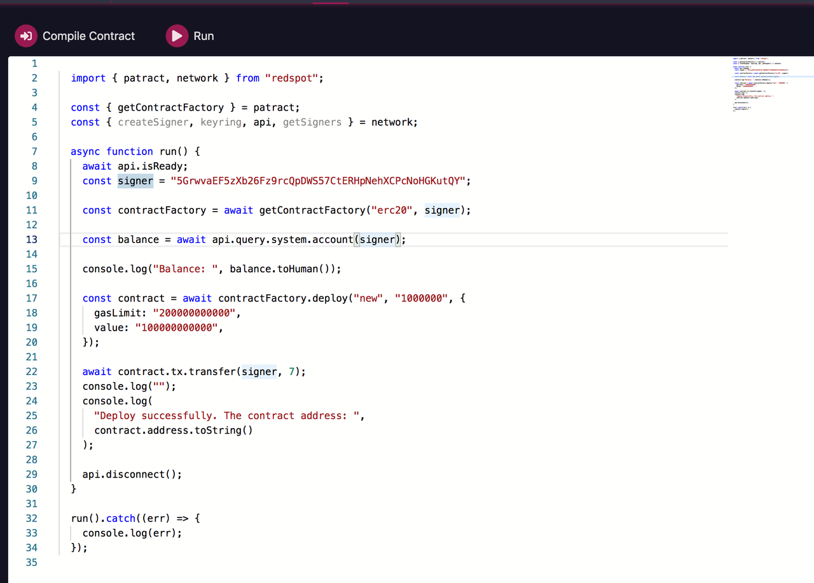

13.点击**compile contract** ，出现此提示表示编译成功。


如果编译时间过长，请切换到运行 `npx redspot explorer`命令的终端，查看日志提示。

14.点击**run**运行脚本，右边控制台会输出运行日志信息。 

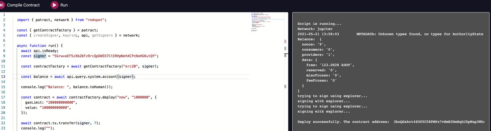

15.现在合约成功，切换到**contracts**页面进行，可以看到，刚刚部署成功的合约。

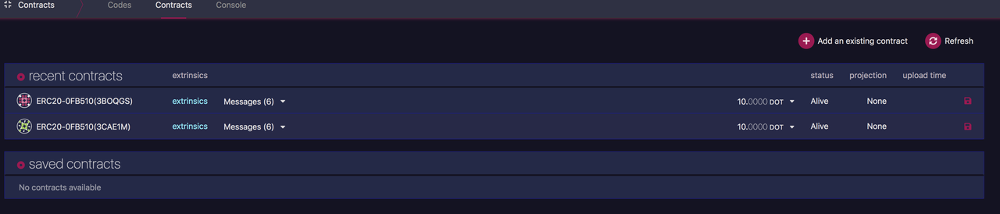

16.点击**extrinsics**按钮（即图中recent contracts中的每一行中的蓝色的extrinsics），可以在跳出来的页面中看到当前合约的相关交易信息。   

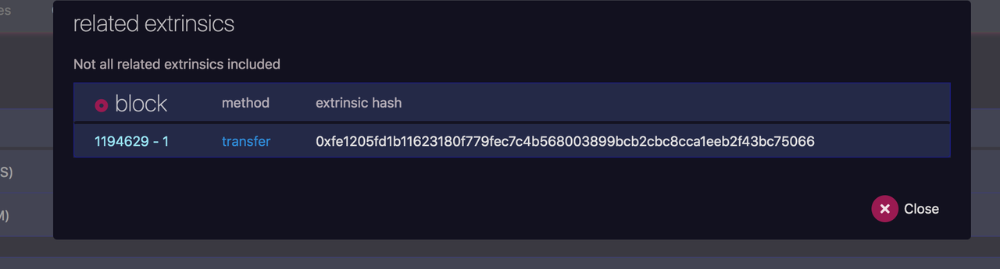