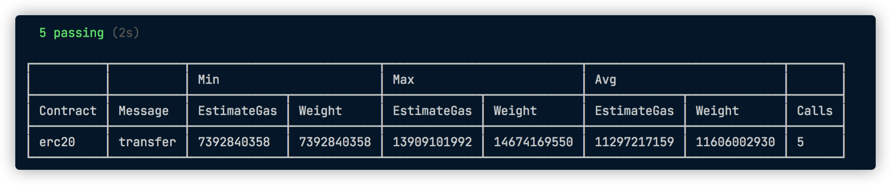

# @redspot_gas-reporter 插件

## 背景信息

该插件会在测试完成时，打印出所调用的合约的交易的gas使用量。




## 如何使用插件？

1. 导入@redspot/gas-reporter 插件。
2. 在`redspot.config.ts`中加入此插件，即可自动运行。
    ```typescript
    // redspot.config.ts
    import { RedspotUserConfig } from 'redspot/types';
    import '@redspot/gas-reporter';
    export default {
     ...
    } as RedspotUserConfig;
    ```


