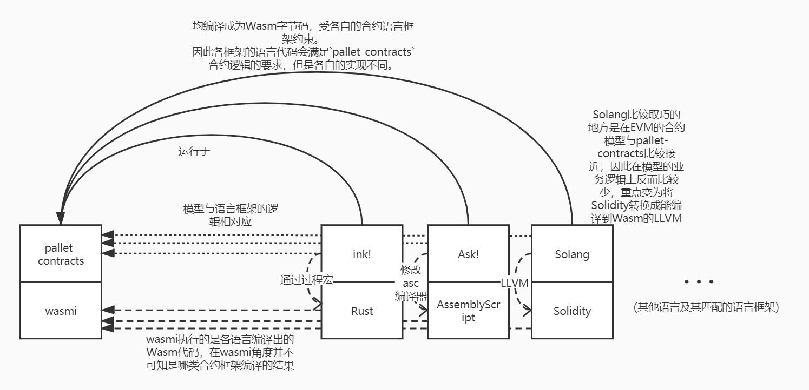

# 合约语言（框架）
与“合约模型”的概念相对应的（运行平台），我们可以衍生出合约语言（框架）的概念（编写能运行于平台上的代码）。

而这里不简单的使用“合约语言”，而是用“合约语言（框架）”这样的词语，是因为由于上一章节中我们已经拆分出了“合约沙盒”与“合约模型”的结构层次，因此实际上一些新型的合约平台并不是像EVM那样“发明”了一套新的Solidity合约语言，而是选择了一些语言（如Rust，C++，AssemblyScript等），基于这门语言在“hack语法解析”，“宏”，等维度上给现有语言添加上合约相关的约束，功能逻辑等。因此许多情况下会以“框架”，“库”等形态存在（如Frame Contract Pallet的rust合约语言框架ink!）。而这种“框架/库”又不是平时程序开发中使用库的维度，有一些合约语言框架需要修改到编译器维度，因此我们更倾向称呼为“语言框架”。

## 合约语言（框架）与合约模型的对应关系

如上图所示，上半部分是 EVM 与 Solidity 之间的关系。由于EVM/Solidity提出的时间比较早，因此其模型与通常的计算机虚拟机与语言的模型关系是一致的。而下半部分是在分离了合约模型后，语言框架部分的对应关系。

这里重点介绍下半部分，上半部分读者可以根据自己在以太坊合约开发的经验对比后文的介绍进行分析。

在编译形语言的体系中，先简单定义以下名词（非严谨说法，仅为了后文介绍而定义）：

* S语言：程序员编写代码的原语言，例如将C++编译成汇编，那么C++就是原语言S
* T语言：S语言通过编译器编译后生产的语言，例如将C++编译成汇编，那么汇编就是目标语言T

前文已经介绍了

## `pallet-contracts` 与对应的合约语言框架

