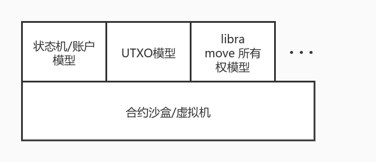

# 合约模型
在已经具备合约及合约沙盒的概念后，我们就可以开始讨论合约模型的概念了。

合约沙盒只是代表运行合约的环境，而合约是以什么方式运行的，合约和合约是怎么交互的，合约是怎么与链的数据互动的，这些问题就归属于合约模型问题。

换句话说，**合约模型就是合约是以什么模型运行在合约沙盒/虚拟机中的**。

如图所示，合约模型与合约虚拟机本质上是可以解耦的，其中关系只存在合约虚拟机是否能支持上层所需要的合约模型，例如：

* Bitcoin 的虚拟机就是比特币脚本的栈执行器，由于执行器设计是非图灵完备的OP_CODE，因此对于上层的合约模型只能支持Bitcoin的脚本。
* Ethereum 跟随Bitcoin的灵感，设计了具备图灵完备的OP_CODE，即EVM虚拟机（Ethereum Virtual Machine）。但是EVM的OP_CODE比较简陋，且只有栈的设计，没有堆的概念。但是EVM引入了读写状态的OP_CODE，因此从虚拟机机制上对合约模型可以支持状态模型。因此EVM也被看做一个执行状态转换的状态转换机（如Gavin Wood撰写的以太坊黄皮书中所描述的）。状态模型实际上是比较通用的抽象模型，绝大多数模型都可以用状态模型模拟（如在状态模型中构建UTXO模型），因此从理论上来说，只要继续完善EVM的OP_CODE，EVM的上层同样可以构建出其他合约模型。
* libra 认为区块链的核心在于资产的处理，因此提出了Move的虚拟机模型（Move Virtual Machine (MVM)）来从虚拟机上限定合约的模型，可以理解为是一种特化逻辑过的OP_CODE集合。因此MVM的上层只能运行Move模型。

通过以上讨论，我们可以认识到合约模型的概念，并且理解到虚拟机对上层合约模型的限制，因此接下来就可以讨论Wasm虚拟机可以运行的合约模型以及`pallet-contracts`的合约模型构成。

## Wasm 虚拟机
Wasm是一种在基于栈的虚拟机上运行的二进制的指令格式。（WebAssembly (abbreviated Wasm) is a binary instruction format for a stack-based virtual machine, from [https://webassembly.org/](https://webassembly.org/)）因此Wasm的模型和主流计算机程序的模型结构比较相似。另一方面Wasm被设计成为了一种比较通用的形式，且设计了WASI并支持了运行环境自由定义`host function`，因此虽然Wasm从浏览器发展而来，但是当前的使用场景已经不限于浏览器，开始在边缘计算，热更新，Serverless平台等发挥效果。

若以指令的完备性来衡量一个虚拟机的能力，则EVM处于半成品的程度，限制多且不够灵活；而JVM，Wasm虚拟机则是比较完备的，限制少，功能性强。另一方面指令设计的合理性一定程度也会影响虚拟机的执行效率，同时虚拟机采用的实现方案也会对执行效率产生比较大的影响。

例如EVM当前只能以解释器（interpreter）的形式运行，并且当前的实现过程体（go, c++等版本）中没有看到针对解释器的优化，执行效率比较底下，而 JVM, Wasm等虚拟机有采用JIT的模式的实现，执行效率相当高甚至逼近本地执行的性能。

> 注：`pallet-contracts`当前只能使用`wasmi`（解释器）执行Wasm代码，因此合约的执行性能比不上能使用`wasmtime`的Runtimed的执行。

而同时，Wasm虚拟机相比于JVM等虚拟机，十分轻便（Lightweight），快速，可定制性强，**且`host function`的功能给予了Wasm虚拟机与宿主之间交互的通道**，因此和其他虚拟机相比，将Wasm虚拟机作为区块链合约沙盒与链的功能结合在一起比较容易。

另一方面在笔者看来，Wasm是处于底层代码与上层代码之间比较好的一个抽象层，且其复杂性与完备性也远超于EVM，因此比较适合区块链合约领域的需求。

因此Wasm虚拟机提供的沙盒环境在满足合约沙盒的前提下还满足以下2点要求：
* 指令完备，功能性丰富，执行效率高
* 有适合的的接口能与宿主（这里指代运行Wasm的环境，即链）交互，方面宿主提供需要的功能。

## EVM 的合约模型

由于Ethereum是存储状态的区块链，因此EVM的合约模型理所应当的需要基本读写状态的功能。如果把每次合约运行的过程看做一次程序的启动到执行结束的过程，那么状态数据的变化就对应着这个程序需要持久化数据的变化。

因此对于读写状态，以太坊的EVM提供了`SLOAD`和`SSTORE`两个指令。

另一方面以太坊描述一个账户使用了“账户模型”，即将合约和调用合约的用户都看做了一个账户，在这个账户下存在`balance`等概念，因此EVM提供了`CALLER`，`ORIGIN`，`CALLVALUE`等等一系列指令来描述这种模型。

同时由于在EVM的抽象体系中，认为合约与用户是一致的，因此出现了“合约调用合约”的模型，即`CALL`，`DELEGATECALL`等指令，由此带来了合约的可组合性，造就了Ethereum繁荣的生态。而在EVM中，一个合约依托于一个EVM进行运行，因此合约调用合约是在一个EVM中启动了另一个EVM并加载指令进行执行。

当然EVM虚拟机设计的初衷就是为了解决比特币脚本的非图灵完备问题，为了解决这个问题并保证停机问题不发生，引入了指令的Gas计费模型

因此总结以上可以得到，EVM的合约模型具备以下特性：

1. 处理数据的模型是状态机模型，状态的变更靠外界调用触发（类比于调用了状态变更函数的过程）；
2. 合约模型中需要链相关的特性；
3. 将合约与用户看做一致，允许合约调用合约；
4. 引入指令计费模型。

## `pallet-contracts`的合约模型

这里直接下结论：**`pallet-contracts`虽然使用了Wasm虚拟机来执行代码，但是其合约模型基本与EVM合约模型一致**。

也就是说`pallet-contracts`的合约模型同样具备以下4点特性：

1. 处理数据的模型是状态机模型；
2. 合约模型中需要链相关的特性；
3. 将合约与用户看做一致，允许合约调用合约；
4. 引入指令计费模型。

并且，在以上4种特性的基础上，增加了“存储租赁模型”：

* `Rent`存储租赁计费。

在上文已经称述了合约执行的环境和合约模型是可以解耦的，EVM由于设计的比较早还没有解耦这个层次的概念，因此在指令中`SLOAD`，`SSTORE`及类似和链相关的指令是与EVM其他指令合并一起的。而Wasm本来并非为区块链设计，因此一定不存在这些和链环境相关的指令。

因此Wasm的`host function`即是用来完成这件事情的。链作为`host`宿主，只需要把**他认为合约可能会用到的方法**提供给Wasm虚拟机，让他导入这些函数对象，在合约的执行过程中即可以使用。因此通过`host function`，`pallet-contracts`合约模块就可以具备1，2，4功能，并将提供3需要的部分功能，同时第5点特性（租赁计费）也可以引入。

并且其中第3点功能的实现方式也与EVM一致，当出现合约调用合约的部分时，通过`host function`从Wasm回到了`pallet-contracts`模块，并启动了一个新的Wasm虚拟机去执行被调用的合约。（该部分在以后的文章中会描述）

因此总结而言，`pallet-contracts`的合约模型具备如下特性：

1. 合约模型与EVM的合约模型一致，并在此基础上增加了存储计费模型
2. 与链交互的实现通过Wasm的`host function`特性实现

## 使用Wasm虚拟机实现其他合约模型

刚才简要描述了`pallet-contracts`是如何在Wasm虚拟机上实现合约模型的，由于前文已经解释了虚拟机与合约模型是可以解耦的，因此实际上在Wasm虚拟机上同样可以实现其他的合约模型。

例如我们可以考虑将Move虚拟机也移植到Wasm虚拟机中，其有两种可能的实现方式：
1. 类比于将EVM的实现体在Runtime的Wasm环境运行，可以将MVM的实现体也编译成Wasm的形式（例如命名为`pallet-mvm`），在Runtime Wasm中运行。

    基于这种实现，Move依然可以按正常方式编译，并和Solidity的编译结果运行于`pallet-evm`一致，将Move的编译结果运行在例如`pallet-mvm`的平台上。

2. 将MVM与所有权，链相关的特性抽象一层，做成和`pallet-contracts`的形式，并设计将Move语言编译的中间码IR编译到Wasm。

    基于这种实现，可以将Move编译成为Wasm，并在Wasm虚拟机中运行。

## 其他合约模型
### EOS的合约模型

EOS的合约模型与EVM类似，同时强化了账户模型的概念。因此EOS使用Wasm的方式也是基于Wasm的执行，并通过`host function`引入与链相关的功能。

EOS和EVM模型的主要区别在于，EOS的合约调用合约的过程是以发交易的形态调用，并且EOS的资源模型是抵押模型。当前普遍认为正是EOS的抵押模型最后导致EOS没有走向成功。

### 异步合约模型
`pallet-actor`是 substrate 尝试实现异步合约模型的一个开端，当前没有什么进展。`pallet-actor`的模型打算使用Wasm虚拟机作为运行环境，并在此基础上添加异步的功能以提升性能。

当前也有其他少数对异步合约模型的研究，但是皆处于比较初步的阶段。
