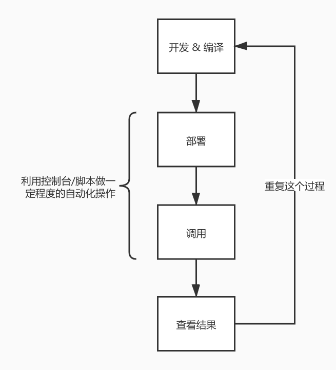

# 控制台console

Redspot 提供了一个功能强大的控制台，允许开发者简单的使用命令与合约做操作，或调用位于`scripts`目录下的脚本做机械化的重复工作等等。

Redspot 的控制台还有很多丰富的特性：
* 提供了**强大的tab补全**能力
* 控制台记录了命令历史，开发者能够查看`cache/console-history.txt`文件获取历史执行过的命令，也可以通过`↑`按键找到需要的历史命令。将来控制台也会提供快捷键索引历史命令的功能。

## 启动控制台
```bash
$ npx redspot console
# 若已经确定在`artifacts`目录下编译好的合约符合自己预期，则可以加上 --no-compile 参数不进行合约编译
$ npx redspot console --no-compile
```

此时执行`.help`命令可以看到相应的帮助：
```bash
> .help
.break    Sometimes you get stuck, this gets you out
.clear    Alias for .break
.editor   Enter editor mode
.exit     Exit the repl
.help     Print this help message
.load     Load JS from a file into the REPL session
.save     Save all evaluated commands in this REPL session to a file
> 
```

## 常用命令
控制台默认导入了`redspot`库下的供合约交互的组件，如

* `patract`
* `network` 
* ...

与在`scripts`目录下的脚本一致，通过这些组件可以调用许多功能，如和合约交互，查询信息，查看网络等等。

### 常用工作流
举例：当前想要调试erc20合约。那么在合约编译好后，可以在`artifacts`目录下看到`erc20.json`和`erc20.wasm`文件。加载合约相关的操作需要以这里的文件名为标示。

例如如果仿照`scripts`目录下的`deploy.ts`部署脚本，我们可以直接在控制台执行部署合约并调用的命令：
```typescript
var factory = await patract.getContractFactory('erc20'); // erc20与文件名一致
var contract = await factory.deployed('new', 10000000); // 上传代码并实例化这个合约
```

如果是已知一个合约的地址，想在先加载这个合约实例则可以通过：

```typescript
var factory = await patract.getContractFactory('erc20'); // erc20与文件名一致
var contract = await factory.attach('16DHBsUan9GoedoTYJmbyBZJMmN39ZpKUPvYeAGMTXCgxLQe'); // 加载合约地址
```

此时这里的`contract`对象就是一个实例化好的对象。因此后续可以直接用这个`contract`对象与合约进行交互，例如调用一个转账功能：

```typescript
var ret = await contract.transfer("15Jbynf3EcRqdHV1K14LXYh7PQFTbp5wiXfrc4kbMReR9KxA", 100)
ret.events // 打印events的信息
```

如果是为了通过rpc调用获取执行某个方法的结果：

```typescript
var ret = await contract.balanceOf("15Jbynf3EcRqdHV1K14LXYh7PQFTbp5wiXfrc4kbMReR9KxA")
c.output.toString()
```

如果这个过程是比较固定的，则可以把以上命令写到一个文件中放到`scripts`目录下，例如命名为`scripts/do_something.ts`：

```typescript
var factory = await patract.getContractFactory('erc20');
var contract = await factory.deployed('new', 10000000); 
var ret = await contract.transfer("15Jbynf3EcRqdHV1K14LXYh7PQFTbp5wiXfrc4kbMReR9KxA", 100)
ret.events
```

然后使用以下命令即可自动化执行一系列过程：

```typescript
.load scripts/do_something.ts
```

因此控制台辅助的功能如下：


